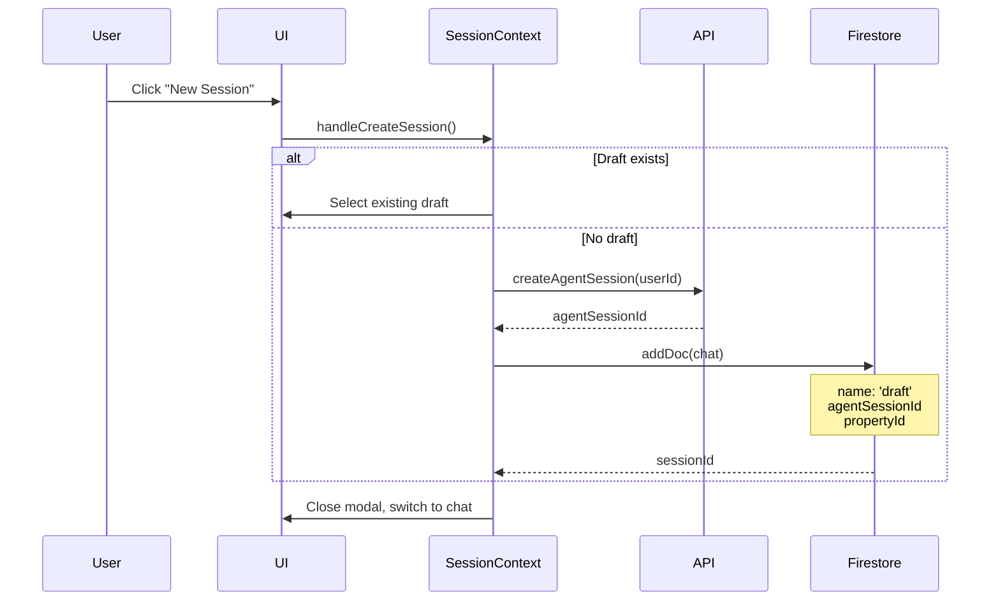
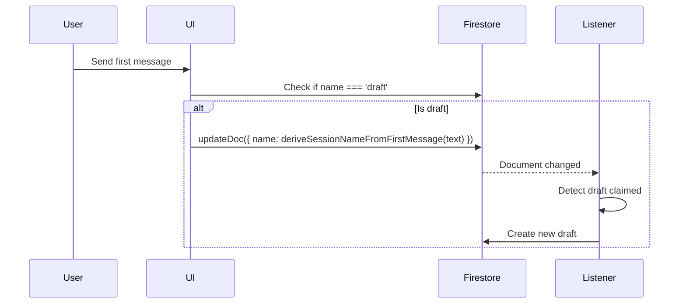

# Session Management

This document explains how chat sessions are managed in the HomeApp application, covering both the mobile app (mapp) and web app (webapp).

## Overview

The session management system provides a seamless chat experience with:
- **Pre-allocated draft sessions** for instant chat access
- **Property-scoped sessions** for contextual conversations
- **Real-time synchronization** across all app instances
- **Backend integration** with AI agent service

## Architecture

### Key Components

```
┌─────────────────────────────────────────────────────────┐
│                    SessionProvider                       │
│  - Manages session state and lifecycle                  │
│  - Real-time Firestore listener                         │
│  - Eager draft creation                                 │
└─────────────────────────────────────────────────────────┘
                          │
                          │ provides
                          │
         ┌────────────────┼────────────────┐
         │                │                │
         v                v                v
  ┌──────────┐    ┌──────────┐    ┌──────────┐
  │SessionsList│   │ChatList   │   │Property  │
  │            │   │           │   │Details   │
  └──────────┘    └──────────┘    └──────────┘
```

## Session Types

### 1. Draft Sessions

**Purpose**: Pre-allocated sessions ready for immediate use

**Characteristics**:
- `name: 'draft'` (special identifier)
- One draft per property (property-scoped)
- One global draft (no propertyId)
- Automatically created when needed
- Converted to regular session on first message

**Storage Path**:
```
users/{userId}/chats/{sessionId}
{
  name: "draft",
  createdAt: Timestamp,
  agentSessionId: string,
  propertyId?: string
}
```

### 2. Regular Sessions

**Purpose**: Active conversation threads with message history

**Characteristics**:
- Auto-named from the first user message (trimmed excerpt, max 60 chars), or `Chat · MMM d, yyyy` when too short
- Contains message count and last message timestamp
- Users can rename manually; auto-name is written once when the draft is promoted
- Grouped by property in UI

**Storage Path**:
```
users/{userId}/chats/{sessionId}
{
  name: string,
  createdAt: Timestamp,
  agentSessionId: string,
  propertyId?: string,
  messageCount?: number,
  lastMessageAt?: Timestamp
}
```

## Core Flows

### 1. Creating a New Session



**Code Location**: `apps/common/src/contexts/session-context.tsx`

```typescript
const createPropertyDraftSession = async (userId: string, propertyId: string) => {
  // 1. Create agent session with backend
  const agentSessionId = await createAgentSession(userId);

  // 2. Create Firestore document
  const docRef = await addDoc(collection(db, 'users', userId, 'chats'), {
    name: 'draft',
    createdAt: serverTimestamp(),
    agentSessionId: agentSessionId,
    propertyId: propertyId,
  });

  return docRef.id;
};
```

### 2. Draft to Regular Session Transition



**Code locations**: `deriveSessionNameFromFirstMessage` in `@homeapp/common/lib/session-name` (webapp mirror: `apps/webapp/src/lib/session-name.ts`). Called on first send when `name === 'draft'` (`PropertyChatWithContext` mapp, `property-chat-with-context` webapp) and when claiming a draft on New Session (`session-context`).

### 3. Auto-Selection on Property Load

**Code Location**: `apps/mapp/app/(tabs)/home/property-details/index.tsx`

```typescript
// Auto-select draft session when property loads
useEffect(() => {
  if (id && draftsByProperty[id] && !selectedSessionId) {
    setSelectedSessionId(draftsByProperty[id].id);
  }
}, [id, draftsByProperty, selectedSessionId]);
```

**Behavior**:
- User navigates to property details
- App automatically selects that property's draft session
- User can immediately start typing without clicking "New Session"

## State Management

### SessionProvider State

**Location**: `apps/common/src/contexts/session-context.tsx`

```typescript
interface SessionContextType {
  // Sessions grouped by property ID
  sessionsByProperty: Record<string, Session[]>;

  // One draft per property
  draftsByProperty: Record<string, Session>;

  // Global draft (no property)
  globalDraft: Session | null;

  // Loading state
  isLoading: boolean;

  // Session creation functions
  createPropertyDraftSession: (userId: string, propertyId: string) => Promise<string | null>;
  createGlobalDraftSession: (userId: string) => Promise<string | null>;
}
```

### Real-time Listener

```typescript
const q = query(
  collection(db, 'users', user.uid, 'chats'),
  orderBy('createdAt', 'desc')
);

const unsubscribe = onSnapshot(q, (snapshot) => {
  const allSessions = snapshot.docs.map(doc => ({
    id: doc.id,
    ...doc.data()
  }));

  // Separate drafts from regular sessions
  const drafts: Record<string, Session> = {};
  const sessions: Record<string, Session[]> = {};

  allSessions.forEach(session => {
    if (session.name === 'draft') {
      if (session.propertyId) {
        drafts[session.propertyId] = session;
      }
    } else if (session.propertyId) {
      if (!sessions[session.propertyId]) {
        sessions[session.propertyId] = [];
      }
      sessions[session.propertyId].push(session);
    }
  });

  setDraftsByProperty(drafts);
  setSessionsByProperty(sessions);
});
```

## Backend Integration

### Agent Session API

**Endpoint**: `POST /agent-session`

**Purpose**: Creates a backend conversation session for AI agent

**Request**:
```json
{
  "user_id": "string"
}
```

**Response**:
```json
{
  "id": "uuid-v4-string"
}
```

**Code Location**: `apps/mapp/lib/api.ts` or `apps/webapp/src/lib/api.ts`

```typescript
export async function createAgentSession(userId: string) {
  const response = await fetch(AGENT_SESSION_URL, {
    method: 'POST',
    headers: { 'Content-Type': 'application/json' },
    body: JSON.stringify({ user_id: userId }),
  });

  const data = await response.json();
  return data.id;
}
```

### Why Separate Backend Sessions?

The `agentSessionId` links the Firestore chat session to a backend AI agent session:

1. **Conversation Memory**: Agent maintains conversation history and context
2. **Stateful Processing**: Tracks multi-turn conversations
3. **Tool Usage**: Remembers previous tool calls and results
4. **Performance**: Backend caching and optimization

## Usage Examples

### Creating a Property Session

Use `beginNewPropertyChatSession` for the **New Session** button. It selects the property draft when one exists, or claims the current draft (if it has messages) and creates a fresh draft.

```typescript
import { useSession } from '@homeapp/common/contexts/session-context';

function PropertyChat({ propertyId, currentSessionId }: { propertyId: string; currentSessionId?: string }) {
  const { beginNewPropertyChatSession } = useSession();
  const { user } = useAuth();

  const handleNewSession = async () => {
    if (!user) return;
    const sessionId = await beginNewPropertyChatSession(user.uid, propertyId, currentSessionId);
    if (sessionId) setSelectedSession(sessionId);
  };

  return <button onClick={handleNewSession}>New Session</button>;
}
```

### Listing Property Sessions

```typescript
import { useSession } from '@homeapp/common/contexts/session-context';

function SessionsList({ propertyId }: { propertyId: string }) {
  const { sessionsByProperty } = useSession();
  const sessions = sessionsByProperty[propertyId] || [];

  return (
    <div>
      {sessions.map(session => (
        <div key={session.id}>
          <h3>{session.name}</h3>
          <p>{session.messageCount} messages</p>
          <p>Last: {session.lastMessageAt?.toDate().toLocaleDateString()}</p>
        </div>
      ))}
    </div>
  );
}
```

## Firestore Structure

```
users/{userId}/
  └── chats/{sessionId}/
      ├── Document (Session metadata)
      │   ├── name: string
      │   ├── createdAt: Timestamp (draft doc creation)
      │   ├── startedAt?: Timestamp (when draft was claimed / named)
      │   ├── lastMessageAt?: Timestamp (last user message)
      │   ├── messageCount?: number
      │   ├── agentSessionId: string
      │   └── propertyId?: string
      │
      └── messages/{messageId}/
          ├── Document (Message)
          ├── role: 'user' | 'assistant'
          ├── content: string
          ├── createdAt: Timestamp
          ├── file?: { name, type, url, gsURI }
          ├── documents?: Array<{ name, type }>
          └── agentSteps?: Array<{ name, status }>
```

### Session list timestamps (sidebar)

- **Sort / activity:** `lastMessageAt ?? startedAt ?? createdAt`
- **Display:** subtitle shows `Last active: …` only when `lastMessageAt` is set
- **Auto names:** first user message text (trimmed, max 60 chars); fallback `Chat · Jun 5, 2026` when the message is too short (`<4` chars). Applied on first send (draft → named) and when claiming a draft on New Session
- **Writes:** `startedAt` on draft claim / first-send rename uses **client clock** (`clientStartedAtTimestamp`) so the sidebar sort does not briefly fall back to draft `createdAt`; `lastMessageAt` + `messageCount` on each user message use `serverTimestamp()`

## Best Practices

### 1. Always Check for Existing Draft

```typescript
// ✅ Good: Check if draft exists
const draft = draftsByProperty[propertyId];
if (draft) {
  selectSession(draft.id);
} else {
  createPropertyDraftSession(userId, propertyId);
}

// ❌ Bad: Always create new session
createPropertyDraftSession(userId, propertyId);
```

### 2. Handle Loading State

```typescript
const { isLoading, sessionsByProperty } = useSession();

if (isLoading) {
  return <LoadingSpinner />;
}

const sessions = sessionsByProperty[propertyId] || [];
```

### 3. Clean Up Subscriptions

The SessionProvider handles cleanup automatically, but if you create custom listeners:

```typescript
useEffect(() => {
  const unsubscribe = onSnapshot(query, callback);
  return () => unsubscribe();
}, [userId]);
```

## Troubleshooting

### Problem: Draft not appearing after creation

**Cause**: Real-time listener hasn't fired yet

**Solution**: The listener should fire within ~100ms. If not, check:
- Firebase connection status
- Firestore security rules
- Console for errors

### Problem: Multiple `POST /agent-session` calls (dev)

**Cause**: Concurrent draft creation (Firestore snapshots, chat redirect, property add) before the first draft lands in Firestore.

**Solution**: `SessionProvider` dedupes in-flight work per key (`global` or `property:{id}`). Concurrent callers join the same promise instead of starting a new agent session.

**Debug logs** (dev / `EXPO_PUBLIC_DEBUG_LOGS=true`): filter console for `[session]` or `[chat]`:

| Log | Meaning |
|-----|---------|
| `draft.eager.global` / `draft.eager.property` | Background eager create scheduled |
| `draft.create.start` | New agent-session + Firestore draft started (`source`: `eager` or `caller`) |
| `draft.create.join` | Duplicate request joined in-flight work |
| `draft.create.done` | Draft Firestore doc created |
| `chat.redirect.wait` / `chat.redirect.create` | Webapp chat entry redirect flow |
| `new_session.click` | User tapped New Session (sidebar / mapp list) |
| `draft.begin.select` | Switched to existing empty draft |
| `draft.begin.create_after_claim` | Promoted in-use draft, creating fresh draft |
| `draft.claim` | Renamed `draft` using first user message (or date fallback) in Firestore |
| `draft.create.aborted` / `draft.global.skipped` | Sign-out or account delete in progress; eager draft create skipped (not an error) |
| `sessions.subscribe.permission_denied` | Chats listener closed after auth revoked (logout / account delete) |

### Problem: `draft.global.failed` after account delete

**Cause**: Race between `deleteUser` and eager draft creation — React `user` may lag behind revoked Firestore rules.

**Behavior**: Draft create aborts when `auth.currentUser` is gone; permission-denied is logged at debug, not error.

### Problem: Multiple drafts for same property

**Cause**: Race before dedup existed, or manual retries after partial failure.

**Solution**: Prefer the draft in `draftsByProperty[propertyId]`; delete extras in Firestore if needed.

### Problem: Agent session creation fails

**Cause**: Backend service unavailable or network error

**Solution**: The creation function returns `null` on failure:

```typescript
const sessionId = await createPropertyDraftSession(userId, propertyId);
if (!sessionId) {
  showError('Failed to create session. Please try again.');
}
```

## Performance Considerations

### 1. Eager Draft Creation

- Drafts created **before** user needs them
- No loading state when clicking "New Session"
- Instant responsiveness

### 2. Real-time Efficiency

- Single Firestore listener for all sessions
- Ordered by `createdAt` for efficient queries
- In-memory grouping by property

### 3. Backend Session Reuse

- Agent sessions persist across page refreshes
- No need to recreate conversation context
- Reduces backend load

## Migration Notes

### From Older Version

If migrating from a version without draft sessions:

1. Existing sessions are unaffected
2. Drafts created on first property visit
3. No data migration needed

### Adding to New Property

When adding session support to a new property type:

1. Call `createPropertyDraftSession(userId, propertyId)` on first access
2. Use `sessionsByProperty[propertyId]` to list sessions
3. Check `draftsByProperty[propertyId]` before creating new draft

## Related Documentation

- [Message Management](./MESSAGE_MANAGEMENT.md) - How messages are stored and displayed
- [Agent Integration](./AGENT_INTEGRATION.md) - Backend AI agent communication
- [File Attachments](./FILE_ATTACHMENTS.md) - Sending files in chat

## API Reference

### `useSession()` Hook

```typescript
interface SessionContextType {
  sessionsByProperty: Record<string, Session[]>;
  draftsByProperty: Record<string, Session>;
  globalDraft: Session | null;
  isLoading: boolean;
  createPropertyDraftSession: (userId: string, propertyId: string) => Promise<string | null>;
  createGlobalDraftSession: (userId: string) => Promise<string | null>;
}
```

### `Session` Type

```typescript
type Session = {
  id: string;
  name: string;
  createdAt: Timestamp;
  agentSessionId?: string;
  propertyId?: string | null;
  messageCount?: number;
  lastMessageAt?: Timestamp;
}
```

### `createAgentSession()` Function

```typescript
async function createAgentSession(
  userId: string
): Promise<{ agentSessionId?: string; error?: string }>
```

---

## Session deletion cascade

Deleting a chat session uses `@homeapp/common/lib/deletion` (`deleteChatSession`) today:

1. Scans `messages` for attachment `file.gsURI` and deletes Storage objects (client)
2. `POST /deletion/agent-sessions` — Vertex Reasoning Engine session (awaited for bulk delete; best-effort for single delete)
3. `POST /deletion/session-shared-chats` — removes `sharedChats` copies (Firestore rules block client delete)
4. Paginated delete of all `messages` docs, then the `chats/{sessionId}` doc (client)

Bulk delete in the session list uses `POST /deletion/sessions` via `deleteChatSessionsBatch` in `@homeapp/common/lib/deletion`. See [DELETION_PLAN.md](../../../docs/operations/DELETION_PLAN.md).

---

**Last Updated**: June 2026
**Maintainer**: HomeApp Team
**Version**: 1.0
