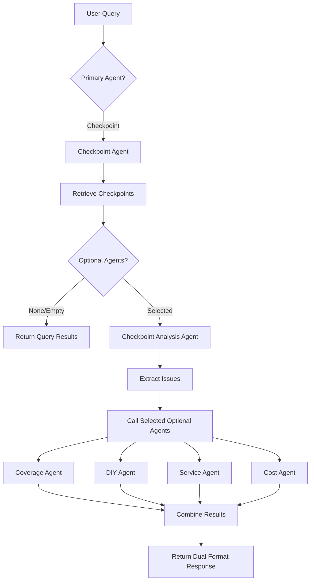

# Checkpoint AI Chat Analysis

## Overview

The Checkpoint AI Chat Analysis feature extends the checkpoint agent with comprehensive analysis capabilities similar to the analysis agent. When users select checkpoints, they can now get actionable recommendations including coverage information, DIY solutions, service provider recommendations, and cost estimates based on issues detected in their checkpoints.

**Implementation Date**: January 2026

## Key Features

### Two Operating Modes

1. **Query Mode** (Default)
   - Simple checkpoint queries without recommendations
   - Answers questions about checkpoint data
   - Examples: "What changed in my kitchen?", "Show me bathroom checkpoints"
   - Backward compatible with existing functionality

2. **Analysis Mode** (New)
   - Comprehensive analysis with recommendations
   - Extracts issues from checkpoint data
   - Provides coverage, DIY, service, and cost recommendations
   - Examples: "Analyze my kitchen checkpoints and give me DIY solutions"

### Optional Analysis Agents

Users can select which analysis aspects they want:

- **Coverage**: Check warranty/insurance for detected issues
- **DIY**: Repair guides, video tutorials, product recommendations
- **Service**: Local professional service providers with ratings
- **Cost**: DIY vs professional cost estimates and comparisons

## Architecture

### Backend Components

```
Root Agent
└── property_agent executor
    └── Checkpoint Agent
        ├── ask_checkpoints_retrieval (tool)
        └── Checkpoint Analysis Agent (orchestrator)
            ├── Coverage Agent
            ├── DIY Agent
            ├── Service Agent
            └── Cost Agent
```

### Data Flow



## Implementation Details

### Backend Changes

#### 1. Input Schema Updates

**File**: `gcp/agents/homecare/property_agent/agent_inputs.py`

Added `checkpoint_optional_agents` field to support analysis mode:

```python
checkpoint_optional_agents: Optional[List[CheckpointOptionalAgent]] = Field(
    default=None,
    description=(
        "Optional list of checkpoint analysis sub-agents to run after checkpoint retrieval. "
        "Allowed values: coverage, diy, service, cost. When provided and non-empty, triggers "
        "comprehensive checkpoint analysis with recommendations."
    ),
)
```

**Type Definition**:
```python
CheckpointOptionalAgent = Literal["coverage", "diy", "service", "cost"]
DEFAULT_CHECKPOINT_OPTIONAL_AGENTS: List[CheckpointOptionalAgent] = []
```

#### 2. Checkpoint Analysis Agent

**Location**: `gcp/agents/homecare/property_agent/sub_agents/checkpoint_analysis_agent/`

**Purpose**: Orchestrates coverage, DIY, service, and cost agents to provide comprehensive recommendations based on checkpoint data.

**Key Features**:
- Extracts issues and conditions from checkpoint retrieval results
- Synthesizes problems into clear problem statements
- Calls optional agents in canonical order: coverage → DIY → service → cost
- Returns dual format (Markdown + JSON) responses

**Input Schema**:
```python
class CheckpointAnalysisInput(BaseModel):
    checkpoint_results: str  # Checkpoint retrieval results
    user_query: str  # Original user query
    checkpoint_optional_agents: List[CheckpointOptionalAgent]  # Agents to invoke
    context_doc_uris: Optional[List[str]]  # For coverage checks
    property_address: Optional[str]  # For location-based services
    property_id: Optional[str]  # Property reference
    location_coordinates: Optional[Dict[str, float]]  # For service searches
    location_radius: Optional[int]  # Search radius
```

**Workflow**:
1. Parse checkpoint_results to extract issues, conditions, problems
2. Synthesize into clear problem statement
3. Call each optional agent with synthesized problem
4. Combine results into structured response
5. Return dual format (Markdown + JSON)

#### 3. Checkpoint Agent Updates

**File**: `gcp/agents/homecare/property_agent/sub_agents/checkpoint_agent/agent.py`

**Changes**:
- Added `checkpoint_analysis_agent` as a tool
- Checks for `checkpoint_optional_agents` in input
- Routes to analysis agent when optional agents are selected
- Maintains backward compatibility

**Decision Logic**:
```python
if checkpoint_optional_agents is provided and non-empty:
    1. Retrieve checkpoints
    2. Format results as string summary
    3. Call checkpoint_analysis_agent
    4. Return analysis response (dual format)
else:
    1. Retrieve checkpoints
    2. Synthesize direct answer
    3. Return simple text response
```

#### 4. property_agent executor updates

**File**: `gcp/agents/homecare/property_agent/prompts.py`

**Changes**:
- Updated to pass `checkpoint_optional_agents` to checkpoint_agent
- Passes all location and context parameters
- Handles dual-format responses from analysis mode

### Frontend Changes

#### Webapp

**Files Modified**:
1. `apps/webapp/src/lib/types.ts` - Added types
2. `apps/webapp/src/components/chat/chat-input.tsx` - Added props and handlers
3. `apps/webapp/src/components/chat/chat-settings-popover.tsx` - Added UI for checkpoint optional agents
4. `apps/webapp/src/components/chat/compact-settings-bar.tsx` - Added badge display
5. `apps/webapp/src/app/home/properties/[propertyId]/chat/[sessionId]/page.tsx` - Added state and API integration

**UI Components**:
- Optional agent toggles appear when checkpoint agent is selected
- Same UI pattern as analysis agent (coverage, DIY, service, cost buttons)
- Badge shows count of selected optional agents
- Settings popover includes checkpoint optional agents section

**State Management**:
```typescript
const [selectedCheckpointOptionalAgents, setSelectedCheckpointOptionalAgents] = 
  useState<CheckpointOptionalAgent[]>([]);
```

**API Request**:
```typescript
const requestBody = {
  // ... other fields
  checkpoint_optional_agents: selectedCheckpointOptionalAgents.length > 0 
    ? selectedCheckpointOptionalAgents 
    : undefined,
};
```

#### Mobile App

**Files Modified**:
1. `apps/common/src/types.ts` - Added shared types
2. `apps/mapp/components/GiftedChatInputToolbar.tsx` - Added props and handlers
3. `apps/mapp/app/(tabs)/home/property-details/index.tsx` - Added state and API integration

**Mobile-Specific Components**:
- CompactSettingsBar shows badge for selected checkpoint optional agents
- ChatSettingsModal includes checkpoint optional agents section
- Follows same patterns as webapp for consistency

## Usage Examples

### Example 1: Simple Query (No Optional Agents)

**User Action**:
1. Select checkpoint agent
2. Select checkpoints from kitchen
3. Ask: "What changed in my kitchen?"

**System Behavior**:
- Retrieves relevant checkpoints
- Synthesizes answer from checkpoint data
- Returns simple text response

**Response Format**: Plain text describing changes

### Example 2: Analysis with DIY and Cost

**User Action**:
1. Select checkpoint agent
2. Toggle on "DIY" and "Cost" optional agents
3. Select checkpoints from bathroom
4. Ask: "Analyze my bathroom checkpoints"

**System Behavior**:
- Retrieves bathroom checkpoints
- Extracts issues: "Cracked tile, grout discoloration, water stain"
- Calls DIY agent with synthesized problem
- Calls cost agent with synthesized problem
- Returns comprehensive analysis

**Response Format**: Dual format (Markdown + JSON)
```json
{
  "checkpointAnalysis": {
    "title": "Bathroom Checkpoint Analysis",
    "checkpointSummary": {
      "checkpointsAnalyzed": 2,
      "issuesDetected": ["Cracked tile", "Grout discoloration", "Water stain"],
      "overallCondition": "Moderate issues requiring attention",
      "locations": ["Bathroom"]
    },
    "diyResults": { /* DIY steps, videos, products */ },
    "costEstimationResults": { /* Cost estimates */ }
  }
}
```

### Example 3: Full Analysis (All Optional Agents)

**User Action**:
1. Select checkpoint agent
2. Toggle on all optional agents (coverage, DIY, service, cost)
3. Select all property checkpoints
4. Ask: "Give me a complete analysis of all issues"

**System Behavior**:
- Retrieves all checkpoints
- Extracts all issues across locations
- Checks warranty/insurance coverage
- Provides DIY solutions
- Finds local service providers
- Estimates costs

**Response Sections**:
- Checkpoint Summary
- Coverage Information
- DIY Solutions
- Local Service Providers
- Cost Estimates

## Response Format

### Dual Format Structure

All analysis responses include both Markdown and JSON:

**Markdown (First)**: Human-readable, suitable for messaging platforms
```markdown
# Checkpoint Analysis: Kitchen & Bathroom Issues

## Checkpoint Summary
- **Checkpoints Analyzed**: 3
- **Issues Detected**: Water damage, cracked tile, loose cabinet
- **Locations**: Kitchen, Bathroom

## Coverage Information
[Coverage details if requested]

## DIY Solutions
[DIY steps if requested]

## Local Service Providers
[Service listings if requested]

## Cost Estimates
[Cost comparison if requested]
```

**JSON (Second)**: Structured data for programmatic consumption
```json
{
  "checkpointAnalysis": {
    "title": "string",
    "checkpointSummary": { /* ... */ },
    "coverageResult": { /* ... */ },
    "diyResults": { /* ... */ },
    "serviceResults": { /* ... */ },
    "costEstimationResults": { /* ... */ }
  }
}
```

## API Integration

### Request Payload

**Webapp**:
```typescript
POST /api/agent/sse
{
  "user_id": "string",
  "session_id": "string",
  "user_query": "string",
  "property_id": "string",
  "primary_agent": "checkpoint",
  "checkpoint_ids": ["id1", "id2"],
  "checkpoint_optional_agents": ["coverage", "diy", "service", "cost"],
  "context_doc_uris": ["gs://..."],
  "property_address": "string",
  "location_coordinates": {"lat": 37.7749, "lng": -122.4194},
  "location_radius": 5
}
```

**Mobile App**:
```typescript
streamAgentResponse({
  userId: "string",
  agentSessionId: "string",
  userQuery: "string",
  propertyAddress: "string",
  primaryAgent: "checkpoint",
  checkpointIds: ["id1", "id2"],
  checkpointOptionalAgents: ["diy", "cost"],
  locationData: { /* ... */ }
})
```

### Response Handling

**Webapp**: Parses JSON from response, displays in chat UI
**Mobile**: Streams response chunks, updates message content in real-time

## Configuration

### Default Behavior

- **checkpoint_optional_agents**: Empty list (simple query mode)
- **Analysis mode**: Only triggered when optional agents are explicitly selected
- **Backward compatibility**: Existing checkpoint queries work unchanged

### Agent Execution Order

When multiple optional agents are selected, they execute in canonical order:
1. Coverage Agent
2. DIY Agent
3. Service Agent
4. Cost Agent

This ensures consistent results and logical flow of information.

## Error Handling

### No Checkpoints Found
```json
{
  "checkpointAnalysis": {
    "title": "No Checkpoints Found",
    "checkpointSummary": {
      "checkpointsAnalyzed": 0,
      "issuesDetected": [],
      "overallCondition": "No checkpoints available for analysis"
    }
  }
}
```

### Analysis Agent Failure
- Returns partial results from successful agents
- Includes error message for failed agents
- Maintains graceful degradation

### Invalid Optional Agents
- Filters out invalid agent names
- Proceeds with valid agents only
- Logs warning for invalid selections

## Performance Considerations

### Response Times

- **Simple Query**: 2-5 seconds
- **Single Optional Agent**: 5-10 seconds
- **Multiple Optional Agents**: 15-30 seconds (agents run in sequence)
- **Full Analysis (all agents)**: 20-40 seconds

### Optimization Strategies

1. **Parallel Execution**: DIY and Service agents can run in parallel (future enhancement)
2. **Caching**: Cache checkpoint retrieval results within same session
3. **Lazy Loading**: Load optional agent results progressively in UI
4. **Result Limits**: Limit number of checkpoints analyzed (default: 10)

## Testing

### Test Scenarios

1. **Simple Query Mode**
   - Select checkpoints, no optional agents
   - Verify simple text response
   - Verify no analysis sections

2. **Single Optional Agent**
   - Test each optional agent individually
   - Verify correct section appears in response
   - Verify other sections are omitted

3. **Multiple Optional Agents**
   - Test various combinations
   - Verify all selected sections appear
   - Verify correct execution order

4. **Full Analysis**
   - Select all optional agents
   - Verify complete response structure
   - Verify all sections populated

5. **Edge Cases**
   - No checkpoints selected
   - No issues detected in checkpoints
   - Invalid optional agent names
   - Network failures during analysis

### Test Data

**Sample Checkpoint Data**:
```json
{
  "id": "checkpoint1",
  "name": "Kitchen Inspection - Jan 2026",
  "location": "Kitchen",
  "aiAnalysis": {
    "summary": "Water damage detected under sink",
    "issues": [
      {
        "description": "Water stain under sink",
        "severity": "moderate"
      }
    ],
    "conditions": ["Wet cabinet floor", "Loose pipe connection"]
  }
}
```

## Future Enhancements

### Planned Features

1. **Parallel Agent Execution**
   - Run DIY and Service agents simultaneously
   - Reduce total analysis time by 30-40%

2. **Smart Agent Suggestions**
   - Analyze checkpoint issues
   - Auto-suggest relevant optional agents
   - Example: Detect water damage → suggest service + cost

3. **Trend Analysis**
   - Compare issues across multiple checkpoints
   - Identify deterioration patterns
   - Predict future maintenance needs

4. **Priority Recommendations**
   - Rank issues by severity
   - Prioritize critical repairs
   - Suggest action timeline

5. **Cost Tracking**
   - Track actual repair costs
   - Compare with estimates
   - Improve future cost predictions

6. **Multi-Property Analysis**
   - Analyze checkpoints across multiple properties
   - Identify common issues
   - Bulk recommendations

## Troubleshooting

### Common Issues

**Issue**: Optional agents not appearing in UI
- **Solution**: Verify checkpoint agent is selected as primary agent

**Issue**: Analysis returns empty results
- **Solution**: Ensure checkpoints have AI analysis data populated

**Issue**: Service agent returns no providers
- **Solution**: Check location data is provided and radius is appropriate

**Issue**: Cost estimates seem inaccurate
- **Solution**: Cost agent uses general estimates; actual costs may vary

## Related Documentation

- [Checkpoint Feature Plan](./CHECKPOINT_FEATURE_PLAN.md)
- [Checkpoint Chat Integration](./CHECKPOINT_CHAT_INTEGRATION.md)
- [Analysis Agent Overview](../analysis/ANALYSIS_AGENT_OVERVIEW.md)
- [Analysis Agent Sub-Agents](../analysis/ANALYSIS_AGENT_SUB_AGENTS.md)

## Changelog

### January 2026 - Initial Release
- Implemented checkpoint analysis orchestrator agent
- Added optional agent selection UI (webapp and mobile)
- Integrated coverage, DIY, service, and cost agents
- Added dual format response support
- Maintained backward compatibility with simple queries
