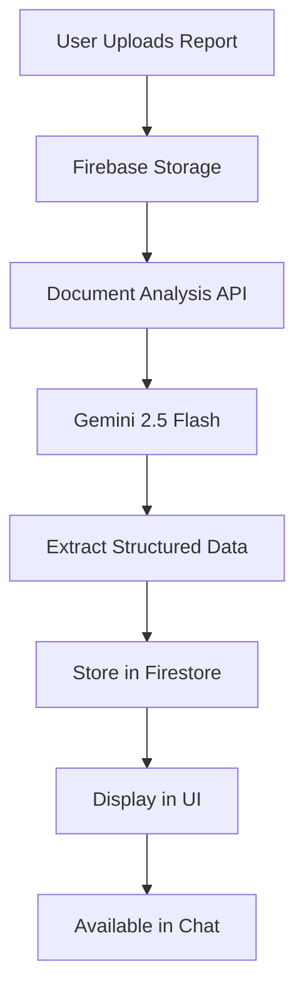

# Checkpoint Document Analysis

## Overview

The Checkpoint Document Analysis feature enables users to upload property analysis reports and have them automatically analyzed by AI to extract structured information about property status, issues, recommendations, and cost estimates.

### Supported Report Types

This feature works with various types of property reports:
- **Home Inspection Reports** - Pre-purchase or periodic home inspections
- **Property Condition Assessments** - Detailed condition evaluations
- **Building Inspection Reports** - Commercial or residential building assessments
- **Maintenance Reports** - Periodic property maintenance assessments
- **Damage Assessment Reports** - Post-incident or insurance-related assessments
- **Energy Audit Reports** - Energy efficiency evaluations
- **Any property analysis document** containing issues, conditions, or recommendations

## Features

### Automatic Detection & Classification
- AI automatically detects if an uploaded document is a property analysis/checkpoint report
- Home inspection reports are automatically identified and processed
- Documents containing keywords like "inspection", "assessment", "condition report", etc. are detected
- Documents explicitly classified as `INSPECTION_REPORT` are automatically treated as checkpoint reports
- Documents are classified as `CHECKPOINT_REPORT` type
- Works with PDF, DOC, DOCX, TXT, and other standard document formats

### Comprehensive Data Extraction

The AI extracts the following information from checkpoint reports:

1. **Property Status**: Overall condition classification
   - Excellent
   - Good
   - Fair
   - Poor
   - Critical

2. **Status Score**: Numerical score from 0-100 representing property condition

3. **Issues**: Detailed list of problems found, each with:
   - Description
   - Severity (critical, major, moderate, minor)
   - Category (structural, electrical, plumbing, roofing, HVAC, etc.)
   - Recommendation to address the issue
   - Estimated cost (if mentioned in report)
   - Priority level (1-5, where 1 is highest)

4. **Recommendations**: General recommendations for property maintenance

5. **Overall Assessment**: Comprehensive summary paragraph

6. **Cost Estimates**: Breakdown by timeframe
   - Immediate costs (needed right away)
   - Short-term costs (within 1 year)
   - Long-term costs (beyond 1 year)

### Visual Presentation

#### Mobile App (mapp)
- **CheckpointReportCard**: Expandable card component showing:
  - Property status badge (color-coded)
  - Status score with progress bar
  - Issues summary with severity badges
  - Expandable detailed view with all extracted information
  - "Chat about this report" button for AI assistance

#### Web App (webapp)
- **CheckpointReportViewer**: Rich web component featuring:
  - Responsive card-based layout
  - Interactive expand/collapse sections
  - Color-coded badges for status and severity
  - Filterable issues list
  - Cost breakdown visualization
  - Chat integration button

### Chat Integration

Checkpoint reports are automatically available in chat:
- Select checkpoint reports from the document drawer
- Ask questions about specific issues
- Get recommendations and cost estimates
- AI has full context of the report analysis

## Architecture

### Data Flow



### Type System

#### TypeScript Types

```typescript
export type CheckpointReportAnalysis = {
  propertyStatus?: "excellent" | "good" | "fair" | "poor" | "critical";
  statusScore?: number; // 0-100
  issues?: Array<{
    description: string;
    severity: "critical" | "major" | "moderate" | "minor";
    category?: string;
    recommendation?: string;
    estimatedCost?: string;
    priority?: number; // 1-5
  }>;
  recommendations?: string[];
  overallAssessment?: string;
  costEstimates?: {
    immediate?: string;
    shortTerm?: string;
    longTerm?: string;
  };
};

export type Document = {
  // ... existing fields
  documentType?: 
    | "DEED"
    | "INSURANCE_POLICY"
    | "UTILITY_BILL"
    | "INSPECTION_REPORT"
    | "MORTGAGE_STATEMENT"
    | "CHECKPOINT_REPORT"  // NEW
    | "OTHER";
  checkpointAnalysis?: CheckpointReportAnalysis;  // NEW
};
```

#### Python Schemas

```python
class CheckpointReportIssue(BaseModel):
    description: str
    severity: str  # critical, major, moderate, minor
    category: Optional[str]
    recommendation: Optional[str]
    estimatedCost: Optional[str]
    priority: Optional[int]

class CheckpointReportAnalysis(BaseModel):
    propertyStatus: Optional[str]
    statusScore: Optional[int]
    issues: Optional[List[CheckpointReportIssue]]
    recommendations: Optional[List[str]]
    overallAssessment: Optional[str]
    costEstimates: Optional[CheckpointReportCostEstimates]
```

### Backend Implementation

#### Document Service (`gcp/proxy/api/services/document_service.py`)

**Detection Logic:**
```python
def _is_checkpoint_report(doc_type: str, summary: str) -> bool:
    """
    Determine if a document is a checkpoint/property analysis report.
    
    This includes:
    - Home inspection reports
    - Property condition assessments
    - Building inspection reports
    - Any document with inspection/assessment keywords
    """
    # Automatically treat INSPECTION_REPORT as checkpoint report
    if doc_type == "INSPECTION_REPORT":
        return True
    
    # Check for checkpoint/inspection keywords in summary
    checkpoint_keywords = [
        "inspection", "analysis", "assessment", "evaluation", 
        "condition report", "property condition", "damage", 
        "issues", "defects", "recommendations", "home inspection",
        "building inspection", "property inspection"
    ]
    summary_lower = summary.lower()
    return any(keyword in summary_lower for keyword in checkpoint_keywords)
```

**Analysis Function:**
```python
def _analyze_checkpoint_report(request: ExtractDocInfoRequest) -> CheckpointReportAnalysis:
    """
    Analyze a checkpoint report using Gemini 2.5 Flash.
    
    Extracts:
    - Property status and score
    - Detailed issues with severity, category, recommendations
    - General recommendations
    - Cost estimates by timeframe
    """
    # Uses structured JSON schema with Gemini
    # Returns CheckpointReportAnalysis object
```

**Integration:**
```python
def extract_doc_info(request: ExtractDocInfoRequest) -> ExtractDocInfoResponse:
    # ... standard document analysis
    
    # Check if checkpoint report
    if _is_checkpoint_report(doc_type, summary):
        checkpoint_analysis = _analyze_checkpoint_report(request)
        doc_type = "CHECKPOINT_REPORT"
    
    return ExtractDocInfoResponse(
        documentType=doc_type,
        checkpointAnalysis=checkpoint_analysis,
        # ... other fields
    )
```

### Frontend Implementation

#### Mobile App Components

**CheckpointReportCard** (`apps/mapp/components/property-details/CheckpointReportCard.tsx`)
- Displays checkpoint report analysis in mobile-optimized format
- Expandable sections for detailed information
- Color-coded severity indicators
- Integration with chat

**Usage in PropertyDetailsTab:**
```typescript
const isCheckpointReport = 
  doc.documentType === 'CHECKPOINT_REPORT' && 
  doc.checkpointAnalysis;

if (isCheckpointReport) {
  return (
    <CheckpointReportCard 
      document={doc}
      onChatPress={() => navigateToChat(doc.id)}
    />
  );
}
```

#### Web App Components

**CheckpointReportViewer** (`apps/webapp/src/components/documents/checkpoint-report-viewer.tsx`)
- Rich web interface for checkpoint report analysis
- Responsive design with card-based layout
- Interactive filtering and expansion
- Badge system for visual indicators

**Usage in Property Details:**
```typescript
if (doc.documentType === 'CHECKPOINT_REPORT' && doc.checkpointAnalysis) {
  return (
    <CheckpointReportViewer 
      document={doc}
      onChatPress={() => navigateToChatWithDoc(doc.id)}
    />
  );
}
```

## Usage Guide

### For Users

#### Uploading a Home Inspection or Checkpoint Report

1. **Navigate to Property Details**
   - Select your property
   - Go to the "Details" tab

2. **Upload Document**
   - Click "Upload Documents" button
   - Select your home inspection report or property analysis document (PDF, DOC, etc.)
   - The system accepts reports from any inspection company or format
   - Wait for upload and AI analysis (typically 5-10 seconds)

3. **View Analysis**
   - Report automatically appears with special checkpoint card/viewer
   - See property status, score, and issues summary
   - View issues organized by severity (critical, major, moderate, minor)
   - Expand to view detailed information including:
     - Full issue descriptions with recommendations
     - Cost estimates for repairs
     - Priority levels
     - Category breakdowns (structural, electrical, plumbing, etc.)

4. **Chat About Report**
   - Click "Chat about this report" button
   - Or select report from document drawer in chat
   - Ask questions about specific issues, costs, or recommendations
   - Get AI-powered explanations and advice

#### Example Questions for Chat

**General Questions:**
- "What are the critical issues in this home inspection report?"
- "Summarize the main findings from this inspection"
- "Are there any immediate safety concerns?"
- "What should I prioritize first?"

**Cost & Budget Questions:**
- "How much will it cost to fix the plumbing issues?"
- "What's the total estimated cost for all repairs?"
- "Which repairs are most urgent and how much will they cost?"
- "What can I defer to next year?"

**Specific Issue Questions:**
- "Explain the structural recommendations in detail"
- "What does the roof inspection say?"
- "Are the electrical issues serious?"
- "Tell me about the HVAC system condition"

**Negotiation & Decision Making:**
- "Which issues should I ask the seller to fix?"
- "What repairs are deal-breakers?"
- "Is this property a good investment given these issues?"
- "What's the priority order for addressing these problems?"

### For Developers

#### Adding New Issue Categories

Edit the Gemini prompt in `document_service.py`:
```python
# Add new categories to the analysis prompt
"Category (e.g., structural, electrical, plumbing, roofing, HVAC, foundation, etc.)"
```

#### Customizing Severity Colors

**Mobile (mapp):**
```typescript
function getSeverityColor(severity: string): string {
  switch (severity) {
    case 'critical': return 'text-destructive';
    case 'major': return 'text-orange-600';
    case 'moderate': return 'text-yellow-600';
    case 'minor': return 'text-blue-600';
  }
}
```

**Web (webapp):**
```typescript
function getSeverityColor(severity: string): string {
  switch (severity) {
    case "critical": return "destructive";
    case "major": return "orange";
    case "moderate": return "yellow";
    case "minor": return "blue";
  }
}
```

#### Extending Analysis Fields

1. Update TypeScript types in `apps/common/src/types.ts`
2. Update Python schemas in `gcp/proxy/api/schemas/document.py`
3. Update Gemini prompt in `gcp/proxy/api/services/document_service.py`
4. Update UI components to display new fields

## API Reference

### Document Analysis Endpoint

**POST** `/extract-doc-info`

**Request:**
```json
{
  "docUrl": "gs://bucket/path/to/report.pdf",
  "contentType": "application/pdf"
}
```

**Response:**
```json
{
  "documentType": "CHECKPOINT_REPORT",
  "propertyAddress": "123 Main Street, Anytown, CA 12345",
  "keyEntities": [
    {"name": "Inspection Date", "value": "2025-01-04"},
    {"name": "Inspector", "value": "John Smith"}
  ],
  "summary": "Comprehensive property inspection report...",
  "checkpointAnalysis": {
    "propertyStatus": "fair",
    "statusScore": 65,
    "issues": [
      {
        "description": "Roof shingles showing wear",
        "severity": "moderate",
        "category": "roofing",
        "recommendation": "Replace within 2 years",
        "estimatedCost": "$5,000-8,000",
        "priority": 3
      }
    ],
    "recommendations": [
      "Schedule annual HVAC maintenance",
      "Repair foundation cracks"
    ],
    "overallAssessment": "Property is in fair condition...",
    "costEstimates": {
      "immediate": "$2,000-3,000",
      "shortTerm": "$10,000-15,000",
      "longTerm": "$20,000-30,000"
    }
  }
}
```

## Firestore Structure

```
users/{userId}/docs/{docId}
  ├─ id: string
  ├─ name: string
  ├─ url: string
  ├─ gsURI: string
  ├─ documentType: "CHECKPOINT_REPORT"
  ├─ propertyId: string
  ├─ createdAt: Timestamp
  ├─ summary: string
  ├─ keyEntities: Array<{name, value}>
  └─ checkpointAnalysis: {
       ├─ propertyStatus: string
       ├─ statusScore: number
       ├─ issues: Array<{
       │    ├─ description: string
       │    ├─ severity: string
       │    ├─ category: string
       │    ├─ recommendation: string
       │    ├─ estimatedCost: string
       │    └─ priority: number
       │  }>
       ├─ recommendations: Array<string>
       ├─ overallAssessment: string
       └─ costEstimates: {
            ├─ immediate: string
            ├─ shortTerm: string
            └─ longTerm: string
          }
     }
```

## Testing

### Manual Testing Checklist

- [ ] Upload PDF checkpoint report in mapp
- [ ] Upload DOC checkpoint report in webapp
- [ ] Verify AI extracts issues with correct severity
- [ ] Verify property status categorization
- [ ] Check cost estimates extraction
- [ ] Test expand/collapse functionality
- [ ] Test chat with checkpoint report context
- [ ] Verify issues display with proper formatting
- [ ] Test on both platforms (webapp + mapp)
- [ ] Verify backward compatibility with existing documents

### Test Documents

Create test documents with:

**Sample Home Inspection Report Structure:**
1. **Critical Issues**: 
   - Fire hazards (faulty wiring, gas leaks)
   - Structural failures (foundation cracks, load-bearing wall damage)
   - Safety hazards (mold, asbestos, radon)

2. **Major Issues**: 
   - Roof damage (missing shingles, leaks)
   - Foundation cracks
   - HVAC system failure
   - Major plumbing issues

3. **Moderate Issues**: 
   - Plumbing leaks
   - Electrical upgrades needed
   - Window/door repairs
   - Drainage problems

4. **Minor Issues**: 
   - Cosmetic repairs
   - Minor wear and tear
   - Weatherstripping
   - Paint touch-ups

**Test with Real Reports:**
- Use actual home inspection reports from companies like:
  - Pillar To Post
  - AmeriSpec
  - WIN Home Inspection
  - HouseMaster
  - Local independent inspectors
- Reports from different formats (PDF, Word, scanned documents)

### Expected Behavior

1. **Upload**: Document uploads successfully to Firebase Storage
2. **Analysis**: AI analyzes within 5-10 seconds
3. **Display**: Checkpoint card/viewer appears with extracted data
4. **Chat**: Report is selectable in document drawer
5. **Questions**: AI can answer questions about specific issues

## Troubleshooting

### Issue: Home inspection report not detected as checkpoint report

**Solution:**
- Ensure document contains keywords like "inspection", "home inspection", "analysis", "assessment"
- Check that document has clear sections for issues/problems/findings
- Verify document is readable (not scanned image without OCR)
- If document is classified as `INSPECTION_REPORT`, it should automatically be treated as checkpoint report
- Try uploading as PDF format for best results
- Ensure the document title or first page mentions "inspection" or "assessment"

### Issue: Missing cost estimates

**Solution:**
- Cost estimates are optional - only extracted if present in report
- Ensure report explicitly mentions costs with dollar amounts
- Check that costs are associated with specific timeframes

### Issue: Incorrect severity classification

**Solution:**
- AI uses context to determine severity
- Critical: Safety hazards, immediate failures
- Major: Significant damage, urgent repairs needed
- Moderate: Notable issues, repair within 1-2 years
- Minor: Cosmetic issues, low-priority maintenance

### Issue: Chat not finding report information

**Solution:**
- Verify document is selected in document drawer
- Check that `gsURI` is present in document
- Ensure RAG upload completed (check `postFileToAgent` call)
- Try asking more specific questions

## Performance Considerations

### Analysis Time
- **Typical**: 5-10 seconds for standard reports
- **Large files** (>10MB): 15-30 seconds
- **Complex reports** (>50 pages): 30-60 seconds

### Optimization Tips
1. Use PDF format when possible (faster than DOC/DOCX)
2. Compress large images in reports
3. Remove unnecessary pages before upload
4. Use clear, structured report formats

## Future Enhancements

### Planned Features
- [ ] Trend analysis across multiple checkpoint reports
- [ ] Automatic priority ranking of issues
- [ ] Cost estimate validation against market rates
- [ ] Photo extraction from reports
- [ ] Comparison between multiple reports
- [ ] Export analysis to PDF
- [ ] Integration with property metrics dashboard

### Potential Improvements
- Support for scanned documents with OCR
- Multi-language report analysis
- Custom severity thresholds per property type
- Automated follow-up reminders for issues
- Integration with contractor databases

## Related Documentation

- **[Home Inspection Reports Guide](./HOME_INSPECTION_REPORTS.md)** - Specific guide for home inspection reports
- [Checkpoint Feature Overview](./CHECKPOINT_FEATURE_PLAN.md) - Overall checkpoint feature documentation
- [Document Analysis API](../proxy/API_OVERVIEW.md) - API documentation
- [Property Context](../../apps/common/docs/SESSION_MANAGEMENT.md) - Property and session management
- [Chat Implementation](../../apps/mapp/docs/CHAT_IMPLEMENTATION.md) - Chat feature documentation

## Support

For issues or questions:
1. Check troubleshooting section above
2. Review related documentation
3. Check backend logs for analysis errors
4. Verify Gemini API quotas and limits

