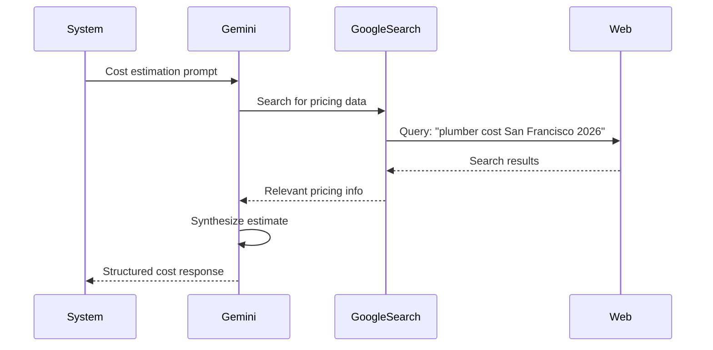

# AI Cost Estimation - Technical Deep Dive

## Overview

This document provides a detailed technical explanation of how AI-powered cost estimation works in the HomeApp system, including the AI model, prompting strategies, response parsing, and validation mechanisms.

## AI Model & Configuration

### Gemini 2.0 Flash Experimental

**Model Selection Rationale**:
- **Speed**: Fast response times (2-4 seconds typical)
- **Cost-Effective**: Lower cost per token than larger models
- **Search Grounding**: Built-in Google Search integration
- **Structured Output**: Good at following formatting instructions
- **Current Data**: Access to real-time web information

**Model Configuration**:
```python
model = 'gemini-3.1-flash-lite-preview'
temperature = 0.3  # Lower for consistent cost estimates
top_p = 0.8
top_k = 40
max_output_tokens = 2048
tools = [GoogleSearch()]  # Enable search grounding
```

**Why Low Temperature (0.3)?**
- Cost estimates need consistency
- Reduce creative variations
- More predictable ranges
- Better parseability

## Google Search Grounding

### How It Works



### Search Queries Generated

The AI automatically generates search queries like:
- "average cost [repair_type] [location] 2026"
- "plumber hourly rate [city] [state]"
- "[material] cost [location] 2026"
- "[repair_type] DIY cost materials"
- "professional [repair_type] service cost"

### Benefits

1. **Real-Time Data**: Current 2026 pricing
2. **Location-Specific**: Regional market rates
3. **Material Costs**: Up-to-date material pricing
4. **Labor Rates**: Current hourly rates by trade
5. **Market Trends**: Recent price changes

## Prompt Engineering

### Prompt Structure

```
┌─────────────────────────────────────────┐
│         Context Section                  │
│  • Repair diagnosis                      │
│  • Location (if available)               │
│  • Repair type category                  │
│  • Severity level                        │
│  • Complexity factors                    │
└─────────────────────────────────────────┘
                  ↓
┌─────────────────────────────────────────┐
│         Task Definition                  │
│  • Provide structured cost estimates     │
│  • DIY vs Professional comparison        │
│  • Current 2026 pricing                  │
│  • Regional considerations               │
└─────────────────────────────────────────┘
                  ↓
┌─────────────────────────────────────────┐
│         Output Format                    │
│  • DIY cost estimate section             │
│  • Professional cost estimate section    │
│  • Cost comparison section               │
│  • Recommendations section               │
│  • Structured, parseable format          │
└─────────────────────────────────────────┘
                  ↓
┌─────────────────────────────────────────┐
│         Requirements & Constraints       │
│  • Use 2026 pricing                      │
│  • Consider location                     │
│  • Account for complexity                │
│  • Provide ranges, not single values     │
│  • Be specific about inclusions          │
└─────────────────────────────────────────┘
```

### Example Prompt

```
You are a home repair cost estimation expert. Provide accurate, current cost estimates for the following repair in San Francisco, CA.

**Repair Diagnosis:** Leaking pipe under kitchen sink, appears to be a loose connection

**Repair Type:** Plumbing
**Severity:** moderate
**Complexity Factors:** Standard

Please provide cost estimates in the following format:

1. **DIY Cost Estimate:**
   - Cost range (materials only, in 2026 dollars)
   - What's included (specific materials, tools needed)
   - Time estimate
   - Skill level required
   - Potential savings vs professional

2. **Professional Service Cost Estimate:**
   - Cost range (labor + materials in San Francisco, CA, in 2026 dollars)
   - What's included (labor, materials, warranty, permits if needed)
   - Typical duration
   - Benefits of professional service

3. **Cost Comparison:**
   - DIY savings percentage
   - Professional benefits (safety, warranty, expertise)
   - Important considerations (complexity, safety, code compliance)

4. **Recommendations:**
   - When DIY is appropriate
   - When professional service is recommended
   - Next steps for the homeowner

**Important:** 
- Use current 2026 pricing
- Consider regional cost variations in San Francisco, CA
- Be specific about materials and labor
- Account for complexity factors: none
- Provide realistic ranges, not single point estimates

Return your response in a structured format that can be parsed into JSON.
```

### Prompt Templates

See `prompts.py` for specialized templates:

1. **Location Pricing Prompt**
```python
get_location_pricing_prompt(trade="plumber", location="San Francisco, CA")
```
Queries: Regional labor rates, cost-of-living adjustments, typical service fees

2. **Material Cost Prompt**
```python
get_material_cost_prompt(materials="PEX pipe, fittings", repair_type="plumbing leak")
```
Queries: Current material costs, where to buy, seasonal variations

3. **Complexity Analysis Prompt**
```python
get_complexity_analysis_prompt(diagnosis="Electrical panel upgrade")
```
Analyzes: Access difficulty, skill level, time, safety, permits, DIY feasibility

4. **Market Trends Prompt**
```python
get_market_trends_prompt(repair_type="HVAC repair", location="Seattle, WA")
```
Queries: Current market rates, seasonal variations, labor availability

## Response Parsing

### AI Response Format

The AI typically returns structured text like:

```
## 1. DIY Cost Estimate

**Cost Range:** $25-120

**What's Included:**
- Pipe repair clamp or epoxy ($15-40)
- Replacement fittings ($10-30)
- Plumber's tape and sealant ($5-15)
- Basic wrench set (if not owned) ($20-50)

**Time Estimate:** 1-3 hours

**Skill Level Required:** Beginner to Intermediate

**Potential Savings:** 60-75% compared to professional service

...
```

### Parsing Strategy

```python
def _parse_ai_response_to_json(ai_response, diagnosis, repair_details):
    # 1. Extract cost ranges using regex
    diy_match = re.search(r'DIY.*?[\$](\d+)[^\d]*[\$](\d+)', ai_response)
    pro_match = re.search(r'Professional.*?[\$](\d+)[^\d]*[\$](\d+)', ai_response)
    
    # 2. Extract sections by headers
    sections = re.split(r'\n\s*\d+\.\s*\*\*', ai_response)
    diy_section = find_section_with_keyword(sections, 'DIY')
    pro_section = find_section_with_keyword(sections, 'Professional')
    
    # 3. Extract lists (includes, benefits, etc.)
    diy_includes = extract_bullet_list(diy_section, 'includes')
    service_includes = extract_bullet_list(pro_section, 'includes')
    
    # 4. Build structured JSON
    return {
        "costEstimates": {
            "repair_type": diagnosis,
            "DIY": {
                "cost_range": format_range(diy_match),
                "includes": diy_includes,
                ...
            },
            "Service": {
                "cost_range": format_range(pro_match),
                "includes": service_includes,
                ...
            },
            ...
        }
    }
```

### Regex Patterns

**Cost Range Extraction**:
```regex
# Pattern 1: $XX-$YY
\$\s*(\d+(?:,\d{3})*(?:\.\d{2})?)\s*[-–—]\s*\$?\s*(\d+(?:,\d{3})*(?:\.\d{2})?)

# Pattern 2: $XX to $YY
\$\s*(\d+(?:,\d{3})*(?:\.\d{2})?)\s+to\s+\$?\s*(\d+(?:,\d{3})*(?:\.\d{2})?)

# Pattern 3: Starting at $XX
(?:starting at|from)\s+\$\s*(\d+(?:,\d{3})*(?:\.\d{2})?)
```

**List Extraction**:
```regex
# Bullet points
[-•]\s*([^\n]+)

# Numbered lists
\d+\.\s*([^\n]+)
```

### Fallback Parsing

If regex fails:
1. Use default ranges based on repair type
2. Generate generic includes lists
3. Create standard recommendations
4. Still return valid JSON structure

## Location Intelligence

### Address Parsing

```python
def _extract_location_info(property_address):
    # Input: "123 Market St, San Francisco, CA 94103"
    
    parts = property_address.split(',')
    # ['123 Market St', ' San Francisco', ' CA 94103']
    
    city = parts[-2].strip()  # "San Francisco"
    state_part = parts[-1].strip()  # "CA 94103"
    state = re.match(r'^([A-Z]{2})', state_part).group(1)  # "CA"
    
    location_string = f"{city}, {state}"  # "San Francisco, CA"
    
    return city, state, location_string
```

### Regional Cost Adjustments

```python
REGIONAL_MULTIPLIERS = {
    "San Francisco": 1.4,   # 40% above baseline
    "New York": 1.35,       # 35% above baseline
    "Los Angeles": 1.25,    # 25% above baseline
    "Seattle": 1.2,         # 20% above baseline
    "default": 1.0          # Baseline
}

def apply_regional_adjustment(base_cost, location):
    multiplier = get_multiplier_for_location(location)
    return base_cost * multiplier
```

### Location Context in Prompts

The location is passed to AI in multiple ways:
1. **Explicit mention**: "in San Francisco, CA"
2. **Search queries**: AI generates location-specific searches
3. **Context**: "Consider regional cost variations in [location]"

## Complexity Analysis

### Repair Categorization

```python
def _extract_repair_details(diagnosis):
    diagnosis_lower = diagnosis.lower()
    
    # Identify repair category
    if any(word in diagnosis_lower for word in ["plumb", "leak", "pipe"]):
        repair_type = "Plumbing"
    elif any(word in diagnosis_lower for word in ["electric", "outlet"]):
        repair_type = "Electrical"
    elif any(word in diagnosis_lower for word in ["hvac", "ac"]):
        repair_type = "HVAC"
    # ... more categories
    
    return {
        "repair_type": repair_type,
        "severity": assess_severity(diagnosis),
        "complexity_factors": identify_complexity(diagnosis)
    }
```

### Severity Assessment

```python
def assess_severity(diagnosis):
    if any(word in diagnosis for word in ["emergency", "urgent", "severe"]):
        return "high"
    elif any(word in diagnosis for word in ["minor", "small", "simple"]):
        return "low"
    else:
        return "moderate"
```

### Complexity Factors

Detected automatically from diagnosis:
- **Difficult access**: "hard to reach", "confined space", "crawl space"
- **Permits required**: "permit", "code", "inspection"
- **Safety concerns**: "safety", "hazard", "dangerous", "electrical"
- **Structural work**: "structural", "foundation", "load-bearing"

Impact on estimates:
- Increases professional cost ranges
- Strengthens professional recommendations
- Adjusts complexity descriptions
- Adds safety warnings

## Confidence Scoring

### Calculation

```python
def calculate_confidence(ai_estimate, location, service_data):
    confidence = 0.7  # Base confidence for AI estimate
    
    # Boost for location
    if location:
        confidence += 0.1
    
    # Boost for service provider data
    if service_data and service_data.has_pricing:
        confidence += 0.1
    
    # Boost for successful cost extraction
    if has_valid_cost_ranges(ai_estimate):
        confidence += 0.1
    
    return min(confidence, 1.0)  # Cap at 1.0
```

### Confidence Thresholds

```python
MIN_AI_CONFIDENCE_THRESHOLD = 0.6

if confidence >= 0.6:
    return ai_estimate  # Use AI
else:
    return fallback_estimate  # Use hardcoded library
```

### Confidence Interpretation

- **0.9-1.0**: Excellent - Location + calibration + valid extraction
- **0.8-0.9**: Very Good - Location + calibration OR location + valid extraction
- **0.7-0.8**: Good - Location provided OR calibration available
- **0.6-0.7**: Acceptable - AI only, minimal context
- **<0.6**: Low - Fallback triggered

## Validation

### Cost Range Validation

```python
def validate_cost_ranges(cost_estimate):
    diy_range = parse_range(cost_estimate['DIY']['cost_range'])
    service_range = parse_range(cost_estimate['Service']['cost_range'])
    
    # Check format
    if not valid_format(diy_range) or not valid_format(service_range):
        return False
    
    # Check range validity
    if diy_range.low >= diy_range.high:
        return False
    if service_range.low >= service_range.high:
        return False
    
    # Check reasonable bounds
    if any(cost < 5 or cost > 50000 for cost in all_costs):
        return False
    
    # Check DIY vs Pro ratio
    if diy_range.high > service_range.high * 1.5:
        return False  # DIY shouldn't be much more expensive
    
    return True
```

### Validation Rules

1. **Format**: Must match `$XX-YY` pattern
2. **Range**: Low < High for both DIY and Professional
3. **Minimum**: All costs >= $5
4. **Maximum**: All costs <= $50,000
5. **Ratio**: DIY high <= Professional high × 1.5
6. **Logic**: Professional generally higher than DIY

### Validation Failure Handling

If validation fails:
1. Log validation error with details
2. Decrement confidence score
3. If confidence < threshold, trigger fallback
4. Return hardcoded estimate

## Error Handling

### AI Call Failures

```python
try:
    response = client.models.generate_content(...)
except TimeoutError:
    logger.error("AI estimation timeout")
    return None, 0.0, "timeout"
except APIError as e:
    logger.error(f"AI API error: {e}")
    return None, 0.0, "api_error"
except Exception as e:
    logger.error(f"Unexpected error: {e}")
    return None, 0.0, "error"
```

### Graceful Degradation

```
AI Estimation
    ↓
[Fails or low confidence]
    ↓
Fallback to Hardcoded Library
    ↓
[Always succeeds]
    ↓
Return Valid Estimate
```

### Timeout Protection

```python
AI_ESTIMATION_TIMEOUT = 30  # seconds

# Gemini client timeout
client = genai.Client(timeout=AI_ESTIMATION_TIMEOUT)

# If timeout occurs, fallback is triggered
```

## Performance Optimization

### Response Time

**Target**: <5 seconds for AI estimation

**Optimization Strategies**:
1. **Low temperature**: Faster generation
2. **Token limit**: 2048 max (sufficient for estimates)
3. **Parallel processing**: Service data extraction concurrent
4. **Early validation**: Fail fast on invalid inputs

### Caching (Future)

Planned caching strategy:
```python
cache_key = hash(diagnosis + location + repair_type)
if cache_key in cache and not_expired(cache[cache_key]):
    return cache[cache_key]
else:
    estimate = call_ai(...)
    cache[cache_key] = estimate
    return estimate
```

Cache TTL: 24 hours (configurable)

## Monitoring & Debugging

### Key Metrics

1. **AI Success Rate**: % of successful AI calls
2. **Average Confidence**: Mean confidence score
3. **Validation Pass Rate**: % passing validation
4. **Latency Distribution**: P50, P95, P99
5. **Fallback Rate**: % triggering fallback

### Logging

```python
# AI estimation attempt
logger.info(f"AI estimation for: {diagnosis[:100]}, location: {location}")

# AI success
logger.info(f"AI estimation successful: confidence={confidence:.2f}")

# AI failure
logger.warning(f"AI estimation failed: reason={reason}")

# Validation failure
logger.warning(f"Validation failed: {validation_error}")

# Fallback trigger
logger.warning(f"Fallback triggered: {fallback_reason}")
```

### Debug Mode

```python
LOG_AI_RESPONSES = True  # Log full AI responses

if LOG_AI_RESPONSES:
    logger.debug(f"AI response: {ai_response}")
    logger.debug(f"Parsed estimate: {json.dumps(estimate)}")
```

## Best Practices

### 1. Always Provide Location

```python
# Good
query = {
    "diagnosis": "Leaking pipe",
    "property_address": "123 Main St, San Francisco, CA"
}

# Less optimal
query = {
    "diagnosis": "Leaking pipe"
}
```

### 2. Detailed Diagnoses

```python
# Good - Specific
diagnosis = "Leaking pipe under kitchen sink, appears to be loose connection at P-trap"

# Less optimal - Vague
diagnosis = "Pipe problem"
```

### 3. Include Service Data When Available

```python
# Best - With calibration
query = {
    "diagnosis": "...",
    "property_address": "...",
    "serviceResults": {...}
}
```

### 4. Monitor Confidence Scores

```python
# Track confidence distribution
if confidence < 0.7:
    alert("Low confidence AI estimates")
```

### 5. Validate Estimates in Production

```python
# Collect actual quotes
# Compare to AI estimates
# Adjust thresholds based on accuracy
```

## Future Enhancements

### Planned Improvements

1. **Fine-tuned Model**: Train on historical cost data
2. **Multi-modal Input**: Accept images for better diagnosis
3. **Historical Tracking**: Learn from past estimates
4. **User Feedback**: Incorporate accuracy feedback
5. **A/B Testing**: Compare AI vs hardcoded accuracy

### Research Areas

- **Ensemble Methods**: Combine multiple AI models
- **Reinforcement Learning**: Improve from user feedback
- **Cost Prediction Models**: ML models for specific repair types
- **Seasonal Adjustments**: Automatic seasonal pricing
- **Supply Chain Integration**: Real-time material costs

## Related Documentation

- [Overview](OVERVIEW.md)
- [Configuration Guide](CONFIGURATION.md)
- [API Integration](API_INTEGRATION.md)
- [Testing Guide](TESTING.md)

---

**Last Updated**: January 18, 2026
**Version**: 1.0
