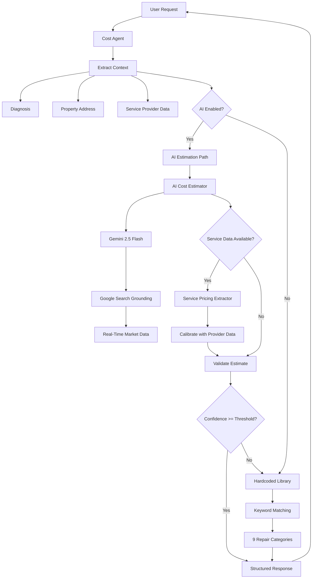

# Cost Estimation System - Overview

## Introduction

The Cost Estimation System is an AI-powered service that provides accurate, location-aware cost estimates for home repairs, vehicle maintenance, and property care services. It combines cutting-edge AI technology (Gemini with Google Search grounding) with reliable fallback mechanisms to ensure consistent, high-quality estimates.

## System Architecture

### High-Level Architecture



### Component Architecture

```
┌─────────────────────────────────────────────────────────────────┐
│                      Cost Agent (agent.py)                       │
│                         Orchestrator                             │
│                                                                   │
│  • Extracts context (diagnosis, location, service data)          │
│  • Routes to AI or fallback                                      │
│  • Manages confidence thresholds                                 │
│  • Logs decisions and metrics                                    │
└────────────────────────┬────────────────────────────────────────┘
                         │
         ┌───────────────┼───────────────┐
         │               │               │
         ▼               ▼               ▼
┌────────────────┐ ┌─────────────┐ ┌──────────────┐
│ AI Estimator   │ │  Service    │ │  Hardcoded   │
│ (Primary Path) │ │  Pricing    │ │   Library    │
│                │ │ (Calibration)│ │  (Fallback)  │
└────────────────┘ └─────────────┘ └──────────────┘
         │               │               │
         ▼               ▼               ▼
┌────────────────┐ ┌─────────────┐ ┌──────────────┐
│ • Location     │ │ • SerpAPI   │ │ • 9 repair   │
│   extraction   │ │   parsing   │ │   categories │
│ • Complexity   │ │ • SerpAPI      │ │ • Keyword    │
│   analysis     │ │   parsing   │ │   matching   │
│ • Prompt       │ │ • Price     │ │ • Static     │
│   building     │ │   extraction│ │   ranges     │
│ • Gemini call  │ │ • Weighted  │ │ • Proven     │
│ • Validation   │ │   calibrate │ │   reliable   │
└────────────────┘ └─────────────┘ └──────────────┘
         │               │               │
         └───────────────┴───────────────┘
                         │
                         ▼
              ┌──────────────────────┐
              │  Configuration       │
              │  (config.py)         │
              │                      │
              │  • Feature flags     │
              │  • Thresholds        │
              │  • Regional          │
              │    multipliers       │
              │  • Validation rules  │
              └──────────────────────┘
```

## Core Components

### 1. Cost Agent (`agent.py`)

**Role**: Main orchestrator that coordinates all cost estimation logic.

**Responsibilities**:

- Extract context from input (diagnosis, location, service data)
- Route to AI estimation or fallback based on configuration
- Manage confidence thresholds and validation
- Log decisions and metrics
- Return structured cost estimates

**Key Functions**:

- `cost_estimation(query)` - Main entry point
- `cost_estimation_diy(query)` - DIY-only estimates
- `_estimate_with_ai()` - AI estimation coordinator
- `_extract_diagnosis_from_query()` - Parse diagnosis
- `_extract_property_address_from_query()` - Parse location
- `_extract_service_results_from_query()` - Parse provider data

**Decision Logic**:

```python
if AI_ENABLED and diagnosis_valid:
    ai_estimate, confidence = estimate_with_ai()
    if confidence >= THRESHOLD:
        return ai_estimate
# Fallback to hardcoded library
return hardcoded_estimate()
```

### 2. AI Cost Estimator (`ai_cost_estimator.py`)

**Role**: AI-powered cost estimation using Gemini with Google Search grounding.

**Responsibilities**:

- Extract location information from addresses
- Analyze repair complexity and categorize repair type
- Build structured prompts for AI
- Call Gemini API with search grounding
- Parse AI responses into structured JSON
- Validate cost ranges
- Calculate confidence scores

**Key Functions**:

- `estimate_costs_with_ai()` - Main AI estimation
- `_extract_location_info()` - Parse city/state
- `_extract_repair_details()` - Categorize and analyze
- `_build_cost_estimation_prompt()` - Create AI prompt
- `_parse_ai_response_to_json()` - Parse response
- `validate_cost_ranges()` - Ensure realistic estimates

**AI Model Configuration**:

- Model: `gemini-3.1-flash-lite`
- Temperature: 0.3 (consistent estimates)
- Max tokens: 2048
- Tools: Google Search grounding enabled

**Repair Categories Detected**:

- Plumbing (leaks, drains, faucets)
- Electrical (outlets, switches, wiring)
- HVAC (AC, furnace, heating)
- Roofing (shingles, leaks)
- Drywall/Painting
- Appliances (washer, dryer, refrigerator)
- Pest Control
- Automotive (dents, scratches)

**Complexity Factors**:

- Difficult access
- Permits required
- Safety concerns
- Structural work

### 3. Service Pricing Extractor (`service_pricing_extractor.py`)

**Role**: Extract and process pricing from service provider results.

**Responsibilities**:

- Parse SerpAPI results for pricing
- Parse SerpAPI results and price levels
- Combine pricing from multiple sources
- Calculate confidence based on data coverage
- Calibrate AI estimates with real market data

**Key Functions**:

- `extract_pricing_from_serp_results()` - Parse SerpAPI
- `extract_pricing_from_yelp_results()` - Parse SerpAPI
- `combine_service_provider_pricing()` - Merge sources
- `calibrate_ai_estimate_with_provider_data()` - Adjust AI
- `extract_and_combine_all_pricing()` - One-stop extraction

**Price Extraction Patterns**:

```regex
$XX-$YY          # Range with dashes
$XX to $YY       # Range with "to"
Starting at $XX  # Minimum price
From $XX         # Starting price
$XX              # Single price (±30%)
```

**SerpAPI Price Level Mapping**:

- `$` → $50-150
- `$$` → $150-300
- `$$$` → $300-600
- `$$$$` → $600-1500

**Calibration Formula**:

```
calibrated_cost = (ai_cost × 0.7) + (provider_cost × 0.3)
```

### 4. Configuration (`config.py`)

**Role**: Centralized configuration and feature flags.

**Feature Flags**:

```python
USE_AI_COST_ESTIMATION = True  # Enable AI
USE_SERVICE_PROVIDER_CALIBRATION = True  # Enable calibration
ENABLE_COST_CACHING = False  # Enable caching (future)
```

**Thresholds**:

```python
MIN_AI_CONFIDENCE_THRESHOLD = 0.6  # AI confidence minimum
MIN_PROVIDER_DATA_CONFIDENCE = 0.5  # Calibration minimum
```

**Timeouts**:

```python
AI_ESTIMATION_TIMEOUT = 30  # seconds
PROVIDER_PRICING_TIMEOUT = 10  # seconds
```

**Regional Cost Multipliers**:

```python
{
    "San Francisco": 1.4,
    "New York": 1.35,
    "Los Angeles": 1.25,
    "Seattle": 1.2,
    "Boston": 1.2,
    "default": 1.0
}
```

**Validation Rules**:

```python
MIN_VALID_COST = 5.0  # Minimum cost
MAX_VALID_COST = 50000.0  # Maximum cost
MAX_DIY_TO_PRO_RATIO = 1.5  # DIY shouldn't exceed 1.5x pro
```

### 5. Prompt Templates (`prompts.py`)

**Role**: Structured prompts for different estimation scenarios.

**Available Templates**:

1. `get_location_pricing_prompt()` - Regional labor rates
2. `get_material_cost_prompt()` - Current material costs
3. `get_complexity_analysis_prompt()` - Repair difficulty
4. `get_market_trends_prompt()` - Pricing trends
5. `get_comprehensive_cost_estimate_prompt()` - Full estimation
6. `get_cost_validation_prompt()` - Estimate validation

**Prompt Structure**:

```
Context: Diagnosis, location, repair type, severity
Task: Provide structured cost estimates
Requirements:
  - DIY cost range (materials only)
  - Professional cost range (labor + materials)
  - What's included in each
  - Complexity assessment
  - Recommendations
Format: Structured text parseable to JSON
```

### 6. Hardcoded Library (Fallback)

**Role**: Reliable fallback with proven cost estimates.

**Coverage**: 9 common repair categories

1. Automotive paint scratch repair
2. Minor automotive dent repair
3. Clear clogged sink or tub drain
4. Minor interior plumbing leak
5. Roof shingle patch or minor leak repair
6. HVAC diagnostic and tune-up
7. Replace standard electrical outlet or switch
8. Drywall hole patch and finishing
9. Major appliance diagnostic and repair

**Matching Logic**:

- Keyword-based matching against diagnosis
- First match wins
- Generic fallback if no match

## Data Flow

### Request Flow

```
1. User Request
   ↓
2. Cost Agent receives query
   ↓
3. Extract context:
   - Diagnosis (required)
   - Property address (optional)
   - Service results (optional)
   ↓
4. Check AI enabled?
   ├─ Yes → AI Estimation Path
   │   ↓
   │   5a. Extract location info
   │   6a. Analyze repair complexity
   │   7a. Build AI prompt
   │   8a. Call Gemini with search grounding
   │   9a. Parse response to JSON
   │   10a. Validate cost ranges
   │   11a. Check confidence >= threshold?
   │       ├─ Yes → Check service data?
   │       │   ├─ Yes → Calibrate with provider data
   │       │   └─ No → Return AI estimate
   │       └─ No → Go to fallback
   │
   └─ No → Fallback Path
       ↓
       5b. Match keywords to categories
       6b. Build response from hardcoded library
       7b. Return fallback estimate
       ↓
8. Return structured JSON response
```

### Calibration Flow

```
1. AI generates initial estimate
   ↓
2. Check if service results available?
   ├─ No → Return AI estimate
   └─ Yes → Continue
       ↓
3. Extract SerpAPI pricing
   ↓
4. Extract SerpAPI pricing
   ↓
5. Combine pricing from both sources
   ↓
6. Calculate combined confidence
   ↓
7. Check confidence >= threshold?
   ├─ No → Return AI estimate
   └─ Yes → Continue
       ↓
8. Apply weighted calibration:
   calibrated = (AI × 0.7) + (Provider × 0.3)
   ↓
9. Update estimate with calibrated values
   ↓
10. Add calibration note to response
    ↓
11. Return calibrated estimate
```

## Key Capabilities

### Location-Aware Pricing

**How it works**:

1. Extract city and state from property address
2. Look up regional cost multiplier
3. Pass location to AI for context
4. AI uses Google Search to find local rates
5. Apply regional multiplier if needed

**Example**:

```
Same plumbing repair:
- San Francisco: $220-550 (1.4x multiplier)
- Denver: $180-400 (1.05x multiplier)
- Rural Kansas: $150-350 (1.0x multiplier)
```

### Complexity Analysis

**Factors Analyzed**:

- **Repair Type**: Plumbing, electrical, HVAC, etc.
- **Severity**: Low, moderate, high
- **Access Difficulty**: Easy, moderate, difficult
- **Safety Concerns**: Electrical, structural, hazardous
- **Permits Required**: Building codes, inspections
- **Skill Level**: Beginner, intermediate, advanced, professional-only

**Impact on Estimates**:

- High complexity → Higher pro costs, stronger pro recommendation
- Low complexity → Lower costs, DIY feasibility emphasized
- Safety concerns → Professional-only recommendation

### Real-Time Market Data

**Data Sources**:

- **Google Search Grounding**: Current 2026 pricing from web
- **Material Costs**: Lumber, copper, appliances, etc.
- **Labor Rates**: Regional hourly rates by trade
- **Seasonal Factors**: Price variations by season
- **Market Trends**: Supply chain, demand levels

**Update Frequency**:

- AI queries fresh data on each request
- No stale cached pricing
- Reflects current market conditions

### Confidence Scoring

**Factors Affecting Confidence**:

- **Base**: 0.7 (AI estimate quality)
- **Location provided**: +0.1
- **Service data available**: +0.1
- **Cost ranges extracted**: +0.1
- **Calibration applied**: +0.1

**Confidence Ranges**:

- **0.9-1.0**: Excellent (location + calibration)
- **0.7-0.9**: Good (AI with location or calibration)
- **0.6-0.7**: Acceptable (AI only, no location)
- **<0.6**: Low (fallback triggered)

## Performance Characteristics

### Latency

**AI Estimation**:

- Target: <5 seconds
- Typical: 2-4 seconds
- Includes: Gemini call + search grounding

**Fallback**:

- Target: <100ms
- Typical: 10-50ms
- Includes: Keyword matching + response building

**Calibration Overhead**:

- Additional: 100-500ms
- Includes: Parsing provider data + calibration

### Accuracy

**AI Estimates**:

- Target: ±20% of actual quotes
- Varies by: Location data quality, repair complexity
- Improved by: Calibration with provider data

**Fallback Estimates**:

- Proven ranges for common repairs
- Generic but reliable
- May not reflect regional variations

### Reliability

**AI Path**:

- Success rate: Target >80%
- Fallback on: Timeout, low confidence, validation failure
- Graceful degradation

**Fallback Path**:

- Success rate: 100%
- Always available
- Proven reliable

## Integration Points

### Input

**Required**:

- `diagnosis`: Repair description (string, >=10 chars)

**Optional**:

- `property_address`: Full address for location-aware pricing
- `serviceResults`: Provider data for calibration
  - `localPros.serpAPIResults`: SerpAPI results
  - `localPros.googleSearchResults`: SerpAPI results

### Output

**Structured JSON**:

```json
{
  "costEstimates": {
    "repair_type": "string",
    "DIY": { ... },
    "Service": { ... },
    "comparison": { ... },
    "recommendation": { ... }
  }
}
```

### External Dependencies

**Required**:

- Gemini API (genai.Client)
- Google Search grounding

**Optional**:

- SerpAPI results (for calibration)
- SerpAPI results (for calibration)

## Monitoring & Observability

### Key Metrics

1. **AI Usage Rate**: % using AI vs fallback
2. **Confidence Distribution**: Average and percentiles
3. **Calibration Rate**: % calibrated with provider data
4. **Fallback Reasons**: Why fallback triggered
5. **Latency**: P50, P95, P99 for AI and fallback
6. **Error Rate**: API failures, timeouts, validation failures

### Logging Events

- AI estimation success/failure
- Fallback triggers with reasons
- Calibration events
- Validation failures
- Configuration changes
- Performance metrics

### Alerts

- AI error rate >10%
- Fallback rate >30%
- Average confidence <0.6
- Latency P95 >10s
- Validation failure rate >5%

## Security & Privacy

### Data Handling

- **Diagnosis**: Sent to Gemini API
- **Location**: City/state only (no full address to AI)
- **Service Data**: Processed locally, not sent to external APIs
- **No PII**: System doesn't collect or store personal information

### API Security

- Gemini API key required
- Rate limiting recommended
- Timeout protection
- Input validation

## Limitations

### Current Limitations

1. **Language**: English only
2. **Geography**: US-focused (regional multipliers)
3. **Repair Types**: Optimized for common home/auto repairs
4. **Historical Data**: No cost trend tracking yet
5. **Caching**: Not yet implemented

### Known Issues

1. **Very rare repairs**: May fall back to generic estimates
2. **International addresses**: May not parse correctly
3. **Ambiguous diagnoses**: May require clarification
4. **Provider data quality**: Varies by location

## Future Enhancements

### Planned Features

- Cost estimate caching
- Historical cost tracking
- User feedback loop
- Additional pricing APIs
- Seasonal adjustments
- Multi-language support

### Under Consideration

- Machine learning for confidence scoring
- A/B testing framework
- Real-time cost index
- Property value integration
- Warranty cost analysis

## Related Documentation

- [AI Cost Estimation Details](AI_COST_ESTIMATION.md)
- [Configuration Guide](CONFIGURATION.md)
- [API Integration](API_INTEGRATION.md)
- [Testing Guide](TESTING.md)
- [Deployment Guide](DEPLOYMENT.md)
- [Troubleshooting](TROUBLESHOOTING.md)

---

**Last Updated**: January 18, 2026
**Version**: 1.0
