# B2B landing pilot plan

**Status:** Tier A + Tier B implemented (2026-06-17)  
**Branch:** `plan/b2b-landing-pilot`  
**Last updated:** 2026-06-17  
**Goal:** Explore the B2B market and convert inbound interest into **qualified pilot conversations** — without building org/team billing or multi-tenant product features yet.

---

## Context

AssetMem AI is a B2C product today (individual Firebase users, Stripe Free/Plus/Pro). The **technical core** already supports B2B pilot demos:

| Capability | Status | Relevant paths |
|------------|--------|----------------|
| Checkpoint AI + condition scores | Shipped | `docs/checkpoint/` |
| Insurance / move-in-out PDF reports | Shipped | `docs/property/PROPERTY_REPORTS_PLAN.md`, `gcp/common/report/template_presets.py` |
| Document Q&A (policies, inspections) | Shipped | `docs/docs_chat/` |
| Shareable report + chat links | Shipped | `apps/common/src/lib/shared-report.ts`, `shared-chat.ts` |
| Org accounts, SSO, API keys | **Not built** | Do not promise on landing |

The landing page (`apps/webapp/src/app/landing/`) uses a **dual-path** model on one URL: B2C-primary by default (`Get Started` → `/login`, `#pricing`), with a parallel B2B path (`#pilot`, Talk to us). Outbound B2B campaigns can use `?audience=b2b` for a team-first hero. Segment detail pages live under `/solutions/*`.

---

## Success criteria

| Metric | Target (first 90 days after deploy) |
|--------|-------------------------------------|
| Pilot form submissions | ≥ 5 qualified leads |
| Pilot calls booked | ≥ 3 conversations |
| Segment signal | At least 2 distinct ICPs represented in form data |
| B2C regression | Signup and checkout conversion unchanged (monitor GA4) |

**Qualified lead:** company name + role + segment + portfolio size + defined use case.

---

## Implementation tiers

### Tier A — Ship first (1–2 days)

Minimum viable B2B landing for outbound and LinkedIn tests.

| # | Change | Files |
|---|--------|-------|
| A1 | Dual-path hero: B2B headline option + `Book a pilot` CTA | `apps/webapp/src/lib/site.ts`, `landing-client.tsx` |
| A2 | New `#pilot` section (program overview + external form embed) | `landing-client.tsx`, optional `components/landing/pilot-section.tsx` |
| A3 | Enterprise / Pilot card on pricing (no Stripe) | `landing-pricing-section.tsx`, `components/billing/plan-pricing-cards.tsx`, `plan-pricing-data.ts` |
| A4 | Reframe 3–4 use-case cards for B2B language | `landing-client.tsx` (use-cases array) |
| A5 | Upgrade `#contact` → pilot-focused CTA block | `landing-client.tsx` |
| A6 | Analytics labels on B2B CTAs | `landing-client.tsx`, `landing-header.tsx`, `lib/analytics.ts` |
| A7 | Pilot form URL + email via Firebase Remote Config (`pilot_form_url`, `pilots_email`); env fallbacks | `landing-remote-config.ts`, `pilot-config.ts`, `.env.example` |

### Tier B — Better inbound (3–5 days)

| # | Change | Files |
|---|--------|-------|
| B1 | Nav: **Solutions** dropdown + **Pilot** link | `landing-header.tsx` |
| B2 | Solution pages (copy-only routes) | `apps/webapp/src/app/solutions/*/page.tsx` |
| B3 | Trust / security block (honest, no overclaim) | `components/landing/trust-section.tsx`, `landing-client.tsx` |
| B4 | Sample insurance report PDF (redacted) in `public/` | `public/samples/`, reports section link |
| B5 | SEO: B2B keywords + OG for solutions pages | `lib/site.ts`, per-page `metadata` |
| B6 | Top banner for B2B visitors (optional UTM `?audience=b2b`) | `landing-client.tsx` or `components/landing/b2b-banner.tsx` |

### Tier C — After first signed pilot

| # | Change |
|---|--------|
| C1 | Customer logo strip (real logos only) |
| C2 | Case study page from pilot outcome |
| C3 | Segment-specific demo videos (Remote Config, same pattern as landing demo URLs) |

**This branch / doc scope:** Tier A + Tier B spec. Tier C is post-pilot.

---

## Detailed specifications

### A1 — Hero and site constants

**File:** `apps/webapp/src/lib/site.ts`

Add B2B-oriented constants (keep B2C strings for pricing section or add separate exports):

```ts
export const SITE_HERO_HEADLINE_PRIMARY_B2B = 'AI property intelligence';
export const SITE_HERO_HEADLINE_ACCENT_B2B = 'for portfolios, claims, and field teams';

export const SITE_HERO_DESCRIPTION_B2B =
  'Capture evidence, generate audit-ready PDFs, and answer questions across properties—from one platform.';

export const SITE_B2B_KEYWORDS = [
  'property inspection software',
  'insurance claims documentation',
  'AI property condition',
  'portfolio maintenance',
  'property management AI',
];
```

**Hero layout** (`landing-client.tsx`):

- Badge: `FOR PROPERTY TEAMS & ENTERPRISE PILOTS` (replaces or alternates with `AI-POWERED INNOVATION`).
- Subhead: use B2B description (or blended: one line B2B, one line B2C below fold).
- CTAs (logged-out):
  1. **Primary:** `Book a pilot` → `#pilot` — `trackLandingCta('pilot_cta_hero')`
  2. **Secondary:** `Watch demo` (existing YouTube modal)
  3. **Tertiary (text link):** `For homeowners — see plans` → `#pricing`

Keep `Get Started` in final CTA section and pricing cards for B2C.

### A2 — Pilot program section (`#pilot`)

Insert after `#how-it-works`, before `#pricing`.

**Component:** `apps/webapp/src/components/landing/pilot-section.tsx`

**Content structure:**

1. **Headline:** 90-day pilot for property operators  
2. **Who it's for** — 4 tiles:
   - Property managers
   - Insurers & adjusters
   - Service / field teams
   - Prop-tech platforms
3. **Included today** (bullet list — only shipped features):
   - Checkpoint capture + AI condition scoring
   - Formal PDF reports (insurance, move-in/out, listing)
   - Document Q&A (inspections, policies, warranties)
   - Shareable evidence links (reports + chat)
4. **Co-designed in pilot** (roadmap framing):
   - Workflow templates, portfolio rollups, integrations
5. **Pilot shape** (suggested defaults for sales — adjust before deploy):
   - 10–50 properties, 3–5 users, 8–12 weeks
   - Weekly feedback cadence
6. **CTA:** embed or link to external form

**Env config (local / fallback):**

```bash
# apps/webapp/.env.example
NEXT_PUBLIC_PILOT_FORM_URL=https://tally.so/r/xxxx  # or Calendly / Typeform
NEXT_PUBLIC_PILOTS_EMAIL=pilots@asset-mem.com
```

**Production (preferred):** Firebase Remote Config parameters `pilot_form_url` and `pilots_email` (same fetch as landing demo URLs — see `apps/webapp/src/lib/landing-remote-config.ts`). Non-empty Remote Config values override env at runtime.

If no form URL is configured, fall back to `mailto:` using `pilots_email` / `NEXT_PUBLIC_PILOTS_EMAIL` with prefilled subject `AssetMem AI pilot request`.

**Form fields** (external form — document in ops runbook):

| Field | Type | Required |
|-------|------|----------|
| Full name | text | yes |
| Work email | email | yes |
| Company | text | yes |
| Role / title | text | yes |
| Segment | select: PM / Insurance / Service / Prop-tech / Other | yes |
| Portfolio size | select: 1–10 / 11–50 / 51–200 / 200+ properties | yes |
| Primary use case | textarea | yes |
| Timeline | select: ASAP / 1–3 mo / 3–6 mo / exploring | no |

### A3 — Enterprise pricing card

**Files:** `plan-pricing-data.ts`, `plan-pricing-cards.tsx`, `landing-pricing-section.tsx`

Add fourth tier `enterprise`:

| Field | Value |
|-------|-------|
| Name | Enterprise / Pilot |
| Price display | Custom |
| Bullets | Dedicated onboarding, custom portfolio limits, co-designed workflows, priority support |
| CTA | `Book a pilot` → `#pilot` (never Stripe checkout) |

Update pricing section heading:

- From: *Plans for homeowners and landlords*
- To: *Individuals start free. Teams and enterprises — start with a pilot.*

Keep Free / Plus / Pro unchanged.

### A4 — Use case reframes

Update copy in `landing-client.tsx` use-cases array (titles + results only; steps can stay):

| Current title | B2B title |
|---------------|-----------|
| Insurance Claim Documentation | Claims evidence for adjusters |
| Rental Move-In / Move-Out | Turnover documentation at scale |
| Seasonal Property Walkthrough | Portfolio inspection cadence |
| Property Condition Tracking | Early risk detection across units |

Section subtitle:

- From: *…homeowners and landlords stay ahead*
- To: *From single homes to multi-property operations*

Optional new card: **Vendor handoff** — share read-only report/chat link with contractors (feature exists today).

### A5 — Contact block

Replace generic `#contact` with pilot-focused block:

- Headline: *Start a pilot conversation*
- Body: response-time expectation (1 business day)
- Primary: pilot form URL
- Secondary: `pilots@asset-mem.com` mailto

### A6 — Analytics

Extend `trackLandingCta` usage (no schema change required):

| Label | Event |
|-------|-------|
| `pilot_cta_hero` | Hero Book a pilot |
| `pilot_cta_pricing_enterprise` | Enterprise card |
| `pilot_cta_footer` | Footer / contact |
| `pilot_cta_nav` | Header Pilot link |
| `solutions_pm` / `solutions_insurance` / … | Solution page CTAs |

Optional: GA4 custom event `pilot_form_click` with `segment` dimension from solution page referrer.

### B1 — Navigation

**File:** `landing-header.tsx`

Add to `NAV_LINKS`:

```ts
{ href: '#pilot', targetId: '#pilot', label: 'Pilot', sectionId: 'pilot' },
```

Tier B: **Solutions** as dropdown or link to `/solutions` hub page.

Header CTAs (logged-out):

- `Book a pilot` (primary, small) → `#pilot`
- `Sign in` (ghost) — replace single cyan Sign In when space allows

Update `checkScrollPosition` sections array in `landing-client.tsx` to include `pilot`.

### B2 — Solution pages

Create hub + four child routes:

```
apps/webapp/src/app/solutions/page.tsx              # hub
apps/webapp/src/app/solutions/property-managers/page.tsx
apps/webapp/src/app/solutions/insurance/page.tsx
apps/webapp/src/app/solutions/field-teams/page.tsx
apps/webapp/src/app/solutions/platform/page.tsx
```

Each page template:

1. Segment headline + problem statement  
2. How AssetMem helps **today** (3 bullets, shipped only)  
3. Report/checkpoint screenshot or link to sample PDF  
4. `Book a pilot` CTA → `NEXT_PUBLIC_PILOT_FORM_URL` or `/landing#pilot`  
5. Link: *Also available for individual homeowners* → `/` `#pricing`

Reuse landing dark theme styles (extract shared `LANDING_COLORS` to `lib/landing-theme.ts` if duplication becomes painful).

### B3 — Trust section

**File:** `components/landing/trust-section.tsx`

Bullets (factual):

- Built on Google Cloud (Cloud Run, Vertex AI, Firebase)
- Per-account data isolation (Firebase Auth + user-scoped Firestore)
- Encryption in transit (HTTPS) and at rest (GCP defaults)

**Honest roadmap line:**

> Team accounts, SSO, and organization admin are available through our enterprise pilot program — not yet in self-serve signup.

### B4 — Sample report

- Export redacted insurance-purpose PDF from staging demo property
- Store at `apps/webapp/public/samples/assetmem-insurance-report-sample.pdf`
- Link from `#reports` section and `/solutions/insurance`

---

## File checklist (implementation)

```
apps/webapp/src/lib/site.ts                          # B2B copy + keywords
apps/webapp/src/lib/pilot-config.ts                  # NEW — form URL, pilots email
apps/webapp/src/lib/landing-theme.ts                 # NEW (Tier B) — shared colors
apps/webapp/src/lib/analytics.ts                     # optional pilot_form_click
apps/webapp/src/components/landing/pilot-section.tsx # NEW
apps/webapp/src/components/landing/trust-section.tsx # NEW (Tier B)
apps/webapp/src/components/billing/plan-pricing-data.ts
apps/webapp/src/components/billing/plan-pricing-cards.tsx
apps/webapp/src/app/landing/landing-client.tsx
apps/webapp/src/app/landing/landing-header.tsx
apps/webapp/src/app/landing/landing-pricing-section.tsx
apps/webapp/src/app/solutions/...                    # Tier B
apps/webapp/.env.example
apps/webapp/public/samples/...                       # Tier B
docs/marketing/B2B_LANDING_PILOT_PLAN.md             # this doc
docs/marketing/README.md
```

---

## Copy guardrails

**Do promise (shipped):**

- AI checkpoint analysis and condition scores
- Before/after comparisons
- PDF reports (insurance, rental, realtor purposes)
- Document chat with citations
- Public share links for reports and chats
- Multiple properties per user account

**Do not promise (not built):**

- Organization / team accounts
- Role-based access (admin, manager, viewer)
- SSO / SAML / SCIM
- Pooled org billing or per-seat licensing
- Partner API keys or webhooks
- White-label mobile apps
- Portfolio-wide admin dashboard

Use *"co-designed in pilot"* or *"on our enterprise roadmap"* for gaps.

---

## Deploy and ops

1. Create external pilot form (Tally / Typeform / Calendly) and publish `pilot_form_url` + `pilots_email` in Firebase Remote Config (staging/prod). Optional env fallbacks in `apphosting.*.yaml` for first paint.
2. Optional: `pilots@asset-mem.com` alias → `support@asset-mem.com`.
3. Deploy webapp via `deploy-webapp-apphosting.yaml`.
4. Smoke test: all `#pilot` anchors, solution pages, B2C signup/checkout unchanged.
5. Monitor GA4: `landing_cta_click` labels + form provider analytics.

---

## Test plan

| Case | Expected |
|------|----------|
| Logged-out visitor | Hero shows Book a pilot + Watch demo; pricing shows Enterprise card |
| Click Book a pilot | Scrolls to `#pilot` or opens form URL |
| Logged-out B2C path | Get Started → `/login`; Free tier signup still works |
| Logged-in user | Dashboard CTA unchanged; pilot section still visible |
| Mobile nav | Pilot link present; form usable |
| Deep link `/#pilot` | Scrolls to pilot section after auth load |
| Solution pages | Each CTA reaches form; no broken metadata |
| Lighthouse / a11y | No regression on landing (form iframe title attribute) |

---

## Suggested implementation order

```mermaid
flowchart LR
  A1[Hero_and_site_ts] --> A2[Pilot_section]
  A2 --> A3[Enterprise_pricing_card]
  A3 --> A4[Use_case_reframes]
  A4 --> A5[Contact_upgrade]
  A5 --> A6[Analytics]
  A6 --> DeployA[Deploy_Tier_A]
  DeployA --> B1[Nav_and_solutions]
  B1 --> B3[Trust_section]
  B3 --> B4[Sample_PDF]
  B4 --> DeployB[Deploy_Tier_B]
```



1. Tier A on `plan/b2b-landing-pilot` → PR → staging QA → prod  
2. Tier B follow-up PR (can be same branch or stacked)  
3. First outbound campaign only after Tier A is on prod

---

## Related docs

- [B2C subscription pricing](../billing/B2C_SUBSCRIPTION_PRICING_RATIONALE.md) — future org tiers noted separately from B2C
- [Property reports plan](../property/PROPERTY_REPORTS_PLAN.md) — insurance preset
- [Launch plan progress](../deployment/LAUNCH_PLAN_PROGRESS.md) — Phase 4 partner API (post-GA)
- Landing implementation: `apps/webapp/src/app/landing/`
