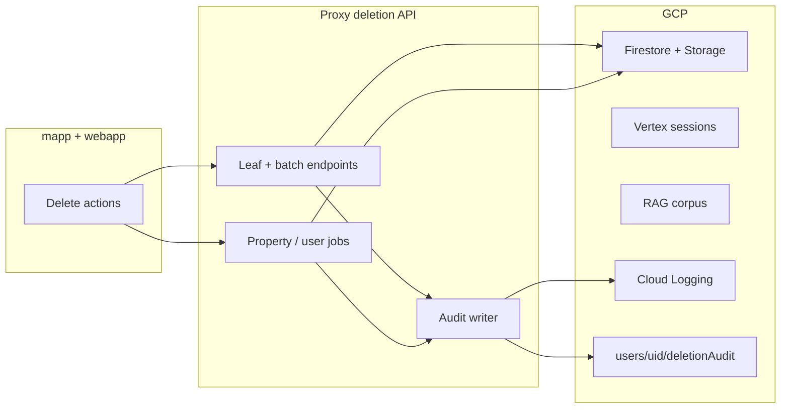
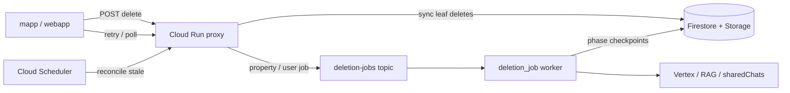

# Deletion plan (unified)

**Single source of truth** for HomeApp delete flows: user actions, proxy API, ops erasure, audit, UX, compliance, and roadmap.

Supersedes the Cursor plan `complete_delete_flows` and the former standalone ops runbook. Script how-tos remain in `apps/webapp/scripts/migration/` (linked below).

---

## Table of contents

1. [Phase status](#phase-status)
2. [Delete flows by user action](#delete-flows-by-user-action)
3. [Architecture & principles](#architecture--principles)
4. [Proxy API reference](#proxy-api-reference)
5. [Phases 1–6 (shipped)](#phases-16-shipped)
6. [Phases 7–10 (shipped)](#phases-710-shipped)
7. [Phase 11 — Deletion resilience (planned)](#phase-11--deletion-resilience-planned)
8. [Compliance, audit & retention](#compliance-audit--retention)
9. [Ops runbook — support erasure](#ops-runbook--support-erasure)
10. [Verification & scripts](#verification--scripts)
11. [Implementation order](#implementation-order)
12. [Out of scope](#out-of-scope)

---

## Phase status

| Phase | Scope | Status |
|-------|--------|--------|
| **1** | `@homeapp/common/lib/deletion` — paginated deletes, orchestrators, types | Done |
| **2** | Wire mapp/webapp delete call sites to common module | Done |
| **3** | Proxy deletion API (`gcp/proxy/api/routers/deletion.py`) | Done |
| **4** | Shared chats, RAG, metrics on delete | Done |
| **5** | `POST /deletion/user` + migration script parity | Done |
| **6** | Docs, unit tests, verify scripts | Done |
| **7** | Route **all** UI deletes through proxy | Done |
| **8** | Bulk delete APIs (checkpoints, documents, sessions) | Done |
| **9** | Delete audit trail (Firestore + Cloud Logging) | Done |
| **10** | UX polish (confirm, progress, failures, bell inbox) | Done |
| **11** | Deletion resilience (durable jobs, stale recovery, proxy-only cleanup) | In progress (11.1–11.2 done) |

---

## Delete flows by user action

### Summary matrix (today)

| Action | UI | Backend | Async? | Audited today? |
|--------|-----|---------|--------|----------------|
| Delete document | Details tab | Proxy (`POST /deletion/document` or batch) | Sync | Yes |
| Delete checkpoint | Checkpoint UI / bulk | Proxy (`POST /deletion/checkpoint` or batch) | Sync | Yes |
| Delete chat session | Session list / sidebar | Proxy (`POST /deletion/session` or batch) | Sync | Yes |
| Delete saved provider | Providers tab | **Client** `deleteDoc` only (not proxy UI) | Sync | No |
| Delete property | Property card | Tombstone + `POST /deletion/property` job | **Async** | Job doc + logs |
| **Delete account** | Settings | Firebase Auth `deleteUser` only | Sync | No |
| **Full data erasure** | Support/ops only | `POST /deletion/user` job | **Async** | Job doc + logs |

### Delete account (in-app)

**Path:** mapp Settings → Delete account; web Settings → Account.

1. Confirm dialog (Stripe not cancelled; data may remain).
2. `deleteUser()` — removes Firebase Auth.
3. `logout()` — local session cleared.

**Does not run:** proxy, property wipe, `POST /deletion/user`, audit event.

Copy: `apps/common/src/lib/account-deletion.ts`. Store compliance: `apps/mapp/docs/STORE_ACCOUNT_DELETION.md`.

### Full data erasure (after account delete or GDPR request)

Support/ops only — see [Ops runbook](#ops-runbook--support-erasure). Wipes `users/{uid}/` tree and related global data. Auth delete is a **separate** step.

### Property delete (user-initiated)

1. Client tombstone: `deletionStatus: 'deleting'`, `deletionJobId`.
2. `POST /deletion/property` → job `users/{uid}/deletionJobs/property_{propertyId}`.
3. Server: Storage first, then Firestore, Vertex, RAG, sharedChats; retries on transient gRPC errors.
4. Client polls job (up to 180s inline today). **Gap:** property hidden while deleting; no bell/listener if user leaves (Phase 10).

### Leaf deletes (document, checkpoint, session, saved provider)

Orchestrators in `apps/common/src/lib/deletion/`. **Document, checkpoint, session** (single + bulk) route through proxy in UI. **Saved provider** uses client `deleteDoc` only — see [Architecture & principles](#architecture--principles).

**Resilience (Phase 11):** no client fallbacks for proxy-routed deletes; tombstone `failed` + retry UX; durable Pub/Sub jobs for property/user erasure.

---

## Architecture & principles



- **Hard delete** for user content (not permanent soft delete). Tombstones only while async jobs run.
- **Proxy-only UI deletes** (Phase 7 + 11): document, checkpoint, session (incl. bulk), property, and user erasure — no client-side Firestore/Storage cascade when the proxy is down.
- **Saved provider delete → client only** — `deleteDoc` on `users/{uid}/properties/{propertyId}/savedProviders/{id}` from the providers tab. Property delete job still wipes `savedProviders` via server cascade; there is no proxy leaf route for single-provider remove.
- **Property / user erasure → tombstone + server job** — survives disconnect (Phase 11 makes jobs durable).
- **In-app account delete → Auth-only** — erasure is support/admin.
- **Idempotent** — missing docs / 404 = success; stable job ids for property/user jobs.

**Storage buckets:** Client files (`documents/`, `uploads/`) → `{project}.firebasestorage.app`. `GCS_BUCKET` (`homegeek-user-data-*`) is RAG only. Proxy uses `FIREBASE_STORAGE_BUCKET` or `GCP_PROJECT_ID` + `.firebasestorage.app`.

**Key code paths:**

| Layer | Path |
|-------|------|
| Common module | `apps/common/src/lib/deletion/` |
| Proxy | `gcp/proxy/api/routers/deletion.py`, `services/deletion_service.py` |
| Client URLs | `apps/mapp/lib/deletion-api.ts`, `apps/webapp/src/lib/api-deletion.ts` |

---

## Proxy API reference

All routes behind Firebase Bearer auth + secret prefix; `userId` must match token (except admin user erasure).

| Route | Purpose | Wired in UI? |
|-------|---------|--------------|
| `POST /deletion/document` | Doc + Storage + RAG | QA only |
| `POST /deletion/checkpoint` | Checkpoint + media | QA only |
| `POST /deletion/session` | Full session cascade | QA only |
| `POST /deletion/rag-files` | RAG by `gsURIs[]` | Via doc delete / jobs |
| `POST /deletion/agent-sessions` | Vertex batch | Partial (session delete) |
| `POST /deletion/session-shared-chats` | sharedChats cleanup | Partial |
| `POST /deletion/property` | Start property job | Yes |
| `GET /deletion/jobs/{jobId}` | Job status | Yes |
| `POST /deletion/user` | Start user erasure (admin secret) | Ops only |
| `POST /deletion/checkpoints` | Batch checkpoints | Done |
| `POST /deletion/documents` | Batch documents | Done |
| `POST /deletion/sessions` | Batch sessions | Done |
| `GET /deletion/audit` | Support query (admin secret) | Done |

Job docs: `users/{uid}/deletionJobs/{jobId}`.

---

## Phases 1–6 (shipped)

Implemented: common deletion module, client wiring (PropertyCard, session sidebar, checkpoint context, document delete), proxy jobs for property/user erasure, shared chats via Admin SDK, RAG delete by gsURI, paginated Firestore batches, integration verify scripts.

See git history and `gcp/proxy/api/tests/test_deletion_service.py`, `apps/common/__tests__/deletion/`.

---

## Phases 7–10 (shipped)

### Phase 7 — Route UI deletes through proxy (except saved providers)

- Extend `buildDeletionApiUrls` + `api-client.ts` (`document`, `checkpoint`, `session`).
- Refactor orchestrators to proxy-only in production for document, checkpoint, session.
- Wire checkpoint-context, PropertyDetailsTab, details page, SessionsList, session-sidebar.
- **Saved providers:** keep client `deleteDoc` in `saved-service-providers-context` (Phase 11 §5 reaffirms).

### Phase 8 — Bulk delete APIs

- `POST /deletion/checkpoints`, `/documents`, `/sessions`.
- Replace `Promise.all` / sequential session loops with one request per user action.
- Cap ~50 ids per request; return `DeletionResult`-shaped JSON.

### Phase 9 — Delete audit trail

**Operational audit (per active user):** `users/{uid}/deletionAudit/{eventId}` — server-written; see [Compliance](#compliance-audit--retention).

```ts
{
  eventId: string;
  correlationId?: string;
  userId: string;
  actorUid: string;
  resourceType: 'document' | 'checkpoint' | 'session' | 'property' | 'user' | 'batch';
  resourceIds: string[];
  propertyId?: string;
  jobId?: string;
  source: 'ui' | 'api' | 'admin' | 'job';
  status: 'started' | 'completed' | 'failed';
  deleted?: string[];
  warnings?: string[];
  error?: string;
  createdAt: Timestamp;
  completedAt?: Timestamp;
}
```

Implementation: `_write_audit_event` on every proxy handler; structured `logger.info` with `auth_uid` + `correlation_id`; optional `GET /deletion/audit?userId=` for support (admin secret).

### Phase 10 — Delete UX polish

**Contract:** confirm on every destructive action; errors visible without checking logs.

**Loading UX by delete shape:**

| Shape | UX |
|-------|-----|
| Single sync (session, document, checkpoint) | Confirm closes immediately; proxy sets Firestore `deletionStatus: deleting` on the resource; row overlay follows the listener (survives navigation) |
| Bulk sync (sessions, checkpoints, documents) | Proxy batch-marks all IDs `deleting`, then deletes sequentially; partial failures set `deletionStatus: failed` on the row |
| Detail-modal checkpoint delete | Confirm + detail close immediately; timeline row shows deleting overlay |
| Async property delete | Confirm closes after job starts; property card shows `propertyRemovingLabel`; bell on background complete/fail |

**Notification bell (v1):** wire placeholder Bell in `AppHeader` / `header` for **background async property outcomes only** — not sync deletes.

| Event | Contextual (primary) | Bell (secondary) |
|-------|----------------------|------------------|
| Sync delete fail | Toast / alert on screen | No |
| Property job failed (user away) | Failed row + retry | Red badge + inbox item |
| Property job completed in background | Foreground toast | Blue badge + dismissible inbox item |

`users/{uid}/notifications/{id}` — types `property_deletion_failed` | `property_deletion_completed`; proxy writes on job terminal state.

Hooks: `usePropertyDeletionListener`, `useNotifications`, copy in `lib/deletion/ux-copy.ts`.

**Remaining UX gaps:** saved provider no confirm (mapp); property hidden while `deleting` (mapp list).

Full UX matrix and call-site list: see Phase 10 section in git history or implementation tickets tied to `deletion-ux-polish` todo.

---

## Phase 11 — Deletion resilience (planned)

**Goal:** Deletes succeed or recover cleanly when Cloud Run restarts, the proxy is unreachable, or a property/user job stops mid-flight — **without** client-side delete fallbacks (proxy-only for document, checkpoint, session, property, user erasure).

**Exception:** saved provider remove stays **client-only** (`deleteDoc`); Phase 11 must not remove or block that path.

### Problem matrix

| Failure mode | Today | Root cause |
|--------------|-------|------------|
| Proxy down / 503 | Sync deletes fail; user sees error | No alternate path (by design) |
| Cloud Run recycle mid-job | Property/user stuck in `deletionStatus: 'deleting'` | `threading.Thread(daemon=True)` in `deletion_service.py` |
| Client timeout after tombstone | Row stuck in `deleting` | Client writes tombstone; no `failed` mark on error |
| Stale `running` job | Retry blocked | No heartbeat, stale detection, or retry endpoint |

### Target architecture

Reuse the existing Pub/Sub worker pattern (`checkpoint_analysis`, `document_analysis`):



**Principles**

- **No client fallbacks** when proxy is down — show error + **Retry** (re-POST to proxy).
- **Async jobs** (property, user erasure) never run in-process threads; durable queue + resumable phases.
- **Firestore job doc** is source of truth; UI follows resource tombstones + job status.
- **Idempotent phases** — safe to rerun after interrupt.
- **Saved provider delete** — client `deleteDoc` only; out of scope for proxy routing and Phase 11 §5 cleanup.

### Phase 11.1 — Tombstone hygiene + retry UI (clients)

On proxy error (4xx/5xx/timeout), if the resource doc still exists:

- Set `deletionStatus: 'failed'`, `deletionError` (truncated).
- Clear optimistic overlay.

Applies to documents, sessions, checkpoints, properties — **not** saved providers (no tombstone flow).

**Property card:** **Retry** when `deletionStatus === 'failed'` (`POST /deletion/property` or `POST /deletion/jobs/{jobId}/retry`). Unblock navigation on `failed` (read-only); keep blocked on `deleting`.

Sync delete failures: toast/alert + retry — no bell.

### Phase 11.2 — Job schema, heartbeat, stale sweep (proxy)

Extend `users/{uid}/deletionJobs/{jobId}`:

```ts
{
  status: 'queued' | 'running' | 'completed' | 'failed' | 'stale';
  phase: 'collect' | 'storage' | 'firestore' | 'vertex' | 'rag' | 'sharedChats' | 'done';
  lastHeartbeatAt: Timestamp;
  leaseExpiresAt: Timestamp;  // refreshed each phase (~10 min)
  attempt: number;
}
```

- Refresh `lastHeartbeatAt` / `leaseExpiresAt` at each phase boundary in `_run_property_deletion_job` / `_run_user_erasure_job`.
- **Startup sweep** (proxy lifespan in `core/events.py`): `status === 'running'` and `leaseExpiresAt < now` → `stale`; property tombstone → `failed`; write `property_deletion_failed` notification.
- **Firestore index:** single-field `fieldOverrides` for `deletionJobs.status` (`COLLECTION_GROUP`) in `apps/webapp/firestore.indexes.json` — deploy with `firebase deploy --only firestore:indexes` before relying on sweep in staging/prod.

**New endpoint:** `POST /deletion/jobs/{jobId}/retry` when `failed | stale`, or `running` with expired lease.

### Phase 11.3 — Durable async jobs (Pub/Sub worker)

| Piece | Location |
|-------|----------|
| Topic | `deletion-jobs-topic` (provision in `create-environment.yaml`) |
| Worker | `gcp/proxy/workers/function/deletion_job/` |
| Deploy | `.github/workflows/deploy-deletion-job.yaml` |

**Message:** `{ userId, jobId, type: 'property' | 'user', propertyId?, attempt, correlationId }`

**Proxy:** `start_property_deletion_job` / `start_user_erasure_job` publish to Pub/Sub instead of `threading.Thread`. Same API contract (`jobId` returned immediately).

**Worker:** Run phased delete with heartbeat; resume from `phase` on redelivery; ack only on terminal `completed`/`failed`; max attempts → `failed` + notification.

Remove daemon threads from proxy once worker is live.

### Phase 11.4 — Reconciliation & ops

- **Cloud Scheduler** → `POST /deletion/reconcile` (admin/service account): stale jobs, orphaned `deleting` tombstones, optional orphan asset scan. Every 15–30 min.
- **`verify-deletion.py`:** `detect-stale-jobs`, `retry-job`.
- **Deploy env** (GHA): `DELETION_JOBS_TOPIC`, `FIREBASE_STORAGE_BUCKET`, `DATA_ERASURE_ADMIN_SECRET`.
- **Deploy order:** Firestore rules → deletion worker + topic → proxy → clients.

### Phase 11.5 — Proxy availability (no client fallback)

| Lever | Purpose |
|-------|---------|
| Cloud Run min instances ≥ 1 (prod) | Fewer cold-start 503s during deletes |
| `/health` confirms deletion router mounted | Deploy / LB readiness |
| Client timeout < Cloud Run request timeout | Sync deletes fail fast with retry |
| Alert on `deletion_job_stale_total` | Ops visibility |

When proxy is down: **"Deletion service unavailable — try again"** + retry. No silent partial deletes.

### Phase 11.6 — Remove client delete fallbacks (proxy-only cleanup)

Align production paths with proxy-only policy:

- **Remove or gate** client-side delete implementations in `apps/common/lib/deletion/` for **document, checkpoint, session** — require `deletionConfig.urls` + `getIdToken`; explicit error if missing.
- **Do not change saved provider delete** — keep `removeProvider` as client `deleteDoc` in `saved-service-providers-context` (mapp + webapp). Revert any proxy wiring for provider remove if present.
- Keep shared helpers: `buildDeletionApiUrls`, tombstone writers, retry UX, `useOptimisticDeletionOverlay`.

### Implementation order (Phase 11)

1. **11.1 + 11.2** — tombstone `failed` marking, retry UI, job heartbeat, stale sweep, retry API
2. **11.3** — Pub/Sub worker; remove daemon threads
3. **11.4** — scheduler reconciler, verify scripts, deploy env
4. **11.6** — proxy-only cleanup (document/checkpoint/session only; **exclude** saved providers)
5. **11.5** — prod min instances + alerts (can parallel 11.4)

### Phase 11 checklist

- [x] **11.1** No stuck `deletionStatus: 'deleting'` on proxy/client errors (sync resources); retry UI on failed rows; property card navigable when `failed`
- [x] **11.2** Stale jobs → heartbeat, sweep, `POST /deletion/jobs/{id}/retry`
- [ ] **11.3** Property/user jobs survive Cloud Run recycle (Pub/Sub worker)
- [ ] Saved provider remove still client `deleteDoc` only
- [ ] **11.6** Document/checkpoint/session have no production client delete fallback
- [ ] **11.4** `verify-deletion.py` detects and retries stale jobs
- [ ] `DELETION_PLAN.md` remains single source of truth

---

## Compliance, audit & retention

> Not legal advice — confirm with counsel for your jurisdictions.

### Two tiers of audit

| Tier | Purpose | Where | After user erasure job |
|------|---------|--------|-------------------------|
| **Operational** | Support, retry, bell, user-facing job status | `users/{uid}/deletionAudit`, `deletionJobs`, `notifications` | **Deleted** with `users/{uid}/` tree |
| **Compliance / security** | Prove deletes occurred; incident response | **GCP Cloud Logging** (proxy structured logs + access logs); optional log sink → BigQuery/GCS | **Retained** per log retention policy |

### Policy (recommended default)

1. **Per-user Firestore audit** while account/data exists — for support and debugging.
2. **On `POST /deletion/user`** — wipe operational audit with the user subtree (`_delete_user_firestore` deletes all subcollections including `deletionAudit`, `deletionJobs`, `notifications`). This supports **right to erasure**; do not keep restorable user content in Firestore after erasure.
3. **Long-lived proof** — rely on **Cloud Logging** (action, uid, resource ids, correlation id, outcome — **no** file/chat content). Configure retention and optional export sink.
4. **Do not** require users to see audit history after account delete.
5. **Optional (counsel only):** anonymized admin-only export before erasure — out of scope unless requested.

### What user erasure deletes

- Entire `users/{uid}/` tree (properties, chats, docs, checkpoints, billing, **deletionJobs**, **deletionAudit**, **notifications** when implemented)
- `llm_token_usage/{uid}`, `support_requests/{uid}`, user's `sharedChats`
- Storage `uploads/{uid}/`, `documents/{uid}/`
- Vertex sessions + RAG (best-effort)

**Does not delete:** Auth user (separate step), Stripe records, Cloud Logging.

### Account delete vs erasure

| Step | Auth | User data | Operational audit | Compliance logs |
|------|------|-----------|-------------------|-----------------|
| In-app Delete account | Removed | **Remains** | Remains | Unchanged |
| `POST /deletion/user` | Unchanged | Removed | **Removed** | Retained in GCP |

---

## Ops runbook — support erasure

### When to use

- User emailed support for **complete erasure** after in-app account delete
- Staging test user cleanup
- GDPR-style removal requests

### Option A — Proxy API (single user)

Requires `DATA_ERASURE_ADMIN_SECRET` on Cloud Run.

```bash
export ADMIN_SECRET="…"
export PROXY_BASE="https://…"

curl -X POST "$PROXY_BASE/deletion/user" \
  -H "Authorization: Bearer $FIREBASE_ID_TOKEN" \
  -H "X-Data-Erasure-Admin-Secret: $ADMIN_SECRET" \
  -H "Content-Type: application/json" \
  -d '{"userId":"TARGET_UID"}'

curl "$PROXY_BASE/deletion/jobs/user_TARGET_UID" \
  -H "Authorization: Bearer $FIREBASE_ID_TOKEN"
```

### Option B — Migration script (batch)

[DELETE-USERS-README.md](../../apps/webapp/scripts/migration/DELETE-USERS-README.md) — always `--dry-run` first. Includes Auth delete; align with proxy behavior for global collections + RAG.

### Billing / Stripe

Erasure removes `users/{uid}/billing/`. Stripe Customer/subscription — handle in Stripe Dashboard manually.

---

## Verification & scripts

| Script | Purpose |
|--------|---------|
| [verify-deletion.sh](../../apps/webapp/scripts/migration/verify-deletion.sh) | Post-delete checks (Firestore, Storage, jobs) |
| [run-deletion-scenarios.sh](../../apps/webapp/scripts/migration/run-deletion-scenarios.sh) | Proxy HTTP integration QA |
| [DELETE-USERS-README.md](../../apps/webapp/scripts/migration/DELETE-USERS-README.md) | Batch user wipe |
| [VERIFY-DELETION-README.md](../../apps/webapp/scripts/migration/VERIFY-DELETION-README.md) | Verifier scenarios |

```bash
cd apps/webapp/scripts/migration
./verify-deletion.sh --project homegeek-staging verify property --user-id UID --property-id PID
```

Scenarios: `document`, `checkpoint`, `session`, `saved-provider`, `property`, `user`.

### Checklist (after Phases 7–10)

- Document/checkpoint/session UI deletes hit proxy; `deletionAudit` + logs written
- Saved provider UI delete uses client `deleteDoc` only
- Bulk checkpoint/session = one batch request
- Property: removing row, bell on background complete/fail
- Sync failures: in-context error, not bell
- User erasure: operational audit gone; GCP logs retained
- `verify-deletion.sh` passes

### Checklist (Phase 11 — resilience)

See [Phase 11 checklist](#phase-11-checklist).

---

## Implementation order

**Shipped (Phases 7–10):** proxy wiring (except saved providers), batch APIs, audit trail, UX polish.

**Next (Phase 11):**

1. **11.3** — Pub/Sub `deletion_job` worker
3. **11.4** — reconciler + verify scripts + deploy env
4. **11.6** — proxy-only cleanup (document/checkpoint/session; **not** saved providers)
5. **11.5** — prod min instances + alerts

---

## Out of scope

- Auto-erasure on in-app account delete (unless product policy changes)
- Stripe subscription cancel on account delete
- Firestore `onDelete` triggers
- Scheduled `sharedChats` janitor (TTL via `expiresAt` today)
- Push notifications for failed property delete (v1)
- Anonymized long-lived Firestore audit export (unless legal requires)
- Client-side delete fallbacks when proxy is down (proxy-only by policy; retry UX instead)
- Routing saved provider remove through proxy in UI (client `deleteDoc` only)

---

## Related docs (narrow scope)

| Doc | Scope |
|-----|--------|
| [SESSION_MANAGEMENT.md](../../apps/common/docs/SESSION_MANAGEMENT.md) | Session delete cascade (client today) |
| [STORE_ACCOUNT_DELETION.md](../../apps/mapp/docs/STORE_ACCOUNT_DELETION.md) | App Store / Play account deletion URL |
| Migration README | General migration tooling |

**Do not** maintain separate delete architecture docs — update this file instead.
