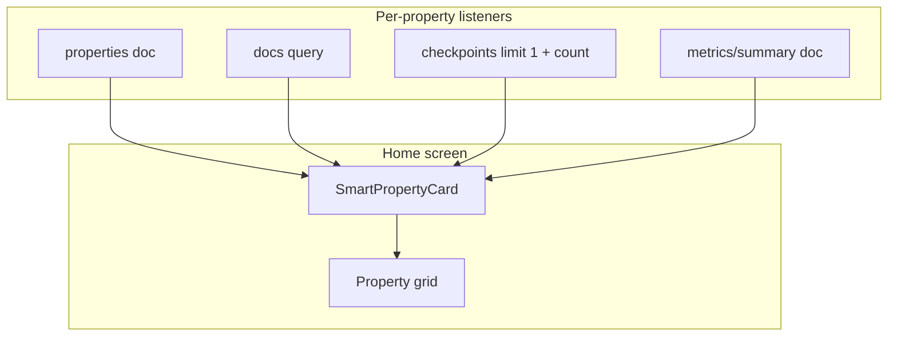
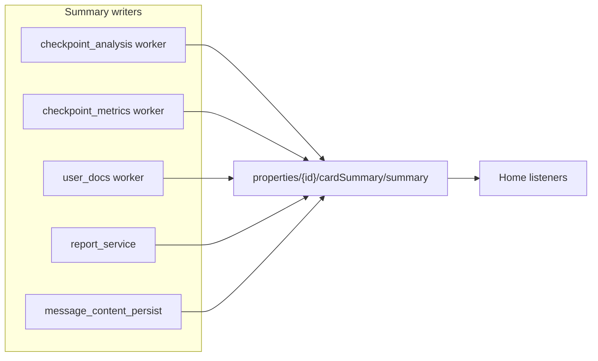

# Smart Property Cards & Home Dashboard — Implementation Plan

**Status:** Planning (not started)  
**Last updated:** June 2026  
**Related:** [HOME_ONBOARDING.md](../../apps/mapp/docs/HOME_ONBOARDING.md), [FEATURE_DISCOVERY.md](../FEATURE_DISCOVERY.md), [CHECKPOINT_FEATURE_PLAN.md](../checkpoint/CHECKPOINT_FEATURE_PLAN.md), [PROPERTY_REPORTS_PLAN.md](./PROPERTY_REPORTS_PLAN.md)

---

## Table of contents

1. [Overview](#overview)
2. [Goals and non-goals](#goals-and-non-goals)
3. [Current state](#current-state)
4. [Product principles](#product-principles)
5. [Home layout patterns](#home-layout-patterns)
6. [Smart card data catalog](#smart-card-data-catalog)
7. [Card layout variants](#card-layout-variants)
8. [Attention and status model](#attention-and-status-model)
9. [Architecture](#architecture)
10. [Data model](#data-model)
11. [Client changes (mapp + webapp)](#client-changes-mapp--webapp)
12. [Backend / worker changes](#backend--worker-changes)
13. [Phased rollout](#phased-rollout)
14. [Performance and Firestore cost](#performance-and-firestore-cost)
15. [Accessibility and empty states](#accessibility-and-empty-states)
16. [Locked decisions](#locked-decisions)
17. [Open questions](#open-questions)
18. [Implementation checklist](#implementation-checklist)

---

## Overview

The signed-in **home** (`/home` on web, Home tab on mapp) is a **multi-property hub**. Today it shows property cards with static counts (docs, saved providers, checkpoints) and onboarding/discovery checklists above a search bar.

This plan evolves home into a **portfolio command center**:

- **Smarter property cards** — surface health, attention, recency, and setup state without opening a property.
- **State-based home layouts** — empty, single-property, and multi-property experiences share one route.
- **Optional “continue where you left off”** — cross-property recency strip above the grid.

Implementation is deliberately **phased**: ship high-value signals from data that already exists (`metrics/summary`, latest checkpoint) before investing in denormalized `cardSummary` writes.

---

## Goals and non-goals

### Goals

1. Help users **prioritize** which property needs attention (issues, failed jobs, stale checkpoints).
2. Help users **resume** work (last chat, in-progress analysis, latest checkpoint).
3. Make cards **scannable** at a glance (health score, trend, cover image, type icon).
4. Keep **mapp and webapp** visually and behaviorally aligned (shared types in `@homeapp/common` where possible).
5. Scale to **5–10+ properties** without N×many Firestore listeners per user on home.

### Non-goals (v1)

- Replacing property-level Insights / Metrics dashboards (cards link in; they do not duplicate full charts).
- Portfolio-level analytics page (aggregate charts across all properties).
- Marketing/landing page redesign (`/landing` is out of scope).
- Changing property creation or onboarding step definitions (see [HOME_ONBOARDING.md](../../apps/mapp/docs/HOME_ONBOARDING.md)).

---

## Current state

### Home screen structure (both clients)

| Block | mapp | webapp |
|-------|------|--------|
| Title + subtitle | ✓ | ✓ |
| Onboarding checklist | ✓ | ✓ |
| Discovery checklist | ✓ | ✓ |
| Product Hunt banner | — | ✓ |
| Billing success notice | — | ✓ |
| Property search | ✓ | ✓ |
| Add property CTA | List row | Grid card |
| Property cards | Vertical list | Responsive grid |

### Property card data today

| Field | Source | Shown on card |
|-------|--------|---------------|
| `name`, `address` | `users/{uid}/properties/{id}` | ✓ |
| `docs` / document count | Listener on `users/{uid}/docs` | ✓ |
| `checks` / `checksCount` | Listener on `.../checkpoints` | ✓ |
| `services` / saved providers | Property doc field `services` (web also reads `servicesCount`) | ✓ |
| `propertyType`, `propertySubType` | Property doc | Loaded, **not displayed** |
| `createdAt` | Property doc | Not displayed |
| `deletionStatus` | Property doc | ✓ (overlay) |
| `docGsURIs` | From docs listener (mapp) | Not displayed |

### Known gaps

- Web `PropertyCard` infers House vs Apartment from presence of a DEED document instead of using `propertyType`.
- Web dashboard loads full `documents[]` per property but card only shows `documents.length`.
- No use of `users/{uid}/properties/{id}/metrics/summary` on home (only inside property Insights).
- No chat recency, report status, or doc processing state on home.
- Home runs **2 listeners per property** (docs + checkpoints); adding more without aggregation will not scale.

---

## Product principles

1. **Glanceable, not noisy** — At most one primary badge + one secondary line per card; full detail stays on property screens.
2. **Actionable** — Badges deep-link to the right tab (chat, timeline/checkpoints, details/docs).
3. **Truthful** — Prefer worker-aggregated metrics (`PropertyCheckpointMetrics`) over re-deriving scores on the client.
4. **Progressive enhancement** — Cards work with counts-only when `cardSummary` or metrics are missing.
5. **Parity** — Same signals on mapp and webapp; web may use hover quick-actions, mapp uses long-press or swipe later.
6. **Respect onboarding** — Onboarding property can show setup progress without hiding portfolio signals on other cards.

---

## Home layout patterns

Home layout adapts by **portfolio state** (computed client-side from property list + preferences).

| State | Condition | Layout |
|-------|-----------|--------|
| **Empty** | `properties.length === 0` | Hero empty state: single CTA “Add your first property”, 3-step visual (upload → checkpoint → chat). Hide search. |
| **Onboarding** | Checklist visible and incomplete | Pin checklist; optional progress ring on onboarding property card. |
| **Single property** | `properties.length === 1` | Property-first: larger card or summary module + “Continue” row; grid optional. |
| **Portfolio** | `properties.length >= 2` | Current grid/list + optional recency strip + filters later. |
| **Power user** | `onboardingChecklistDismissed && discoveryChecklistDismissed` | Collapse/hide checklist blocks by default (already dismiss-driven). |

### “Continue where you left off” (Phase 2+)

Horizontal strip (web) or carousel (mapp) above the property grid:

- Last chat session per property (`chats` where `propertyId` set, order by `lastMessageAt`).
- In-progress checkpoint analysis or doc indexing.
- Report in `generating` state.

Max **3 items**, sorted by recency across all properties.

---

## Smart card data catalog

Data grouped by **availability** and **recommended phase**.

### Tier A — Exists today; read on home (Phase 1)

| Signal | Firestore path / field | Card use |
|--------|------------------------|----------|
| Health score | `properties/{id}/metrics/summary` → `overall.headline.value` | Numeric badge 0–100 |
| Metrics status | `metrics/summary.status` | `pending_analysis`, `ready`, `stale`, etc. |
| Issue counts | `metrics/summary.issues.total_by_severity` | “2 major · 1 critical” |
| Trend | `metrics/summary.deterioration.trend` | improving / stable / deteriorating chip |
| Top issue | `metrics/summary.issues.recent[0]` | One-line subtitle |
| Metrics freshness | `metrics/summary.updatedAt` | “Updated 2d ago” |
| Property type | `property.propertyType`, `propertySubType` | Correct icon + subtype chip |
| Setup incomplete | `docs === 0` or `checks === 0` | “Finish setup” CTA |
| Onboarding pin | `preferences.onboardingPropertyId` | Highlight border / progress |

Types: `PropertyCheckpointMetrics` in `apps/common/src/types.ts`; display helpers in `apps/common/src/lib/checkpoint-metrics-display.ts`.

### Tier B — Exists today; extend listeners (Phase 1–2)

| Signal | Source | Card use |
|--------|--------|----------|
| Cover image | Latest checkpoint `media[0].thumbnailUrl` | Card hero image |
| Last checkpoint | `capturedAt` / `createdAt` on latest checkpoint | “Checkpoint 3d ago” |
| Location label | `location` or `detectedAsset` | Subtitle |
| Analysis state | checkpoint `analysisStatus` | Spinner / failed badge |
| Summary snippet | `aiAnalysis.summary` (truncated) | Secondary line |
| Doc processing | `documents[].status` (web already has docs) | “2 indexing…” |
| Doc types | `documentType` counts | Small icon row |
| RAG readiness | `ragIndexed` | “Chat-ready” hint |

Implementation: change checkpoint listener from `size` only to `limit(1, orderBy('createdAt','desc'))` **or** a separate lightweight query per property.

### Tier C — Exists; needs home wiring (Phase 2)

| Signal | Source | Card use |
|--------|--------|----------|
| Last chat | `users/{uid}/chats` filtered by `propertyId`, `lastMessageAt` | “Roof leak — 2h ago” |
| Message count | `messageCount` on session | Secondary stat |
| Draft session | session `name === 'draft'` | “Continue draft” |
| Report status | `properties/{id}/reports` latest by `updatedAt` | “Report ready” / generating |
| Saved providers | `properties/{id}/savedProviders` count | Replace stale `property.services` counter |

### Tier D — Denormalized `cardSummary` (Phase 3)

See [Data model](#data-model). Written by workers/triggers so home uses **one doc read per property** (or a single collection query).

---

## Card layout variants

### Variant 1: **Minimal** (Phase 1 default)

```
┌─────────────────────────────┐
│ [type icon]  Property name  │  [attention dot]
│ Address line                │
│ ┌─────┬─────┬─────┐         │
│ │ docs│ ckpt│ pros│         │
│ └─────┴─────┴─────┘         │
│ 82 · Stable · 2 major       │  ← from metrics/summary
└─────────────────────────────┘
```

### Variant 2: **Standard** (Phase 2)

Adds hero thumbnail (latest checkpoint), last activity line, setup progress on onboarding property.

```
┌─────────────────────────────┐
│ [thumbnail]  Name      [82] │
│              Kitchen ckpt   │
│ Address                     │
│ Last chat: Roof leak · 2h   │
│ [docs] [ckpt] [pros]        │
└─────────────────────────────┘
```

### Variant 3: **Portfolio dense** (Phase 3, optional setting)

Score + trend + issues only; stats on hover/expand. For users with 6+ properties.

---

## Attention and status model

Derived client-side (Phase 1–2) or precomputed in `cardSummary` (Phase 3).

| Status | Priority | Rules (illustrative) |
|--------|----------|----------------------|
| `deleting` | Highest | `deletionStatus === 'deleting'` (existing) |
| `failed` | High | Checkpoint `analysisStatus === 'failed'`, doc `status === 'failed'`, report `status === 'failed'` |
| `attention` | High | `issues.critical + major > 0` OR `metrics.status === 'stale'` |
| `in_progress` | Medium | Any doc `analyzing`, checkpoint `processing`, report `generating` |
| `setup` | Medium | `docs === 0` or `checks === 0` (and user has not dismissed onboarding) |
| `healthy` | Low | Score ≥ 80, trend stable/improving, no major+ issues |
| `idle` | Default | None of the above |

**Display:** one primary badge (`Attention`, `Processing`, `Setup`, `Healthy`) + optional colored dot. Do not stack multiple badges.

Deep links:

| Badge / tap target | Destination |
|--------------------|-------------|
| Card body (default) | Property chat (unchanged) |
| Health score | Property → Timeline → Insights |
| Setup CTA | Property → Details (upload) or Timeline (checkpoint) |
| Last chat line | Property chat → session |
| Failed / attention | Property → Timeline → relevant checkpoint |

---

## Architecture

### Phase 1–2: Client aggregation



- Extend `PropertiesListProvider` (mapp / `@homeapp/common`) and `PropertiesDashboardProvider` (web) **or** introduce `PropertyCardSummaryProvider` that composes existing property list + new subscriptions.
- Shared pure functions: `derivePropertyAttention()`, `formatLastActivity()`, `pickCardDisplayFields()` in `apps/common/src/lib/property-card-display.ts` (new); web mirrors only if needed for App Hosting import rules.

### Phase 3: Denormalized summary



Home reads `cardSummary/summary` **instead of** per-subcollection listeners for display fields (counts can remain denormalized on the summary doc).

---

## Data model

### `PropertyCardSummary` (Firestore)

Path: `users/{uid}/properties/{propertyId}/cardSummary/summary`

```ts
/** Denormalized home card payload; optional until Phase 3. */
export type PropertyCardSummary = {
  version: number;
  updatedAt: Timestamp;

  // Counts (denormalized from subcollections)
  docsCount: number;
  checkpointsCount: number;
  savedProvidersCount: number;
  reportsCount: number;

  // Health (from metrics worker)
  healthScore: number | null;
  metricsStatus: PropertyCheckpointMetricsStatus | null;
  issuesBySeverity: {
    critical: number;
    major: number;
    moderate: number;
    minor: number;
  };
  trend: 'improving' | 'stable' | 'deteriorating' | 'unknown' | null;
  topIssueLabel: string | null;

  // Latest checkpoint
  latestCheckpointId: string | null;
  latestCheckpointName: string | null;
  latestCheckpointAt: Timestamp | null;
  latestCheckpointThumbnailUrl: string | null;
  latestCheckpointAnalysisStatus: Checkpoint['analysisStatus'] | null;

  // Last activity (max of chat, checkpoint, doc, report)
  lastActivityAt: Timestamp | null;
  lastActivityKind: 'chat' | 'checkpoint' | 'doc' | 'report' | null;
  lastActivityLabel: string | null;
  lastActivityTargetId: string | null; // sessionId, checkpointId, etc.

  // Processing / attention (precomputed)
  attentionStatus: 'none' | 'attention' | 'in_progress' | 'failed' | 'setup';
  pendingJobsCount: number;

  // Setup
  setupComplete: boolean; // docs > 0 && checks > 0
};
```

**Versioning:** increment `version` when shape changes; clients ignore unknown fields.

**Writers:** merge-patch from existing workers; idempotent upsert. Initial backfill script optional for staging.

### Client-facing composite type

```ts
/** Enriched property for home cards (Phase 1: client-side merge). */
export type PropertyWithCardDisplay = Property & {
  metrics?: PropertyCheckpointMetrics | null;
  latestCheckpoint?: Pick<Checkpoint, 'id' | 'name' | 'createdAt' | 'media' | 'analysisStatus' | 'location' | 'detectedAsset'> | null;
  cardSummary?: PropertyCardSummary | null;
  attention?: PropertyAttentionStatus;
};
```

---

## Client changes (mapp + webapp)

### Shared (`apps/common`)

| Item | Action |
|------|--------|
| `types.ts` | Add `PropertyCardSummary`, `PropertyAttentionStatus`, `PropertyWithCardDisplay` |
| `lib/property-card-display.ts` | New: attention derivation, formatting, type icon resolver |
| `lib/checkpoint-metrics-display.ts` | Reuse `getMetricsHeadlineScore`, `getMetricsStatus` |
| `contexts/properties-list-context.tsx` | Phase 1: subscribe to `metrics/summary` per property; Phase 1b: latest checkpoint query |
| `constants/property-types.ts` | Export icon mapping helper (or in `property-card-display.ts`) |

### mapp

| File | Action |
|------|--------|
| `components/PropertyCard.tsx` | Refactor to `SmartPropertyCard`; add health badge, attention, type icon |
| `app/(tabs)/home/index.tsx` | State-based layout hooks; optional recency strip component |
| New: `components/home/ContinueWhereLeftOff.tsx` | Phase 2 |
| New: `components/home/HomeEmptyState.tsx` | Phase 2 |

### webapp

| File | Action |
|------|--------|
| `components/properties/property-card.tsx` | Align with mapp; fix `propertyType` icon; use `docs` count from dashboard context consistently |
| `contexts/properties-dashboard-context.tsx` | Same listener extensions as common/mapp |
| `app/home/page.tsx` | Layout states + recency strip |
| Mirror types/helpers per `webapp-no-common-imports` rule where required |

### Tests

| Area | Tests |
|------|-------|
| `property-card-display.ts` | Unit tests for attention rules, formatting edge cases |
| `properties-list-context` | Mock Firestore: metrics + checkpoint merge |
| Component | Snapshot or RTL: minimal vs standard card variants |

---

## Backend / worker changes

### Phase 1

**None required** — clients read existing `metrics/summary` and checkpoint docs.

### Phase 3 — `cardSummary` writers

| Event | Writer location | Fields updated |
|-------|-----------------|----------------|
| Checkpoint analysis complete / fail | `gcp/proxy/workers/function/checkpoint_analysis` | latest checkpoint, analysis status, pending jobs |
| Metrics aggregation complete | `gcp/proxy/workers/function/checkpoint_metrics` | health, issues, trend, metricsStatus |
| Doc analyze / RAG complete | `gcp/proxy/workers/function/user_docs` | docsCount, pending jobs, lastActivity |
| Report generate complete / fail | `gcp/proxy/api/services/report_service.py` | reportsCount, lastActivity |
| Chat message persisted | `gcp/proxy/api` message persist path | lastActivity chat fields |
| Property create / delete | Property CRUD + deletion service | init or remove summary doc |

Implement `gcp/common/property_card_summary.py` (merge helper + attention computation) imported by workers and proxy.

Optional: **backfill** Cloud Function or script for staging/prod existing properties.

---

## Phased rollout

### Phase 1 — Smart counts + health (MVP)

**Ship:**

- Subscribe to `metrics/summary` per property on home.
- Display health score, trend chip, issue severity line on cards.
- Use `propertyType` for icons (remove DEED heuristic on web).
- Client-derived `attention` badge (failed analysis, major/critical issues).
- Unit tests for display helpers.

**Not in scope:** thumbnails, recency strip, `cardSummary`.

**Success metrics:**

- Users with metrics see score on home without opening property.
- No measurable regression in home load time (see [Performance](#performance-and-firestore-cost)).

### Phase 2 — Recency + visuals

**Ship:**

- Latest checkpoint thumbnail + “last checkpoint” line.
- Doc processing indicators (web: from loaded docs; mapp: lightweight status counts).
- “Continue where you left off” strip (chat + in-progress jobs).
- Single-property home layout variant.
- Empty state hero.

### Phase 3 — Denormalized `cardSummary`

**Ship:**

- Firestore schema + worker writers.
- Home reads summary doc; reduce checkpoint/docs listeners to counts-only or remove.
- Backfill script.
- Portfolio dense card variant (optional).

### Phase 4 — Polish

- Quick actions (web hover / mapp long-press): Chat, Checkpoint, Upload.
- Sort/filter: “Needs attention”, “Recently active”.
- Pin primary property in preferences.

---

## Performance and Firestore cost

### Current cost model

Per user with **P** properties on home:

- 1 properties collection listener
- **2P** listeners (docs + checkpoints)

### Phase 1 addition

- **P** `metrics/summary` document listeners  
- Optional **P** latest-checkpoint queries (if not merged into checkpoint listener)

**Mitigation:**

- Unsubscribe all per-property listeners when user navigates away from home (if not already).
- Phase 3 collapse to **P** `cardSummary` reads + 1 properties listener.

### Index requirements

- Checkpoints: `orderBy('createdAt', 'desc')` with `propertyId` scope (collection path already scoped).
- Chats: composite index on `propertyId` + `lastMessageAt` if querying across portfolio for recency strip.

Document new indexes in `apps/webapp/firestore.indexes.json` when Phase 2 queries are added.

---

## Accessibility and empty states

- Health score: `aria-label="Property health score 82 out of 100"`; do not rely on color alone for attention (use text: “Needs attention”).
- Thumbnails: `alt=""` if decorative; otherwise checkpoint name.
- Attention badges: visible text, not dot-only.
- Empty state: single focusable primary CTA; screen reader heading hierarchy preserved.
- Deletion in progress: retain existing behavior; card not navigable.

---

## Locked decisions

| # | Decision | Rationale |
|---|----------|-----------|
| L1 | Default card tap opens **chat** | Matches current behavior; avoids surprising navigation change. |
| L2 | Health score sourced from **`metrics/summary`** | Single source of truth from metrics worker; no client scoring. |
| L3 | Phase 1 requires **no backend deploy** | Faster iteration; validates UX before `cardSummary` investment. |
| L4 | Shared display logic lives in **`@homeapp/common`** | mapp consumes directly; webapp mirrors only when import rules require. |
| L5 | At most **one** attention badge per card | Reduces visual noise on portfolio home. |
| L6 | `cardSummary` path is `cardSummary/summary` | Parallels `metrics/summary` convention. |

---

## Open questions

1. **Sort order:** Keep `createdAt desc` (mapp) vs `address` alpha (web) — align to `lastActivityAt` when available?
2. **Single-property home:** Replace grid entirely or show enlarged card + shortcuts?
3. **Quota exceeded on checkpoint:** Show upgrade CTA on home card or only in property?
4. **Primary property pin:** New preference `primaryPropertyId` vs implicit “most recently active”?
5. **Phase 3 trigger:** Firestore triggers vs worker-only writes (cost vs complexity)?

Resolve in PR review before Phase 2 starts.

---

## Implementation checklist

### Phase 1

- [ ] Add `property-card-display.ts` + types in `@homeapp/common`
- [ ] Extend `properties-list-context` with `metrics/summary` listener
- [ ] Extend `properties-dashboard-context` (web) with same
- [ ] Update `PropertyCard` (mapp) and `property-card.tsx` (web)
- [ ] Fix web property type icon (use `propertyType`)
- [ ] Unit tests for attention derivation and score formatting
- [ ] Update this doc status to “Phase 1 in progress / shipped”

### Phase 2

- [ ] Latest checkpoint query + thumbnail on card
- [ ] Doc processing badges
- [ ] `ContinueWhereLeftOff` component + chat query
- [ ] `HomeEmptyState` + single-property layout
- [ ] Firestore indexes for chat recency query
- [ ] Manual QA on staging: 0 / 1 / 3+ property accounts

### Phase 3

- [ ] `PropertyCardSummary` type + `gcp/common/property_card_summary.py`
- [ ] Writers in checkpoint, metrics, user_docs, report, chat persist
- [ ] Client reads `cardSummary`; thin listeners
- [ ] Backfill script + staging validation
- [ ] Load test: 10 properties, measure listener count and TTI

### Docs

- [ ] Link from [FEATURE_DISCOVERY.md](../FEATURE_DISCOVERY.md) or home onboarding doc when cards show setup state
- [ ] Add Firestore schema notes to `gcp/common/token/README.md` or new `docs/property/CARD_SUMMARY_SCHEMA.md` if schema stabilizes

---

## References

- `apps/common/src/types.ts` — `Property`, `PropertyCheckpointMetrics`, `Checkpoint`, `Session`, `Document`, `PropertyReport`
- `apps/common/src/lib/checkpoint-metrics-display.ts` — score formatting
- `apps/common/src/contexts/properties-list-context.tsx` — home data loading (mapp)
- `apps/webapp/src/contexts/properties-dashboard-context.tsx` — home data loading (web)
- `apps/mapp/app/(tabs)/home/index.tsx` — mapp home
- `apps/webapp/src/app/home/page.tsx` — web home
