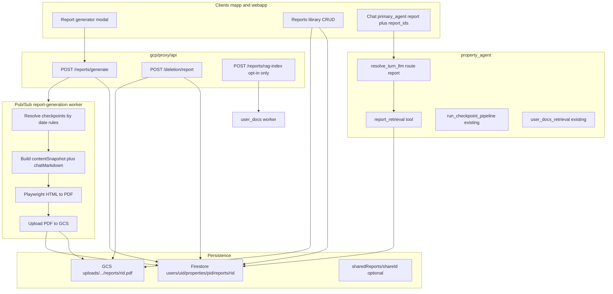

# Property Reports — Implementation Plan

**Status:** Phase 1 shipped; Phase 2 in progress; **architecture decisions locked** (see [Locked decisions](#locked-decisions))  
**Last updated:** June 2026  
**Related:** [Checkpoint README](../checkpoint/README.md), [DELETION_PLAN](../operations/DELETION_PLAN.md), [DOCS_CHAT_OVERVIEW](../docs_chat/DOCS_CHAT_OVERVIEW.md), [ORCHESTRATOR_V2_PLAN](../../gcp/agents/homecare/docs/ORCHESTRATOR_V2_PLAN.md)

---

## Table of contents

1. [Overview](#overview)
2. [Use cases](#use-cases)
3. [Product principles](#product-principles)
4. [Architecture](#architecture)
5. [Data model](#data-model)
6. [Checkpoint resolution](#checkpoint-resolution)
7. [Report generation pipeline](#report-generation-pipeline)
8. [CRUD, publish, and share](#crud-publish-and-share)
9. [Deletion and property wipe](#deletion-and-property-wipe)
10. [AI chat integration](#ai-chat-integration)
11. [API surface (proxy)](#api-surface-proxy)
12. [UI (mapp + webapp)](#ui-mapp--webapp)
13. [Phased rollout](#phased-rollout)
14. [Quota, limits, and cost](#quota-limits-and-cost)
15. [Security and compliance](#security-and-compliance)
16. [Locked decisions](#locked-decisions)
17. [Implementation checklist](#implementation-checklist)

---

## Overview

Property Reports let users **generate, save, update, and delete** formal PDF artifacts derived from checkpoint data. Two modes share one model:

| Mode | Primary audience | Date input |
|------|------------------|------------|
| **`snapshot`** | Realtors, walk-throughs, insurance snapshots | Single date or narrow range (“as of”) |
| **`comparison`** | Rental move-in / move-out, security deposits | **Two** date ranges (baseline + comparison) |

A report is a **persisted artifact**, not a live export:

1. Resolve which checkpoints belong in the report.
2. **Freeze** a `contentSnapshot` (JSON) at generation time.
3. Render a PDF **server-side** and store in GCS.
4. Save metadata in Firestore for list / reopen / share / delete.

Historical sketch in [CHECKPOINT_FEATURE_PLAN.md § 5.12.4](../checkpoint/CHECKPOINT_FEATURE_PLAN.md) — this doc is the canonical plan for reports.

---

## Use cases

### Rental security deposit (`comparison`)

- Landlord or tenant captures checkpoints at **move-in** and **move-out**.
- User generates a comparison report with per-room before/after photos, issue tables, and visual-diff callouts where available.
- Report is **immutable** (revision history on regenerate) for dispute evidence.
- Optional share link or PDF download for the other party.

### Realtor property visit (`snapshot`)

- Agent visits a home on a specific date.
- User generates a **single-date** condition snapshot: executive summary, room-by-room status, headline metrics.
- Lightweight (2–4 pages); suitable for showing or emailing before/after a showing.

### Reports library

- All reports listed on the property under Timeline → Reports (mapp) or Checkpoints → Reports (webapp).
- Open PDF, edit title/notes, **regenerate** (new revision), or delete.
- “Publish” = report reaches `ready` status + optional public share — distinct from RAG indexing.

---

## Product principles

1. **Snapshot fidelity** — What the user saved must not silently change. Checkpoint IDs and `contentSnapshot` are frozen at generation; regenerate creates a new `revision`.
2. **Server-side PDF** — One consistent layout across mapp/webapp; photo-heavy pages are not rendered on device.
3. **Reuse checkpoint intelligence** — Pull from existing `aiAnalysis`, `visualDiff`, `PropertyCheckpointMetrics`, and `comparison_service` narrative patterns; do not duplicate analysis pipelines.
4. **Separate human vs AI consumption** — PDF for people; structured `contentSnapshot` + optional `chatMarkdown` for AI. RAG ingest is **opt-in only** (`includeInDocsChat` defaults to `false`).
5. **Deletion parity** — Report delete goes through the proxy deletion matrix (Firestore + GCS + optional RAG + share link), same as documents/checkpoints.

---

## Architecture



### Component ownership

| Layer | Responsibility |
|-------|----------------|
| **Clients** | Configure report, show job status, list/open/share/delete, attach `report_ids` in chat |
| **Proxy** | Auth, validate, enqueue or run generation, deletion, optional RAG index |
| **Report worker** | Resolve checkpoints, build snapshot, render PDF, update Firestore status |
| **Firestore** | Report metadata, frozen snapshot, job status, revision |
| **GCS** | PDF binary; optional `.md` companion for opt-in RAG |
| **Agent** | `report_retrieval` injects structured snapshot; does not parse PDF |

---

## Data model

### Firestore path

```
users/{userId}/properties/{propertyId}/reports/{reportId}
```

### TypeScript shape (`apps/common/src/types.ts`)

```typescript
export type PropertyReportMode = 'snapshot' | 'comparison';

export type PropertyReportPurpose =
  | 'rental_security'
  | 'realtor_visit'
  | 'insurance'
  | 'custom';

export type PropertyReportStatus =
  | 'draft'
  | 'generating'
  | 'ready'
  | 'failed';

export type PropertyReportDateRange = {
  start: Timestamp;
  end: Timestamp;
};

export type PropertyReportTemplate = {
  includeCoverPage: boolean;
  includePhotos: boolean;
  includeIssueTable: boolean;
  includeMetricsChart: boolean;
  includeVisualDiff: boolean;
  includeRecommendations: boolean;
  includeSignatureBlock: boolean;
};

/** Frozen at generation — source of truth for PDF and AI chat */
export type PropertyReportContentSnapshot = {
  schemaVersion: 1;
  property: {
    id: string;
    address?: string;
    name?: string;
  };
  mode: PropertyReportMode;
  generatedFor: PropertyReportPurpose;
  resolvedAt: string; // ISO
  dateConfig: {
    snapshotRange?: { start: string; end: string };
    baselineRange?: { start: string; end: string };
    comparisonRange?: { start: string; end: string };
  };
  checkpoints: PropertyReportCheckpointSlice[];
  comparisonPairs?: PropertyReportComparisonPair[];
  metrics?: PropertyCheckpointMetrics; // scoped subset or rollup
  narrative?: {
    executiveSummary?: string;
    comparisonSummary?: string;
  };
};

export type PropertyReportCheckpointSlice = {
  checkpointId: string;
  name: string;
  location?: string;
  capturedAt?: string;
  media: { url: string; thumbnailUrl?: string }[];
  aiAnalysis?: CheckpointAnalysis;
  visualDiff?: VisualDiffAnalysis;
};

export type PropertyReportComparisonPair = {
  location: string;
  baselineCheckpointId: string;
  comparisonCheckpointId: string;
  summary?: string;
  similarityScore?: number;
};

export type PropertyReport = {
  id: string;
  userId: string;
  propertyId: string;
  title: string;
  mode: PropertyReportMode;
  purpose?: PropertyReportPurpose;

  snapshotRange?: PropertyReportDateRange;
  baselineRange?: PropertyReportDateRange;
  comparisonRange?: PropertyReportDateRange;

  /** Frozen checkpoint IDs used in this revision */
  checkpointIds: string[];
  contentSnapshot?: PropertyReportContentSnapshot;

  /** Plain-text companion for opt-in RAG (not the PDF) */
  chatMarkdown?: string;
  includeInDocsChat?: boolean;
  ragGsUri?: string;

  template: PropertyReportTemplate;
  customNotes?: string;

  status: PropertyReportStatus;
  revision: number;
  failureReason?: string;

  pdfStoragePath?: string;
  pdfGsUri?: string;

  shareId?: string;

  createdAt: Timestamp;
  updatedAt: Timestamp;
  generatedAt?: Timestamp;

  deletionStatus?: 'deleting' | 'failed';
  deletionBatchId?: string;
};
```

### GCS layout

```
uploads/{userId}/properties/{propertyId}/reports/{reportId}/v{revision}.pdf
uploads/{userId}/properties/{propertyId}/reports/{reportId}/v{revision}.md   # optional RAG companion
```

### Firestore indexes (add to `firestore.indexes.json`)

- `reports`: `propertyId` + `createdAt` DESC (collection group if needed)
- `reports`: `status` + `updatedAt` DESC (job polling)

### Revision history (Phase 3+)

**Locked:** Firestore subcollection `reports/{reportId}/revisions/{revision}` stores prior `contentSnapshot`, PDF paths, and `generatedAt`. Parent report doc always reflects the latest `revision` (required for rental-dispute auditability).

---

## Checkpoint resolution

### Date field

Use **`capturedAt ?? createdAt`** for all range filters. Document this in UI copy.

### Snapshot mode

1. User picks a date `D` (or range).
2. Query checkpoints where effective date ∈ range.
3. Default grouping: **latest checkpoint per `location`** within range (tie-break: highest `assetConfidence`, then newest).
4. User can override selection in preview UI before generate.

### Comparison mode

1. User picks **baseline range** (move-in) and **comparison range** (move-out).
2. For each range, compute **latest per location** (same as snapshot).
3. **Pair** baseline ↔ comparison by normalized `location` (reuse location/asset matching from `gcp/proxy/workers/function/checkpoint_analysis/comparison_service.py`).
4. Unpaired rooms appear in an “only in baseline” / “only in comparison” appendix.
5. Where `visualDiff` exists between paired IDs, include in snapshot; else worker may run a lightweight comparison narrative (Gemini) — **quota counted**.

### Validation gates

- Block generate if comparison mode and either range has zero checkpoints.
- Warn if &lt; 50% of locations pair successfully.
- **Locked (v1):** Block if any selected checkpoint has `analysisStatus !== 'completed'`; show a clear message to wait for analysis or deselect pending checkpoints.

---

## Report generation pipeline

### Trigger

**Locked:** `POST /reports/generate` (proxy) → creates/updates Firestore doc `status: generating` → Pub/Sub topic `report-generation` (always async; no sync shortcut for small reports).

### Worker steps

1. Load property + checkpoints (by IDs or date resolution).
2. Build `contentSnapshot` JSON.
3. Optionally call Gemini for `narrative.executiveSummary` / `comparisonSummary` (text only).
4. Render HTML from Jinja/React-email-style template + embedded image URLs (signed or public checkpoint media URLs).
5. Convert HTML → PDF via **Playwright** (Chromium) on a Cloud Run job — locked after Phase 1 fidelity spike.
6. Upload PDF to GCS; write `pdfStoragePath`, `pdfGsUri`, `contentSnapshot`, `chatMarkdown`, `status: ready`, `generatedAt`.
7. On failure: `status: failed`, `failureReason`.

### Reuse existing backend

| Existing module | Use in reports |
|-----------------|----------------|
| `checkpoint_metrics` aggregator | Scoped metrics rollup for snapshot charts |
| `comparison_service` | Pairing logic + optional diff narrative |
| Checkpoint `visualDiff` | Side-by-side sections |
| `user_docs` worker | **Only** if user opts into RAG (ingest `.md`, not PDF) |

### Templates (v1)

| Template preset | Mode | Sections |
|-----------------|------|----------|
| Move-in / Move-out | `comparison` | Cover, paired rooms, diff callouts, issue table, appendix |
| Property condition snapshot | `snapshot` | Cover, executive summary, metrics, room grid |
| Advanced sections (step 3) | either | User toggles via `PropertyReportTemplate` on any intent |

---

## CRUD, publish, and share

| Action | Behavior |
|--------|----------|
| **Create** | Open generator → configure → generate → appears in library |
| **Read** | List by property; open PDF via signed URL or Storage download |
| **Update metadata** | Edit `title`, `customNotes`, `template` flags without regenerating |
| **Regenerate** | Bump `revision`, new PDF path, new snapshot; prior revision archived (Phase 3) |
| **Delete** | Proxy `POST /deletion/report` — Firestore, GCS PDF(s), optional RAG file, `sharedReports` doc |
| **Publish / share** | Optional `shareId` in `sharedReports/{shareId}` (mirror [sharedChats](../../apps/common/src/lib/shared-chat.ts)): read-only PDF viewer or signed redirect, `expiresAt` TTL |

**Publish ≠ RAG index.** Sharing a PDF does not add it to the document corpus unless the user enables “Include in Docs Chat.”

---

## Deletion and property wipe

Extend [DELETION_PLAN.md](../operations/DELETION_PLAN.md) matrix:

| Action | UI | Backend | Async? | Audited? |
|--------|-----|---------|--------|----------|
| Delete report | Reports library | `POST /deletion/report` | Sync | Yes |
| Delete property | existing | Include `reports/` subcollection + GCS prefix + RAG companions | Async job | Yes |

Implementation notes:

- Reuse `delete_rag_files_by_gcs_uris` when `ragGsUri` is set.
- Delete all `v{revision}.pdf` under report prefix.
- Remove `sharedReports/{shareId}` if present.

---

## AI chat integration

### Primary path: `primary_agent: "report"` + structured retrieval

**Locked:** Reports chat is a **first-class primary agent** (alongside `analysis`, `checkpoint`, `docs`). Do **not** auto-ingest PDFs into Vertex RAG.

| Mechanism | Behavior |
|-----------|----------|
| `primary_agent: "report"` | User selects **Reports** in chat settings (mapp modal / webapp popover) |
| `report_ids: string[]` | Required when in report mode — one or more saved reports attached (property-scoped) |
| `resolve_turn_llm` | Sets `route=report` when `primary_agent=report` |
| `report_retrieval` tool | Executor loads `contentSnapshot` + `chatMarkdown` from Firestore; answers cite the frozen snapshot only (no generic home-inspection filler). Report route skips `[SESSION_WORKING_MEMORY]` inject; per-turn `[REPORT_MODE]` block (not global executor prompts) forbids inventing systems/sections not in the snapshot and handles empty retrieval. Base `prompts.py` keeps the general empty-retrieval rule for checkpoint/docs. Session caches loaded text by `report_ids` + `report_revisions` fingerprint; follow-up turns skip re-fetch when selection unchanged. Chat Add Context lists **current revision only** per report (no `revisions` subcollection fetch on open). |
| `PrimaryAgent` type | Extend `apps/common/src/types.ts`: `'analysis' \| 'checkpoint' \| 'docs' \| 'report'` |

**Good queries:** “What did the move-out report say about the kitchen?” “Summarize damage in report X.” “Compare issues in revision 1 vs revision 2.” (future: multi-revision picker or explicit archived-revision selection — not in default Add Context list today.)

**Client UX:**

- Reports mode in chat settings (same pattern as Docs / Checkpoint).
- Report picker in context sheet; chips show report title + revision.
- Persist `contextRefs.reports` on user messages.
- UI must show **Reports mode** so users know answers come from frozen snapshots, not live checkpoints.

**Orchestrator flow (aligned with [ORCHESTRATOR_V2_PLAN](../../gcp/agents/homecare/docs/ORCHESTRATOR_V2_PLAN.md)):**

```
primary_agent=report → resolve route=report → report_retrieval → synthesis LLM → contentMarkdown / contentJson patches
```

### Secondary path: opt-in RAG (`includeInDocsChat`)

**Locked:** Default **off**. RAG is never automatic on publish, share, or generate.

| Setting | Behavior |
|---------|----------|
| `includeInDocsChat: false` (default) | Report not in Vertex RAG corpus |
| User toggles on (Phase 5) | Worker writes `v{revision}.md` → `user_docs` import → `ragGsUri` stored on report |
| Regenerate | Delete old RAG file, re-import new `.md` |
| Delete report | `delete_rag_files` for companion URI |

Ingest **markdown companion**, not photo-heavy PDF. Tag with metadata filter so “all docs” search can exclude `PROPERTY_REPORT` unless intended. Opt-in RAG does **not** replace report mode — it only makes report text discoverable in **Docs** agent searches.

### Agent routing guidance

| User intent | Path |
|-------------|------|
| Questions about **saved report(s)** | `primary_agent: "report"` + `report_ids` → `report_retrieval` |
| **Live** property condition | `primary_agent: "checkpoint"` + `checkpoint_ids` / checkpoint pipeline |
| Warranty, deed, indexed report `.md` | `primary_agent: "docs"` + `context_doc_uris` |

Do not mix `primary_agent: "report"` with live checkpoint analysis in the same turn without explicit product support; mode switch should clear incompatible context.

---

## API surface (proxy)

Follow [add-proxy-endpoint](../../.claude/skills/add-proxy-endpoint/SKILL.md) conventions: `schemas/`, `services/`, `routers/`, mount under secret prefix.

### Endpoints (proposed)

| Method | Path | Purpose |
|--------|------|---------|
| `POST` | `/reports/generate` | Create or regenerate; enqueue worker |
| `GET` | `/reports/{reportId}/status` | Poll job (optional if Firestore listener sufficient) |
| `PATCH` | `/reports/{reportId}` | Metadata-only update |
| `POST` | `/reports/{reportId}/share` | Create/update `sharedReports` link |
| `DELETE` | `/reports/{reportId}/share` | Revoke public link |
| `POST` | `/reports/{reportId}/rag-index` | Opt-in RAG ingest of `.md` companion |
| `POST` | `/deletion/report` | Sync delete (batch variant later) |

### Request sketch: generate

```json
{
  "propertyId": "prop123",
  "title": "Move-out comparison — June 2026",
  "mode": "comparison",
  "purpose": "rental_security",
  "baselineRange": { "start": "2025-01-01", "end": "2025-01-07" },
  "comparisonRange": { "start": "2026-05-25", "end": "2026-06-01" },
  "checkpointIds": null,
  "template": { "includeCoverPage": true, "includePhotos": true },
  "customNotes": "Tenant: Jane Doe",
  "regenerateReportId": null
}
```

`checkpointIds: null` → server resolves by date rules; non-null → user override from preview.

### Client URL injection

- mapp: `app.config.js` → `extra.reportsGenerateUrl`, `extra.reportsSignedUrl` (deletion via shared `deleteReportViaProxy`)
- webapp: `apphosting*.yaml` env vars (same pattern as checkpoint analysis URLs)

---

## UI (mapp + webapp)

### Information architecture (shipped)

Reports live **under Timeline / Checkpoints**, not as a top-level property tab.

| Client | Location |
|--------|----------|
| **mapp** | Property → **Timeline** → sub-tab **Reports** (`tab=timeline&subTab=reports`). Header `+` opens generate when Reports sub-tab is active. Legacy `tab=reports` redirects to timeline. |
| **webapp** | Property → **Checkpoints** → segment **Reports** (`/checkpoints?tab=reports`). `/reports` redirects here. |

### Surfaces

| Surface | Location |
|---------|----------|
| **Generate report** | 3-step wizard (intent → dates/checkpoints → layout/sections). Shared helpers in `@homeapp/common/lib/report-wizard`. |
| **Regenerate** | Confirm screen (title/notes) + optional “Change layout & sections” — checkpoints and ranges unchanged. |
| **Reports library** | Compact cards: title, purpose, status chip, overflow menu (edit, share, regenerate, delete). |
| **Report detail** | Open PDF, share, regenerate, delete (unchanged) |
| **Chat settings** | **Reports** primary agent (`primary_agent: "report"`) |
| **Chat context** | Attach `report_ids`; show chips with title + revision |

### Wizard intents (step 1)

- [x] Realtor showing → `snapshot` + `realtor_visit` + today
- [x] Rental move-in/out → `comparison` + `rental_security` + prior-month ranges
- [x] Insurance / claim → `snapshot` + `insurance` + today (dates editable in step 2)

### Shared components (`@homeapp/common`)

- Types in `apps/common/src/types.ts`
- `lib/report-wizard.ts` — intent cards, `applyReportIntent`, `suggestReportTitle`, step labels
- `lib/report-preview.ts` + `lib/report-resolve.ts` + `hooks/use-report-wizard-checkpoint-preview.ts` — checkpoint preview: client-side resolve from `CheckpointContext` when loaded data covers the date range (instant on timeline), else `POST /reports/preview`; LRU cache, stale-request guard, draft/applied **Update checkpoints** for snapshot and comparison
- `reports-context.tsx` — list/subscribe (mapp + webapp)

---

## Phased rollout

### Phase 1 — Snapshot reports (MVP)

- [x] Types + Firestore `reports` subcollection
- [x] Proxy `POST /reports/generate` + async Pub/Sub worker (snapshot only; **xhtml2pdf** in CF worker; Playwright Cloud Run job TBD)
- [x] `monthlyReportGenerationsLimit` quota check/record on generate
- [x] PDF template: cover + room grid + issue table
- [x] Reports library (property-scoped, webapp): list, open PDF, delete
- [x] `POST /deletion/report` + property wipe includes reports
- [x] Block generate when any checkpoint analysis is not `completed`
- [x] Webapp Reports segment under Checkpoints + signed URL open
- [x] mapp Reports sub-tab under Timeline + 3-step wizard + signed URL open + delete
- [x] GHA `deploy-report-generation.yaml` + `REPORT_GENERATION_TOPIC` in `create-environment`
- [x] Deploy worker + Pub/Sub topic to staging (manual: set var on existing env, run workflows)

**Exit criteria:** User can save a single-date snapshot PDF and delete it.

### Phase 2 — Comparison mode

- [x] Dual date ranges + per-location pairing (proxy `resolve_comparison_checkpoints`)
- [x] Visual diff summary in PDF template (uses checkpoint `visualDiff` when present)
- [x] Comparison snapshot builder + worker branch (`mode: comparison`)
- [x] Validation UX for empty ranges / low pair rate (`warnings` on generate response; web + mapp comparison tab)
- [x] Comparison narrative (Gemini) in worker when `visualDiff` missing
- [x] Playwright PDF renderer (`REPORT_PDF_RENDERER=playwright`, xhtml2pdf fallback)

**Exit criteria:** Rental move-in/move-out report usable for security deposit documentation.

### Phase 3 — Update, revisions, share

- [x] Metadata PATCH without regenerate (`POST /reports/metadata`)
- [x] Regenerate → `revision++`, archive prior revision in `reports/{id}/revisions/{n}` subcollection
- [x] `sharedReports` public link with TTL (`POST /reports/share`, `/share/report/[shareId]`)
- [x] mapp + webapp parity (edit, share, regenerate)

### Phase 4 — AI chat (`primary_agent: "report"`)

- [x] Extend `PrimaryAgent` + proxy/agent request schema with `primary_agent: "report"` and `report_ids`
- [x] `resolve_turn_llm` route `report` + `report_retrieval` tool under `property_agent/reports/`
- [x] Chat settings: Reports mode (mapp + webapp)
- [x] Report picker + `contextRefs.reports` on messages
- [x] Agent display strings (e.g. `report_retrieval` step label)
- [x] Tests: resolve routing, retrieval with frozen snapshot, missing `report_ids` error

### Phase 5 — Opt-in RAG

- [x] `includeInDocsChat` toggle + `POST /reports/rag-index`
- [x] `.md` companion generation in worker (`mdGsUri` / `mdStoragePath`)
- [x] RAG delete on report delete/regenerate; companion doc cleanup
- [x] Docs chat filter / document type `PROPERTY_REPORT`

---

## Quota, limits, and cost

| Resource | Locked behavior |
|----------|-----------------|
| Report generation | **Dedicated** plan limit `monthlyReportGenerationsLimit` — enforce in proxy before enqueue (mirror `monthlyCheckpointLimit` / `check_and_record_*` in `gcp/common/plan_limits.py`) |
| Gemini narrative | Count toward LLM token usage (worker `usage_sink`) |
| PDF render | Cloud Run CPU/memory per job; cap concurrent jobs per user |
| RAG opt-in | Count as document creation (same as `user_docs` worker); only when user enables `includeInDocsChat` |
| Storage | PDFs count toward user storage; max **50 reports per property** (enforced in proxy on new generate) |

### `monthlyReportGenerationsLimit` integration (sketch)

- Firestore counter on `llm_token_usage/{userId}`: `periodReportGenerations` (+ lifetime `reportGenerations`) or separate billing field on `users/{uid}/billing/summary` if Stripe caps are added later.
- Env/Stripe JSON: extend `STRIPE_B2C_PRICE_*` caps with `monthlyReportGenerationsLimit` per plan tier.
- Proxy `POST /reports/generate`: check + record before Pub/Sub publish; return `REPORT_QUOTA_EXCEEDED` (or reuse plan-limit HTTP shape) when over cap.
- Settings UI: show report usage alongside checkpoint/document limits on AI usage screen.

---

## Security and compliance

- Reports contain photos and addresses — same Firestore rules as property data (`users/{uid}/...` owner-only).
- `sharedReports` — public read with `expiresAt` (copy `sharedChats` rules pattern).
- Signed URLs for PDF download; short TTL.
- Immutable snapshots support dispute evidence; retain revision history per compliance needs.
- Erasure: `POST /deletion/user` and property delete must include reports (see DELETION_PLAN).

---

## Locked decisions

Reviewed June 2026. Override only via explicit plan revision.

| # | Topic | Decision |
|---|--------|----------|
| 1 | Async vs sync generate | **Always async** via Pub/Sub `report-generation` worker |
| 2 | PDF engine | **Playwright** (Chromium on Cloud Run job); Phase 1 spike confirms layout fidelity |
| 3 | Revision storage | **Firestore subcollection** `reports/{reportId}/revisions/{revision}` + versioned PDFs in GCS |
| 4 | Agent routing | **`primary_agent: "report"`** — dedicated route `report` + `report_retrieval` (not an extension of checkpoint route) |
| 5 | Pending checkpoint analysis | **Block generate in v1** if any selected checkpoint is not `analysisStatus: completed` |
| 6 | Report list scope | **Property-scoped only** (no user-level portfolio list in v1) |
| 7 | Report generation quota | **New `monthlyReportGenerationsLimit`** limit (not folded into checkpoint quota) |
| 8 | RAG for reports | **Default off**; ingest `.md` companion only when user sets `includeInDocsChat: true` (Phase 5) |

---

## Implementation checklist

### Backend

- [x] `gcp/proxy/api/schemas/reports.py`
- [x] `gcp/proxy/api/services/report_service.py`
- [x] `gcp/proxy/api/routers/reports.py`
- [x] `gcp/proxy/workers/function/report_generation/` (new Cloud Function)
- [x] Pub/Sub topic + deploy workflow (see [WORKERS_DEPLOYMENT.md](../deployment/WORKERS_DEPLOYMENT.md))
- [x] Extend `deletion_service.py` for reports
- [x] Firestore indexes (`reports` collection group composites in `firestore.indexes.json`)

### Shared / clients

- [x] `PropertyReport` types in `apps/common`
- [x] API helpers in mapp `lib/api-reports.ts` and webapp `lib/api-reports.ts`
- [x] Report generator modal + library (webapp + mapp)
- [x] Chat report picker (mapp + webapp add-context sheet)

### Agent (Phase 4)

- [x] `primary_agent: "report"` + `report_ids` in proxy `AgentRequest` and agent routing schema
- [x] `property_agent/reports/` — `retrieval.py`, resolve route `report`, executor wiring
- [x] Register `report_retrieval` in orchestrator tool registry
- [x] Tests: `test_report_retrieval.py`

### Quota (Phase 1)

- [x] `monthlyReportGenerationsLimit` in `plan_limits.py` + proxy check/record on `/reports/generate`
- [x] Counter fields on `llm_token_usage` (or documented billing mirror)
- [x] AI usage UI slice for report generations (webapp + mapp settings; `/token-quota-status` `reports`)

### Docs (keep in sync as built)

- [x] Update DELETION_PLAN matrix when delete ships
- [x] `docs/property/PROPERTY_REPORTS_API.md` (API reference)
- [x] Link from checkpoint README

---

## References

- Checkpoint data model: `apps/common/src/types.ts` (`Checkpoint`, `PropertyCheckpointMetrics`)
- Comparison pairing: `gcp/proxy/workers/function/checkpoint_analysis/comparison_service.py`
- RAG import: `gcp/proxy/workers/function/user_docs/`
- Shared link pattern: `apps/common/src/lib/shared-chat.ts`
- Deletion: `gcp/proxy/api/services/deletion_service.py`, `docs/operations/DELETION_PLAN.md`
