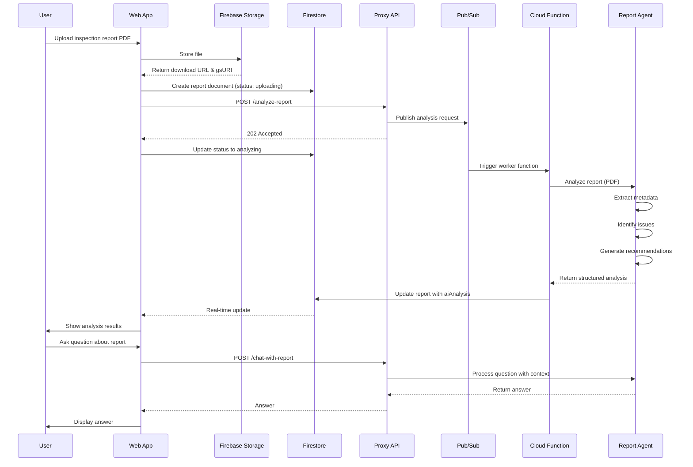

# Inspection Reports Feature Documentation

## Overview

The Inspection Reports feature enables users to upload property inspection reports (PDFs and images), have them automatically analyzed by AI, and interact with the reports through conversational chat. The system extracts structured data including issues, recommendations, and cost estimates.

## Quick Links

- [Architecture Overview](ARCHITECTURE.md)
- [Report Agent Details](REPORT_AGENT.md)
- [API Documentation](API.md)
- [Frontend Integration](FRONTEND_INTEGRATION.md)
- [Deployment Guide](DEPLOYMENT.md)
- [Testing Guide](TESTING.md)

## Features

### 1. Report Upload
- Support for PDF and image files (max 50MB)
- Multi-file upload with drag-and-drop
- Report type classification (Home Inspection, Pre-Purchase, Annual, Specialized, Other)
- Automatic Firebase Storage upload
- Real-time progress tracking

### 2. AI-Powered Analysis
- **Metadata Extraction**: Inspector info, dates, property details
- **Issue Identification**: Categorized by type (Structural, Electrical, Plumbing, etc.)
- **Severity Classification**: Critical → Major → Moderate → Minor
- **Cost Estimation**: Immediate, short-term, and long-term repair costs
- **Recommendations**: Actionable steps with timeframes and DIY feasibility

### 3. Conversational Chat
- Ask questions about analyzed reports
- Context-aware responses referencing specific sections
- Cost breakdowns and severity explanations
- Page number references for easy navigation

### 4. Data Management
- Firestore storage with real-time updates
- Vector embeddings for semantic search
- Proper security rules (user-owned data only)
- Optimized indexes for performance

## User Workflow



## Data Model

### InspectionReport
```typescript
{
  id: string
  userId: string
  propertyId: string
  name: string
  url: string                    // Download URL
  storagePath: string
  gsURI: string                  // gs://bucket/path
  contentType: string            // application/pdf or image/*
  createdAt: Timestamp
  
  // Optional metadata extracted by AI
  inspectionDate?: Timestamp
  inspectorName?: string
  inspectorCompany?: string
  
  reportType: "HOME_INSPECTION" | "PRE_PURCHASE" | "ANNUAL" | "SPECIALIZED" | "OTHER"
  status: "uploading" | "analyzing" | "complete" | "failed"
  
  // AI Analysis Results
  aiAnalysis?: {
    summary: string
    overallCondition: "excellent" | "good" | "fair" | "poor" | "critical"
    issues: ReportIssue[]
    recommendations: ReportRecommendation[]
    keyFindings: string[]
    costEstimates?: {
      immediate: number
      shortTerm: number
      longTerm: number
    }
    analyzedAt: Timestamp
    confidence: number            // 0-1 scale
  }
  
  // For semantic search
  embedding?: number[]            // 768-dimensional vector
  embeddingModel?: string         // "text-embedding-004"
  embeddingGeneratedAt?: Timestamp
}
```

### ReportIssue
```typescript
{
  id: string
  category: string                // "Structural", "Electrical", "Plumbing", etc.
  title: string
  description: string
  severity: "minor" | "moderate" | "major" | "critical"
  location: string
  priority: number                // 1-10 (10 = most urgent)
  estimatedCost?: number
  pageNumber?: number             // Page in original report
  confidence: number              // 0-1 scale
}
```

### ReportRecommendation
```typescript
{
  id: string
  issue: string                   // Reference to issue
  recommendation: string
  timeframe: "immediate" | "short_term" | "long_term" | "monitoring"
  estimatedCost?: number
  diyFeasible: boolean
}
```

## Storage Structure

### Firebase Storage
```
reports/
  {userId}/
    {propertyId}/
      report_{timestamp}_{filename}.pdf
```

### Firestore
```
users/
  {userId}/
    properties/
      {propertyId}/
        reports/
          {reportId}/
            - Basic report metadata
            - aiAnalysis object
            - embedding vector
```

## Technology Stack

### Backend
- **Gemini 2.0 Flash**: Multimodal PDF analysis
- **Vertex AI**: Model hosting and embedding generation
- **Google Cloud Functions**: Async processing
- **Pub/Sub**: Message queue for analysis requests
- **Firestore**: Document storage
- **Firebase Storage**: File storage

### Frontend
- **React/Next.js**: Web application
- **React Native**: Mobile application
- **Context API**: State management
- **Real-time listeners**: Firestore subscriptions

## Key Design Decisions

1. **Async Processing**: Reports are analyzed asynchronously via Pub/Sub to handle long-running AI operations without blocking the API

2. **Dedicated Agent**: Separate `report_agent` from `property_agent` for specialized inspection report handling

3. **Multimodal Analysis**: Uses Gemini 2.0 Flash for both text and image parsing from PDFs

4. **Vector Embeddings**: Generates embeddings for future semantic search capabilities

5. **Structured Output**: Forces JSON schema from AI for consistent, parseable results

6. **Cost Tracking**: Three timeframes (immediate, short-term, long-term) for budget planning

7. **DIY Feasibility**: Helps users decide whether to hire professionals or do it themselves

## Security

- Reports are stored under user-specific paths
- Firestore rules enforce user ownership
- API endpoints require authentication via Firebase webhook secret
- No cross-user data access
- File uploads validated for size and type

## Performance Considerations

- **Firestore Indexes**: Optimized for common queries (by date, status, type)
- **Embedding Exclusion**: Large embedding arrays excluded from list queries
- **Pagination**: Ready for future implementation with cursor-based pagination
- **Real-time Updates**: Efficient listeners that only fetch changed documents

## Getting Started

1. **Backend Setup**: [Deployment Guide](DEPLOYMENT.md)
2. **Frontend Integration**: [Frontend Guide](FRONTEND_INTEGRATION.md)
3. **Testing**: [Testing Guide](TESTING.md)

## Support

For issues or questions:
- Check the [Troubleshooting Guide](TROUBLESHOOTING.md)
- Review [API Documentation](API.md)
- See [Report Agent Details](REPORT_AGENT.md)

