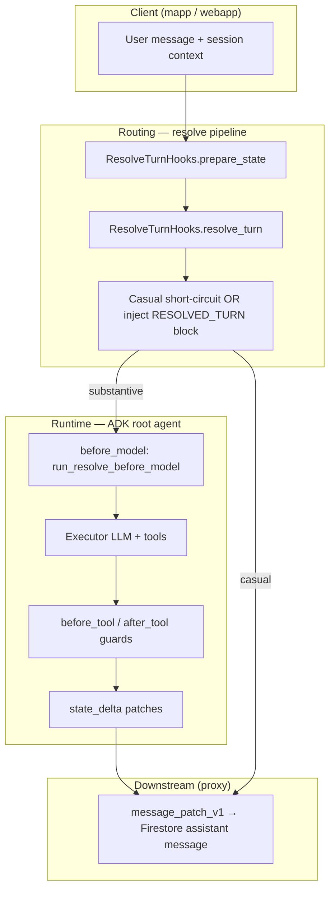

# Agent Framework

Reusable **Google ADK agent platform** for HomeApp and future verticals. It holds domain-agnostic plumbing: turn resolution, tool registry, branch orchestration, session state merge, message-patch contracts, context assembly, observability, and parallel execution.

**Layout:** `gcp/agent_framework/` — Python package imported as `agent_framework.*` (same monorepo pattern as `gcp/common/`).

**Boundary rule:** `agent_framework` must **never** import `property_agent.*` or other consumer packages. Vertical apps supply domain bindings (state merge keys, log redaction policy, resolve hooks, hydrators). Enforced by `tests/test_boundaries.py`.

**Primary consumer today:** `gcp/agents/homecare` (`property_agent`) via an editable path dependency in `pyproject.toml`.

**Logging split:** Cloud Run proxy and Pub/Sub workers use `gcp/common/observability/logging_context.py`; Vertex ADK agents use `agent_framework/observability/logging_context.py` (same bind/unbind API, packaged for Agent Engine deploys). Keep behavior in sync when changing either file.

---

## Architecture

**Homecare today:** `property_agent` uses **single-loop pre-routing** (`single_loop_routing.prepare_single_loop_before_model`) instead of the generic `run_resolve_before_model` + `ResolveTurnHooks` path below. The resolve pipeline remains available for other verticals.

Each user turn flows through three platform layers before and during tool execution:



### Module map

| Package          | Responsibility                                                                                                        |
| ---------------- | --------------------------------------------------------------------------------------------------------------------- |
| `runtime/`       | Build ADK root agent (`build_root_agent`), LLM short-circuit responses, event compaction config, logging plugin mixin |
| `routing/`       | Generic resolve pipeline (`run_resolve_before_model`), resolved-turn inject helpers, tool guards                      |
| `registry/`      | `ToolSpec` / `BranchToolSpec`, `build_tools`, execution-plan builder                                                  |
| `execution/`     | Async parallel runners, wave-based `run_orchestrated_branches`, thread context propagation                            |
| `state/`         | `merge_state_delta`, session `state_take`, context id resolution for logging                                          |
| `contracts/`     | Versioned v1 protocols (`ContextHydratorV1`, `MessagePatchInputV1`) and Firestore wire format                         |
| `context/`       | Prompt assembly budgets, session working-memory blocks, hydrator render helpers                                       |
| `memory/`        | Vertex Memory Bank ingest selection, stream id helpers, env toggles                                                   |
| `observability/` | Auth uid / correlation id logging, log redaction policy                                                               |

### Extension model

The framework exposes **protocols and hooks**; consumers implement domain logic in separate packages:

| Platform API                                   | Consumer supplies                                                                                         |
| ---------------------------------------------- | --------------------------------------------------------------------------------------------------------- |
| `RootAgentPlugin`                              | Model, instructions, tools, ADK callbacks (`property_agent/runtime/root_agent_plugin.py`)                 |
| `prepare_before_model` (single-loop)             | Deterministic pre-routing + slim `[SESSION_CONTEXT]` (`property_agent/routing/single_loop_routing.py`) |
| `ToolSpec` list                                | Lazy tool factories + optional branch metadata (`property_agent/registry.py`)                             |
| `merge_state_delta(..., list_dedupe_keys=...)` | Domain list keys (`property_agent/bindings/state_merge.py`)                                               |
| `LogRedactionPolicy`                           | Sensitive field names (`property_agent/observability/log_redaction.py`)                                   |
| `message_patch_v1` helpers                     | Branch-aware `contentJson` merge in proxy (`gcp/proxy/api/utils/message_content_persist.py`)              |

See also `gcp/agents/homecare/property_agent/ARCHITECTURE.md` for how Homecare maps onto these layers.

---

## Installation

### As a path dependency (HomeApp)

In the consumer `pyproject.toml`:

```toml
dependencies = ["agent-framework"]

[tool.uv.sources]
agent-framework = { path = "../../agent_framework", editable = true }
```

Then from the consumer directory:

```bash
uv sync
```

### Standalone (framework tests only)

```bash
cd gcp/agent_framework
uv sync --extra dev
uv run pytest tests/ -v
```

Homecare CI runs both suites: `make test` under `gcp/agents/homecare` executes `tests/` and `../../agent_framework/tests/`.

---

## Usage guide

### 1. Build a root ADK agent from a plugin

Implement `RootAgentPlugin` (or extend `LoggingRootAgentPlugin` for automatic auth/correlation logging), then call `build_root_agent`:

```python
from agent_framework.runtime.build_root_agent import RootAgentPlugin, build_root_agent
from agent_framework.runtime.logging_plugin import LoggingRootAgentPlugin

class MyRootAgentPlugin(LoggingRootAgentPlugin):
    root_agent_name = "my_agent"
    root_agent_description = "Handles my vertical."
    global_gemini_model = "gemini-2.5-flash"
    executor_instructions = lambda self: "You are a helpful assistant."
    executor_input_schema = MyInputSchema
    build_executor_tools = my_build_executor_tools  # Callable[[Callable[[], bool]], list]
    memory_preload_enabled = memory_preload_enabled  # from agent_framework.memory.ingest
    before_model_callback = my_before_model
    before_tool_callback = my_before_tool
    after_model_callback = my_after_model
    after_tool_callback = my_after_tool
    after_agent_callback = my_after_agent

root_agent = build_root_agent(MyRootAgentPlugin())
```

Homecare wires this in `property_agent/runtime/root_agent_plugin.py` → `PropertyRootAgentPlugin`.

### 2. Turn resolution (before_model)

**Homecare:** use `property_agent.routing.single_loop_routing.prepare_single_loop_before_model` (deterministic chip / accept-offer / casual paths + slim `[SESSION_CONTEXT]`). The generic resolve pipeline below is for **new verticals** that want a separate routing LLM.

Register a `before_model` callback that delegates to `run_resolve_before_model` with vertical-specific hooks:

```python
from agent_framework.routing.resolve_pipeline import run_resolve_before_model

_HOOKS = MyResolveHooks()

def before_model(ctx, llm_request=None):
    return run_resolve_before_model(ctx, llm_request=llm_request, hooks=_HOOKS)
```

**What the pipeline does:**

1. `prepare_state` — e.g. set `property_id` from session
2. `early_short_circuit` — return `LlmResponse` to skip the executor entirely (passthrough replies)
3. Per-invocation dedupe via `_resolve_turn_invocation_id` — re-inject existing resolve without re-running LLM
4. `resolve_turn` → `apply_to_state` — persist `ResolvedTurn` to session state
5. If `is_casual(resolved)` — return `plain_text_llm_response(...)` (no executor LLM)
6. Otherwise inject `[RESOLVED_TURN]` JSON into the executor system instruction

Implement `ResolveTurnHooks` in your vertical (see `MyResolveHooks` in the end-to-end skeleton below).

**Inject block formatting** uses `format_resolved_turn_block`; pass optional `metadata` for UI context:

```python
from agent_framework.routing.resolved_turn import format_resolved_turn_block

block = format_resolved_turn_block(
    resolved,
    metadata={"primary_agent": "checkpoint", "checkpoint_ids": ["abc123"]},
)
```

### 3. Tool registry

Declare tools as lazy `ToolSpec` entries so imports stay cheap at deploy time:

```python
from agent_framework.registry.tool_spec import ToolSpec, build_tools

def _my_tool_factory():
    from google.adk.tools import FunctionTool
    from my_vertical.tools import run_pipeline
    return FunctionTool(run_pipeline)

TOOL_SPECS = (
    ToolSpec(id="my_retrieval", factory=_my_tool_factory),
    ToolSpec(
        id="run_composite_pipeline",
        factory=_composite_factory,
        branches=MY_BRANCH_SPECS,  # optional orchestration metadata
    ),
)

def build_executor_tools(memory_preload_enabled):
    tools = build_tools(TOOL_SPECS)
    if memory_preload_enabled():
        from google.adk.tools.preload_memory_tool import preload_memory_tool
        tools.append(preload_memory_tool)
    return tools
```

`build_tools` sets each ADK tool's `name` to `spec.id` when the wrapper allows it.

### 4. Branch orchestration (parallel optional agents)

For composite tools that run optional branches (coverage, DIY, service, cost), declare `BranchToolSpec` metadata and use the execution planner:

```python
from agent_framework.registry.orchestration import BranchToolSpec, build_execution_plan
from agent_framework.execution.parallel_runner import run_orchestrated_branches

BRANCH_SPECS = (
    BranchToolSpec(
        branch_id="coverage",
        writes_branch="coverageResult",
        parallel_result_key="parallel_coverage_result",
        parallel_group="optional",  # same group → concurrent in one wave
    ),
    BranchToolSpec(
        branch_id="cost",
        writes_branch="costEstimationResults",
        parallel_result_key="parallel_cost_result",
        parallel_group="optional",
        depends_on=("service",),  # runs in a later wave
    ),
)

# Plan only (sync)
waves = build_execution_plan(BRANCH_SPECS)
# waves[0].branch_ids might be ("coverage", "diy", "service")
# waves[1].branch_ids might be ("cost",)

# Execute (async)
async def run_branches(requested: list[str]):
    async def worker(branch_id: str) -> dict:
        return await run_single_branch(branch_id)

    return await run_orchestrated_branches(
        BRANCH_SPECS,
        requested,
        worker,
        on_result=lambda bid, result: emit_progress(bid, result),
    )
```

**Scheduling rules:**

- Branches with satisfied `depends_on` form a readiness batch.
- Within a batch, each distinct `parallel_group` becomes its own **wave** (groups run sequentially; ids inside a group run concurrently).
- Cycles or unknown dependency ids raise `OrchestrationCycleError`.

Homecare SSOT: `property_agent/checkpoint/branch_registry.py`.

### 5. State delta merge

Tools emit `actions.state_delta` dicts. Merge them with ADK-aligned semantics (deep dict merge, list concatenation):

```python
from agent_framework.state.state_delta_merge import merge_state_delta

# Generic merge
merged = merge_state_delta(existing, incoming)

# With list dedupe for domain keys (Homecare binding)
HOMECARE_LIST_DEDUPE_KEYS = frozenset({"checkpoint_ids", "checkpoint_optional_agents"})

merged = merge_state_delta(
    existing,
    incoming,
    list_dedupe_keys=HOMECARE_LIST_DEDUPE_KEYS,
)
```

### 6. Message patch contract (V2 UI streaming)

Structured assistant UI data flows through Reasoning Engine `state_delta` keys:

| `state_delta` key | Firestore field   | Purpose                                 |
| ----------------- | ----------------- | --------------------------------------- |
| `contentMarkdown` | `contentMarkdown` | Rendered markdown for clients           |
| `contentJson`     | `contentJson`     | Structured analysis payload (schema v2) |
| `analysisRunId`   | `analysisRunId`   | Correlates checkpoint analysis runs     |

Agent side — build patches:

```python
from agent_framework.contracts.v1 import MessagePatchInputV1
from agent_framework.contracts.message_patch_v1 import state_delta_from_message_patch_input

patch = MessagePatchInputV1(
    content_markdown="## Coverage summary\n...",
    content_json={"coverageResult": {...}},
    revision=0,
    client_routing_hint="checkpoint",
    agent_steps=[],
    analysis_run_id="run-uuid",
)
delta = state_delta_from_message_patch_input(patch)
# Apply via tool_context.actions.state_delta
```

Proxy side — accumulate stream deltas and persist:

```python
from agent_framework.contracts.message_patch_v1 import (
    merge_state_delta_message_keys,
    message_patch_input_from_accumulator,
    firestore_fields_from_message_patch_input,
)

accumulated = merge_state_delta_message_keys(incoming_delta, accumulated)
patch = message_patch_input_from_accumulator(
    accumulated, revision=rev, agent_steps=steps, client_routing_hint="checkpoint"
)
fields = firestore_fields_from_message_patch_input(
    patch, content=stream_prose, updated_at=server_timestamp
)
```

### 7. Tool guards

Block tools on session flags or casual resolves:

```python
from agent_framework.routing.tool_guards import block_tools_on_flag

def before_tool(tool_context, tool):
    blocked = block_tools_on_flag(
        tool_context.state,
        flag_key="block_checkpoint_tools",
        blocked_tool_names=frozenset({"run_checkpoint_pipeline"}),
        result_message="Checkpoint analysis is not available for this turn.",
        tool_name=tool.name,
        resolved_casual=is_casual_resolved(tool_context.state),
    )
    if blocked:
        return blocked  # ADK uses this as the tool result
    return None
```

### 8. Context and session memory in prompts

Budget-aware prompt assembly:

```python
from agent_framework.context.prompt.assembler import AssemblyBudget, join_segments_with_budget
from agent_framework.context.prompt.session_memory import format_session_working_memory_block_from_memory

memory_block = format_session_working_memory_block_from_memory(
    session_state.get("session_working_memory"),
    max_chars=12000,
)
prompt = join_segments_with_budget(
    [system_rules, memory_block, user_context],
    budget=AssemblyBudget(max_chars=24000),
)
```

Implement `ContextHydratorV1` for retrieval-backed resolve context; render with `render_hydrated_context` from `context/hydrator_render.py`.

### 9. Memory Bank ingest

Env-gated helpers for Vertex Memory Bank:

```python
from agent_framework.memory.ingest import (
    memory_ingest_enabled,
    memory_preload_enabled,
    select_events_for_memory_ingest,
    build_ingest_custom_metadata,
    memory_stream_id,
)

if memory_ingest_enabled():
    events = select_events_for_memory_ingest(
        session.events,
        invocation_id=inv_id,
        allowed_authors=frozenset({"user", "property_agent"}),
    )
    metadata = build_ingest_custom_metadata(
        stream_id=memory_stream_id(property_id=property_id)
    )
```

| Variable                     | Default | Meaning                         |
| ---------------------------- | ------- | ------------------------------- |
| `ADK_MEMORY_INGEST_ENABLED`  | `false` | Write turns to Memory Bank      |
| `ADK_MEMORY_PRELOAD_ENABLED` | `false` | Attach `preload_memory_tool`    |
| `ADK_MEMORY_FORCE_FLUSH`     | `true`  | Force flush vs idle trigger     |
| `ADK_MEMORY_STREAM_PREFIX`   | `""`    | Prefix for stream ids           |
| `ADK_MEMORY_IDLE_DURATION`   | `60s`   | Idle flush when force flush off |

### 10. Observability

Install structured logging once at process startup:

```python
from agent_framework.observability.logging_context import (
    install_auth_uid_logging,
    suppress_otel_context_detach_noise,
    auth_uid_scope,
    correlation_id_scope,
)

install_auth_uid_logging(level=logging.INFO)
suppress_otel_context_detach_noise()  # silences benign OTel detach spam from parallel ADK runs
```

`LoggingRootAgentPlugin.bind_request_context` / `unbind_request_context` pull uid and correlation id from ADK session state automatically.

Redact tool args before logging:

```python
from agent_framework.observability.log_redaction import redact_tool_args_for_log
from agent_framework.observability.redaction_policy import LogRedactionPolicy

MY_POLICY = LogRedactionPolicy(
    sensitive_keys=frozenset({"user_query", "diagnosis"}),
    address_keys=frozenset({"property_address"}),
)
safe_args = redact_tool_args_for_log(tool_args, policy=MY_POLICY)
logger.info("tool=%s args=%s", tool.name, safe_args)
```

### 11. Event compaction

Configure ADK session event compaction from environment:

```python
from agent_framework.runtime.compaction_config import build_events_compaction_config_from_env

compaction = build_events_compaction_config_from_env(
    base_token_threshold=500_000,
    base_event_retention_size=200,
)
# Pass to google.adk.apps.app.App(events_compaction_config=compaction)
```

Set `ADK_EVENTS_COMPACTION_DISABLED=1` to disable. Tune with `ADK_COMPACTION_TOKEN_THRESHOLD`, `ADK_COMPACTION_EVENT_RETENTION_SIZE`, `ADK_COMPACTION_INTERVAL`, `ADK_COMPACTION_OVERLAP_SIZE`.

### 12. Parallel execution with thread context

When calling sync code from async tools via threads, propagate OTel + contextvars:

```python
from agent_framework.execution.thread_context import to_thread, executor_submit

result = await to_thread(blocking_firestore_call, doc_id)
future = executor_submit(pool, blocking_gemini_call, prompt)
```

---

## End-to-end example: minimal vertical skeleton

```python
# my_vertical/registry.py
from agent_framework.registry.tool_spec import ToolSpec, build_tools

def build_executor_tools(_memory_preload_enabled):
    return build_tools((ToolSpec(id="search", factory=_search_tool),))


# my_vertical/routing/hooks.py
from agent_framework.routing.resolve_pipeline import ResolveTurnHooks
from agent_framework.runtime.llm_short_circuit import plain_text_llm_response

class MyResolveHooks:
    def prepare_state(self, ctx): ...
    def early_short_circuit(self, ctx):
        if is_greeting(ctx):
            return plain_text_llm_response("Hello! How can I help?")
        return None
    def resolved_turn_from_state(self, state): ...
    def is_casual(self, resolved): return resolved.intent == "greeting"
    def before_resolve(self, ctx): ...
    def resolve_turn(self, ctx, *, llm_request=None): ...
    def apply_to_state(self, state, resolved): ...
    def build_casual_reply(self, resolved, ctx): return "Hi there!"
    def format_inject_block(self, resolved, *, state=None): ...
    def log_substantive_resolve(self, resolved, ctx): ...


# my_vertical/runtime/agent.py
from agent_framework.routing.resolve_pipeline import run_resolve_before_model
from agent_framework.runtime.build_root_agent import build_root_agent
from agent_framework.runtime.logging_plugin import LoggingRootAgentPlugin

class MyPlugin(LoggingRootAgentPlugin):
    root_agent_name = "my_vertical"
    # ... fill RootAgentPlugin fields ...
    def before_model_callback(self, ctx, llm_request=None):
        self.bind_request_context(ctx)
        try:
            return run_resolve_before_model(ctx, llm_request=llm_request, hooks=_HOOKS)
        finally:
            self.unbind_request_context()

root_agent = build_root_agent(MyPlugin())
```

---

## Testing

```bash
# Framework unit tests only
cd gcp/agent_framework && uv run pytest tests/ -v

# Framework + Homecare (includes boundary guard)
cd gcp/agents/homecare && make test
```

Notable test modules:

| Test file                        | Covers                                       |
| -------------------------------- | -------------------------------------------- |
| `test_boundaries.py`             | No forbidden imports from consumers          |
| `test_orchestration.py`          | `build_execution_plan` waves, cycles, groups |
| `test_orchestrated_execution.py` | Async wave execution ordering                |
| `test_message_patch_v1.py`       | Wire format round-trip                       |
| `test_session_state.py`          | `merge_state_delta` list/dict behavior       |

---

## Deployment notes

- Agent Engine bundles include `agent_framework` as a sibling package (see `gcp/agents/homecare/deployment/agent_engine_bundle.py` and `.github/workflows/deploy-homecare-agent.yaml`).
- The FastAPI proxy imports `agent_framework.contracts.message_patch_v1` and `message_patch_types` for Firestore persist. CI stages only those contract modules via `gcp/proxy/scripts/stage-agent-framework-contracts.sh` (not the full framework tree).
- Intended future: extract to a standalone GitHub repo once the public API stabilizes. Until then, dogfood via the monorepo path dependency.

---

## Quick reference — key imports

```python
# Root agent
from agent_framework.runtime.build_root_agent import build_root_agent, RootAgentPlugin

# Resolve pipeline
from agent_framework.routing.resolve_pipeline import run_resolve_before_model, ResolveTurnHooks
from agent_framework.routing.resolved_turn import format_resolved_turn_block, RESOLVED_TURN_STATE_KEY

# Tools + orchestration
from agent_framework.registry.tool_spec import ToolSpec, build_tools
from agent_framework.registry.orchestration import BranchToolSpec, build_execution_plan
from agent_framework.execution.parallel_runner import run_orchestrated_branches

# State + messages
from agent_framework.state.state_delta_merge import merge_state_delta
from agent_framework.contracts.message_patch_v1 import state_delta_from_message_patch_input

# Observability
from agent_framework.observability.logging_context import install_auth_uid_logging
from agent_framework.observability.log_redaction import redact_tool_args_for_log
```
