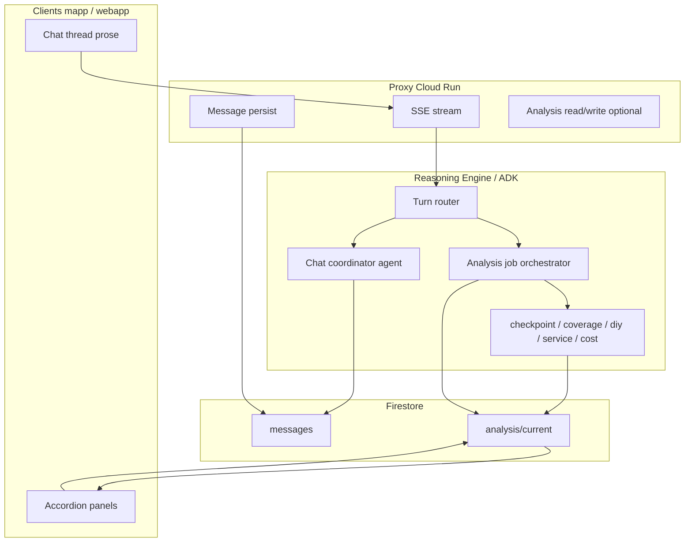

# Greenfield plan: Chat + structured analysis (separate buses)

**Status:** Planning document — greenfield not implemented; practical Phases 1–3 + follow-up intent **shipped** (interim).  
**Audience:** Engineering leads implementing a post–Phase-1/2/3 architecture.  
**Related:** Practical path shipped slim session events, context short-circuit, property-scoped Firestore stash (`agentSessionAnalysis/current`), follow-up intent LLM (`turn_intent_llm`), and provider/context-only fixes. This doc describes the **target** if you rebuild the seam instead of evolving dual-format-in-chat further. Interim code is a bridge until Phase G3.

---

## 1. North star

| Goal | Greenfield approach |
|------|---------------------|
| **Progressive UI** (Coverage / DIY / Service / Cost accordions) | UI binds to a **versioned analysis document** + live patches, not to parsing `message.content`. |
| **ChatGPT-style chat** | Chat messages are **short prose only**. Follow-ups use **compact memory**, not 15–21k-token executor history. |
| **Tools / sub-agents** | Workers return **structured JSON** into analysis state; coordinator speaks in natural language. |

**One sentence:** Separate **conversation** (what the user reads in the thread) from **analysis state** (what the app renders as accordions and what the model uses for follow-ups).

---

## 2. Current vs target

### Today (after practical Phases 1–3 + follow-up intent)

```
User message ──► prepare_before_model_turn
                      │
                      ├─► resolve_turn_llm (route, user_goal hint)
                      ├─► turn_intent_llm when prior analysis exists (explain vs re-run)
                      ├─► context_only short-circuit OR ADK property_agent executor
                      │       ├─► [RESOLVED_TURN] + tools
                      │       └─► Dual-format markdown+JSON in message.content (SSE replace)
                      ├─► Slim progress placeholders in ADK session (Phase 1)
                      └─► Firestore agentSessionAnalysis/current (Phase 3, agent-side)

Clients: parse ```json from message.content for accordions.
LLM: still sees growing ADK transcript + injected working memory on non-short-circuited turns.
```

**Interim shipped (2026-05-27, practical only — not greenfield):**

| Piece | Purpose |
|-------|---------|
| Phase 1 — slim progress | Full dual-format in `state_delta` / SSE; minimal text in ADK session |
| Phase 2 — `context_only_turn` | Skip fat executor for eligible `answer_from_context` turns |
| Phase 3 — `session_analysis_store` | Persist/hydrate `agentSessionAnalysis/current` per property |
| `turn_intent_llm` | When prior analysis exists: classify explain vs re-run branches (LLM + guardrails) |
| `query_mode` provider matching | Named-provider follow-ups; `service` vs `services` normalization |
| Provider UX polish | Agent prose: “From your previous Service results…”, sparse-details fallback |

Env: `CONTEXT_ONLY_SHORT_CIRCUIT_DISABLED`, `SESSION_ANALYSIS_FIRESTORE_*`, `TURN_INTENT_LLM_DISABLED` (see `.env.example`).

### Target (greenfield)

```
User message ──► Router (small LLM or rules+LLM)
                      │
         ┌────────────┼────────────┐
         ▼            ▼            ▼
   Chat coordinator  Analysis jobs  Docs / KB workers
   (prose only)     (structured)   (existing patterns)
         │            │
         │            ▼
         │     session.analysis (Firestore)
         │            │ patches: { branch, status, payload }
         ▼            ▼
   messages/{id}   UI accordions + working memory
   content: prose   (no megabyte strings in chat)
```

---

## 3. Design principles

1. **Single writer per concern** — Only the analysis pipeline writes `analysis.*`; only the chat coordinator writes `messages.*.content` (prose).
2. **Replace, don’t append, for snapshots** — Each branch completion emits a **full branch snapshot** or a **patch** with monotonic `revision`; UI replaces accordion section (same as today’s SSE replace semantics).
3. **LLM context = memory object, not transcript dumps** — Follow-ups receive `SessionMemory` (~1–2k tokens), optional last N prose turns, never full dual-format bodies.
4. **Idempotent jobs** — Re-run optional branch = new `analysisRunId`, not mutation of chat history.
5. **Property-scoped durability** — Analysis survives new chat sessions (extend Phase 3 doc or move to a first-class `propertyAnalysis` collection).

---

## 4. Data model (Firestore)

### 4.1 Chat thread (existing paths, new fields)

`users/{userId}/chats/{chatId}/messages/{messageId}`

| Field | Type | Notes |
|-------|------|--------|
| `role` | `user` \| `assistant` | Unchanged |
| `content` | string | **Prose only** — no ```json fences |
| `analysisRunId` | string? | Links assistant status messages to a run |
| `agentSteps` | array? | Keep for thinking ticker |
| `primaryAgent` | string? | Unchanged |

Remove dependence on embedded analysis JSON in `content` for new clients (keep parser fallback during migration).

### 4.2 Property analysis document (source of truth for accordions)

`users/{userId}/properties/{propertyId}/analysis/current`  
(or generalize Phase 3 `agentSessionAnalysis/current`)

```typescript
interface PropertyAnalysisDocument {
  schemaVersion: 1;
  analysisRunId: string;           // uuid per full/partial run
  updatedAt: Timestamp;
  checkpointIds: string[];
  optionalAgentsRequested: ("coverage"|"diy"|"service"|"cost")[];
  status: "idle" | "running" | "completed" | "failed";
  branches: {
    checkpoint?: BranchState;
    coverage?: BranchState;
    diy?: BranchState;
    service?: BranchState;
    cost?: BranchState;
  };
  memory: SessionMemorySnapshot;     // compact facts for routing + chat
  synthesis?: {
    title: string;
    checkpointSummary?: object;
    markdownSummary?: string;      // optional short prose for coordinator
  };
}

interface BranchState {
  status: "pending" | "running" | "completed" | "skipped" | "failed";
  revision: number;                // monotonic per branch
  updatedAt: Timestamp;
  payload: object;                 // coverageResult | diyResults | serviceResults | ...
  error?: string;
}
```

### 4.3 Session memory (for LLM, not shown raw to user)

Same shape as today’s `session_working_memory_snapshot` but **owned by analysis doc**, not rebuilt from chat:

- `areas_analyzed`, `checkpoint_summary`, `service_providers_mentioned`, `service_provider_details`, `last_response_kind`, etc.

### 4.4 Real-time delivery options

| Option | Pros | Cons |
|--------|------|------|
| **A. Firestore listener** on `analysis/current` | Works web + mobile; no proxy change for patches | Slightly higher read cost; schema must be client-friendly |
| **B. SSE event types** (`analysis_patch`, `chat_chunk`) | Matches today’s stream UX | Proxy + both clients must implement new protocol |
| **C. Hybrid** | SSE for chat prose; Firestore for accordion state | Two paths to test |

**Recommendation:** **C (hybrid)** — minimal chat streaming change; accordions subscribe to Firestore (or SSE patch events that mirror Firestore writes).

---

## 5. Runtime architecture



### 5.1 Turn router (replaces fat executor for most turns)

**Inputs:** `user_query`, `property_id`, `checkpoint_ids`, UI toggles, `analysis/current`, last 2–3 prose messages.

**Outputs:**

```json
{
  "intent": "greeting | capabilities | new_analysis | follow_up | replay",
  "route": "none | analysis | user_docs | knowledge_base",
  "run_optional_agents": ["coverage", "diy", "service", "cost"],
  "retrieval_only": false,
  "expanded_user_query": "..."
}
```

**Practical today:** Two routing layers when prior analysis exists — `resolve_turn_llm` then `turn_intent_llm` (via `_apply_checkpoint_retrieval_plan`). Keyword branch detection is bypassed for explain-style follow-ups (“explain DIY steps”, “why is cost high”) when guardrails fire.

**Greenfield target:** **One** router call with explicit `follow_up` intent; inputs include `analysis/current.branches.*.status` and completed branch payloads. No separate `turn_intent_llm` module — fold that behavior into the unified router and orchestrator gate (“only run branch X if `branches.X` missing or user asked for fresh run”).

Reuse `resolve_turn_llm` / `context_only_turn` patterns; greenfield change is **downstream consumers** (chat coordinator vs job orchestrator), not a second intent classifier.

### 5.2 Analysis job orchestrator

- Runs **checkpoint retrieval** → writes `branches.checkpoint`.
- Fans out **optional branches** in parallel (today’s `checkpoint_progress_agent` / `parallel_runner`).
- On each branch complete: `revision++`, write `branches.{name}`, emit patch event.
- Final **synthesis** writes `synthesis` + `memory` + `status: completed`.
- **Never** appends full JSON into ADK session events as user-visible content.

### 5.3 Chat coordinator

- **new_analysis / running:** “I’m analyzing your garage checkpoints…” (status prose).
- **follow_up:** Single flash call with `memory` + user query → prose only.
- **replay:** “Here’s your analysis” + UI already has accordions from `analysis/current` (optional: trigger UI scroll/highlight).

Model: `gemini-3.1-flash-lite` (see `docs/MODEL_POLICY.md`).

---

## 6. API / streaming contract (proxy)

Extend SSE (or parallel Firestore writes) with explicit types:

| Event | Purpose |
|-------|---------|
| `chat_delta` | Prose token/chunk for message bubble |
| `chat_done` | Final prose + `messageId` |
| `analysis_patch` | `{ branch, status, revision, payload? }` |
| `analysis_done` | `{ analysisRunId, memory }` |
| `agent_step` | Unchanged thinking ticker |

**Backward compatibility:** During migration, proxy can still emit legacy `**Agent**: text` lines **and** write `analysis/current`; clients use feature flag `structuredAnalysisV2`.

---

## 7. Client changes (mapp + webapp)

### 7.1 `@homeapp/common`

- Types: `PropertyAnalysisDocument`, `BranchState`, `AnalysisPatch`.
- Hook: `usePropertyAnalysis(propertyId)` — Firestore listener on `analysis/current`.
- **Accordion renderer** reads `branches.*.payload` directly (reuse `parseStructuredResponseFromContent` field mapping as reference, then deprecate parser).

### 7.2 Chat send path

Unchanged URL (`firebase-agent-stream`); optional request flag:

```json
{ "analysisDelivery": "v2" }
```

### 7.3 Migration UX

- **Flag off:** Parse dual-format from `content` (today).
- **Flag on:** Accordions from Firestore; chat from `content` prose only.

---

## 8. What to reuse from practical Phases 1–3

| Shipped piece | Greenfield use |
|---------------|----------------|
| `resolve_turn_llm` / `query_mode` | Router + memory inference; extend with `follow_up` + `analysis/current` inputs |
| `context_only_turn` | Becomes **chat coordinator** path (prose-only follow-ups) |
| `turn_intent_llm` | **Do not carry forward** — merge explain vs re-run into single router + `branches.*` completion checks |
| `checkpoint_progress_sse_body` + slim session text | Replace with `analysis_patch` events only |
| `session_analysis_store` | Evolve into `analysis/current` schema (section 4.2) |
| `parallel_runner` + sub-agents | Keep; change **output sink** from dual-format string → branch payload |
| `vertex_service` replace semantics | Map to `analysis_patch` + prose `chat_delta` |
| Provider follow-up formatting (`format_provider_context_answer`) | Coordinator reads `memory.service_provider_details`; enrich workers so sparse rows are rare |

---

## 9. Implementation phases (suggested order)

### Phase G0 — Spec & flags (1–2 weeks)

- [ ] Finalize Firestore schema + security rules (`propertyId` match).
- [ ] Feature flag: `structuredAnalysisV2` (webapp env + mapp `extra`).
- [ ] Document SSE event shapes in `gcp/proxy/api` OpenAPI / README.
- [ ] Exit: both clients can read mock `analysis/current` JSON.

### Phase G1 — Write path (2–3 weeks)

- [ ] Orchestrator writes `analysis/current` on branch complete (agent or proxy post-process).
- [ ] Stop embedding ```json in persisted Firestore messages for **new** runs (prose-only `content`).
- [ ] Keep ADK dual-format internally if needed; strip before persist.
- [ ] Exit: one full analysis run visible in Firestore; chat message is short summary only.

### Phase G2 — Read path / UI (2–3 weeks)

- [ ] `usePropertyAnalysis` + accordion binding in mapp/webapp.
- [ ] Progressive UI from `branches.*.status` + `revision`.
- [ ] Exit: accordions work with empty/minimal `message.content` JSON.

### Phase G3 — Chat coordinator split (2 weeks)

- [ ] Dedicated prose generator; remove property_agent executor for `follow_up` / `replay`.
- [ ] **Single** turn router (replaces `resolve_turn_llm` + `turn_intent_llm` split); route `follow_up` → chat coordinator only.
- [ ] Orchestrator runs branches only when `analysis/current` lacks data or user requests fresh run (`analysisRunId` bump).
- [ ] Exit: follow-up token budget &lt; ~3k input (measure via `llm_token_usage`).

### Phase G4 — ADK session diet (optional, 1–2 weeks)

- [ ] Stop storing progress/synthesis blobs in ADK session events.
- [ ] Compaction defaults aggressive; memory only from Firestore hydrate.
- [ ] Exit: `adk web` session DB size stable across long threads.

### Phase G5 — Deprecate dual-format-in-chat (1 week)

- [ ] Remove `parseStructuredResponseFromContent` from hot path (keep fallback 90 days).
- [ ] Exit: no production dependence on ```json in messages.

---

## 10. Success metrics

| Metric | Baseline (pre-change) | Target |
|--------|------------------------|--------|
| Follow-up executor `prompt_token_count` | ~15–21k | &lt; 4k |
| Full analysis session input tokens | ~165k / 6 turns (example session) | −40% minimum |
| Time-to-first accordion section | ~same as today | No regression |
| Firestore message size | Large dual-format strings | Prose &lt; 2 KB typical |
| Cross-session follow-up without re-analysis | Partial (Phase 3 agent hydrate) | 100% with `analysis/current` |

---

## 11. Risks and mitigations

| Risk | Mitigation |
|------|------------|
| Two sources of truth during migration | Feature flag; single write path per flag value |
| Firestore 1 MiB doc limit | Branch payloads compressed or split subcollections if needed |
| ADK still ingests tool blobs | G4: custom event filters; don’t save synthesis to session |
| Eval / conformance tests expect dual-format in content | New eval fixtures on `analysis/current`; keep legacy eval suite until G5 |
| Provider details sparse (name + rating only) | Enrich service worker output; coordinator LLM fallback (practical: `format_provider_context_answer` + polish copy) |
| Explain questions re-trigger DIY/cost/service branches | Practical: `turn_intent_llm` + guardrails; greenfield: `follow_up` never invokes orchestrator if branch `completed` |
| Two routing LLMs per follow-up turn | Greenfield G3: one router; practical interim acceptable until coordinator split |

---

## 12. Open decisions (fill before G0)

1. **Collection path:** `analysis/current` vs extend `agentSessionAnalysis/current`?
2. **Who writes analysis doc:** Agent Engine only vs proxy finalize (duplicate guard)?
3. **SSE vs Firestore-only** for progressive accordion updates on web?
4. **Replay UX:** Re-stream prose only, or also reset accordion UI from `revision` 0?
5. **Multi-property chats:** One analysis doc per property (recommended) — confirm product rule.

---

## 13. Out of scope (for this plan)

- Replacing Vertex Reasoning Engine with a custom orchestrator service.
- Non-checkpoint agents (user_docs, knowledge_base) beyond keeping current tool routes.
- Billing / token quota schema changes (existing `llm_token_usage` still applies).
- Checkpoint **media** analysis worker (already async via Pub/Sub).

---

## 14. References in repo

| Area | Path |
|------|------|
| Practical Phase 3 stash | `property_agent/session_analysis_store.py` |
| Turn routing | `property_agent/resolve_turn_llm.py`, `query_mode.py` |
| Follow-up intent (practical interim) | `property_agent/turn_intent_llm.py` |
| Context short-circuit | `property_agent/context_only_turn.py` |
| Follow-up intent tests | `tests/test_turn_intent_llm.py` |
| Progressive dual-format | `sub_agents/checkpoint_dual_format/`, `parallel_runner.py` |
| Proxy stream replace | `gcp/proxy/api/services/vertex_service.py` |
| Client parser | `apps/common/src/lib/checkpoint-branch-progress.ts` |
| Checkpoint chat product doc | `docs/checkpoint/CHECKPOINT_AI_CHAT_ANALYSIS.md` |
| Model policy | `gcp/agents/homecare/docs/MODEL_POLICY.md` |

---

## 15. Quick start when you pick this up

1. Read §4.2 and lock schema + rules.
2. Implement **G1 write path** behind `structuredAnalysisV2` (smallest vertical slice).
3. Point one client (webapp staging) at **G2 read path**.
4. Measure tokens on a 6-turn replay script (reuse `web-log` conformance pattern).
5. Only then start **G3** coordinator split.

---

## 16. Practical interim vs greenfield (routing)

| User query (after full analysis) | Practical (today) | Greenfield (target) |
|----------------------------------|-------------------|---------------------|
| “Explain DIY steps” | `turn_intent_llm` → `answer_from_context` → `context_only_turn` | Router `follow_up` → chat coordinator; read `branches.diy.payload` |
| “Why is professional cost high?” | Same (context-only) | Same |
| “Find more service providers” | `new_analysis` + `service` branch | New `analysisRunId` + `service` job only |
| “How about cost?” (explicit pick) | `new_analysis` + `cost` (explicit branch) | Re-run cost only if user intent = fresh branch or payload stale |
| “Analyse checkpoints for coverage, diy…” | Full executor + all branches | Analysis orchestrator (no prior-analysis shortcut) |

**Do not block greenfield on `turn_intent_llm`.** It exists because the executor path and keyword branch rules still coexist with context-only short-circuit. G3 removes that coupling.

*Last updated: 2026-05-27 — practical Phases 1–3 + `turn_intent_llm` + provider follow-up fixes; greenfield phases G0–G5 unchanged in scope.*
