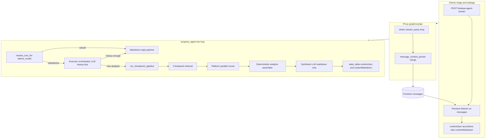

# Orchestrator V2 (Locked)

This document is the **canonical V2 architecture** for Homecare chat orchestration: how the agent, proxy, and clients cooperate after cutover.

**Implementation tracking:** see the workspace plan *Orchestrator V2 Dual Format* (proxy message persist, checkpoint pipeline, orchestrator, dead-code and docs purge).

---

## Mental model

| Layer | Responsibility |
| ----- | ---------------- |
| **Agent** (`property_agent`) | Decide whether to answer from history or run tools; compute structured `analysis` in code; optional synthesis LLM for **markdown prose only**; emit **patches** on the stream (`state_delta`). |
| **Proxy** (`gcp/proxy/api`) | Merge patches into **one Firestore assistant message** per turn (revision, size limits, schema validation). |
| **UI** (mapp / webapp) | Render **`contentJson`** first (accordions), else **`contentMarkdown`** (prose). Listen to Firestore; do not parse fenced JSON from `message.content`. |

The **Firestore chat message document** is the only source of truth for what users see. There is no `analysis/current` sidecar for chat rendering.

---

## Message SSOT contract

All assistant rendering data is stored on:

`users/{userId}/chats/{chatId}/messages/{messageId}`

### Required V2 fields

| Field | Type | Purpose |
| ----- | ---- | ------- |
| `contentMarkdown` | `string?` | User-visible prose (ReactMarkdown) |
| `contentJson` | `object?` | Structured accordion payload (`StructuredResponseData` shape) |
| `contentSchemaVersion` | `number` | Must be `2` for V2 assistant messages |
| `revision` | `number?` | Monotonic; proxy rejects stale patches |
| `analysisRunId` | `string?` | Idempotent key for a single analysis run (optional branches) |
| `agentSteps` | `array?` | Thinking strip / branch progress ticker |
| `primaryAgent` | `string?` | Unchanged |
| `updatedAt` | `timestamp` | Stream throttle / ordering |
| `content` | `string` | Legacy; prose-only or minimal; **not** the UI SSOT |

### Client rendering rule

Hard rule: chat UI reads **`contentMarkdown`** and **`contentJson`** via `@homeapp/common` [`resolveMessageContentParts`](../../../apps/common/src/lib/message-content-parts.ts):

- If **`contentJson`** is present and valid → accordions / structured UI.
- Else → **`contentMarkdown`** for prose.
- Do **not** parse ```json fences from `message.content`.
- Do **not** use `usePropertyAnalysis` / `properties/{id}/analysis/current` for chat accordions.

---

## End-to-end data flow

```mermaid
sequenceDiagram
  participant UI as mapp_or_webapp
  participant FS as Firestore_messages
  participant Proxy as proxy_vertex_service
  participant RE as Vertex_property_agent

  UI->>FS: Create user message + empty assistant message
  UI->>Proxy: POST firebase-agent-stream

  Proxy->>RE: stream_query(session)

  alt Casual_short_circuit
    RE->>RE: resolve_turn_llm canned markdown
    RE-->>Proxy: model text chunks
    Proxy->>FS: patch contentMarkdown revision++
  else Substantive_turn
    RE->>RE: resolve_turn_llm inject RESOLVED_TURN
    RE->>RE: Executor orchestrator LLM history first
    alt History_sufficient
      RE-->>Proxy: markdown only
      Proxy->>FS: patch contentMarkdown revision++
    else New_checkpoint_analysis
      RE->>RE: run_checkpoint_pipeline
    Note over RE: retrieve, parallel branches, assemble, synthesis
    RE-->>Proxy: events with state_delta contentJson contentMarkdown agentSteps
    Proxy->>FS: merge patches revision++
  end

  FS-->>UI: onSnapshot message updates
  Note over UI: resolveMessageContentParts
```

### Architecture overview



---

## Agent runtime (Vertex `property_agent`)

### Two-hop orchestration (accepted)

Each turn runs **resolve** then optionally **execute**:

| Hop | Component | Role |
| --- | --------- | ---- |
| 1 | **`resolve_turn_llm`** (`before_model`) | Flash JSON router: casual short-circuit **or** inject `[RESOLVED_TURN]` block for the executor |
| 2 | **Executor orchestrator LLM** | History-first brain: answer from session / prior message `contentJson` digests **or** call flat tools |

**Resolve hop (`resolve_turn_llm`):**

1. Classifies intent (greeting, follow-up, new checkpoint work, docs/KB).
2. **Casual** (greeting / thanks): returns canned markdown — **executor LLM is skipped**; no tools, no `contentJson`.
3. **Substantive**: writes `resolved_turn` to session state and injects `[RESOLVED_TURN]` (+ optional session working memory) into the executor prompt.

**Executor hop (orchestrator LLM):**

1. Uses compact context from prior chat messages (`contentJson` digests + session working memory), not full dual-format transcripts.
2. **Follow-up** (“explain DIY steps”, “why is cost high?”): markdown only — no `run_checkpoint_pipeline`.
3. **New or expanded checkpoint work**: call **`run_checkpoint_pipeline`** (one Python tool).

Nested `checkpoint_agent` AgentTool + fenced dual-format strings are **removed**.

### Routing control plane

Turn routing is distributed across three layers (see [`property_agent/ARCHITECTURE.md`](../property_agent/ARCHITECTURE.md)):

| Layer | Owns |
| ----- | ---- |
| **1 — Resolve** | `discourse_act`, `focus_branch`, intent, route, `user_goal`, pending offers, `[RESOLVED_TURN]` + dialogue/focus inject |
| **2 — Executor** | History-first markdown vs tool call |
| **3 — Guards** | Thin invariants: block tools on `explain_prior` / closure; no UI toggle merge on context turns |

NLU-first resolve is **on by default** (resolve turn-semantics JSON is the semantic SSOT). Set `HOMEAPP_NLU_FIRST_RESOLVE=0` for legacy regex post-processing. Pending affirmations: `pending_user_action` + after-agent `pending_offer_extract`.

### `run_checkpoint_pipeline` (internal)

| Step | Mechanism | Output |
| ---- | --------- | ------ |
| 1. Retrieval | Vector search over `checkpoint_ids` | `checkpoint_results` blob in session |
| 2. Optional branches | Parallel coverage / diy / service / cost | Branch payloads in session |
| 3. Assemble | **Code** (`checkpoint/analysis/assembler.py`) | `checkpoint_analysis` dict: `{ "analysis": { … } }` with `analysisStatus` |
| 4. Synthesize | **LLM** (narrow contract) | Markdown summary only; JSON comes from step 3, not from model fences |
| 5. Emit | ADK events `actions.state_delta` | `contentJson`, `contentMarkdown`, branch progress, `agentSteps` |

The agent does **not** emit markdown + ```json as a single wire-format blob.

### Session state (ADK, after session diet)

**Stored (lightweight):**

- `checkpoint_analysis` — structured dict for the current run.
- Optional `checkpoint_analysis_markdown` — synthesis prose before proxy patch.
- Branch status / `checkpoint_parallel_results` during the run (trimmed for session where possible).

**Not stored on hot path:**

- `checkpoint_analysis_dual_format`
- `checkpoint_progress_sse_body`
- Full fenced dual-format bodies in session history.

### Tools (flat registry)

| Tool id | Role |
| ------- | ---- |
| `run_checkpoint_pipeline` | Full checkpoint retrieval + optional parallel analysis |
| `user_docs_retrieval` | User document RAG |

---

## Proxy runtime (`vertex_service`)

The proxy is the **authoritative writer** of message fields.

On each throttled persist (`persist_chat_message_state`):

1. Read **`actions.state_delta`** when present: `contentJson`, `contentMarkdown`, `analysisRunId`, branch completion hints.
2. **Merge** `contentJson` (branch-level last-write-wins with monotonic `revision`).
3. Set **`contentMarkdown`** (prose only; strip any accidental fences on finalize).
4. Validate schema (`contentSchemaVersion: 2`) and enforce [`constrain_content_json_size`](../../proxy/api/utils/message_patch_state.py).

SSE events may still stream to the client for responsiveness; **rendering SSOT remains the Firestore message document**, not parsing SSE text as dual-format.

---

## UI runtime (mapp / webapp)

### Send path (unchanged URL)

1. User message written to Firestore.
2. Empty assistant placeholder created.
3. `POST {proxy}/firebase-agent-stream` with session / property / checkpoint context.

### Receive path (V2)

1. **Firestore listener** on `messages/{messageId}`.
2. `resolveMessageContentParts(message)` → `{ markdown, contentJson }`.
3. **Accordions** from `contentJson.analysis.*` (including `analysisStatus` for progressive UI).
4. **Prose** from `contentMarkdown`.
5. **`agentSteps`** for thinking strip (unchanged shape).

`propertyAnalysisV2` / property-level `analysis/current` is **not** used for chat rendering.

---

## Example user journeys

### A. Full checkpoint analysis (optional branches)

| Phase | Agent | Proxy → Firestore | UI |
| ----- | ----- | ----------------- | -- |
| Start | `run_checkpoint_pipeline` | Empty `contentMarkdown` / `contentJson` | Loading, agent steps |
| After retrieval | Assembler: summary + `analysisStatus` pending | Patch partial `contentJson` + short markdown | Summary, accordions loading |
| Per branch | Merge branch into `analysis`, status `completed` | Merge `contentJson`, `revision++` | Section becomes interactive |
| After synthesis | Executive summary markdown | Final patch both fields | Full prose + accordions |

### B. Follow-up from prior analysis

| Phase | Agent | Proxy → Firestore | UI |
| ----- | ----- | ----------------- | -- |
| Turn | Orchestrator uses prior message **`contentJson`** digests | — | — |
| Reply | Markdown only; no pipeline | This message: `contentMarkdown` only | Prose answer; **previous** message still has accordions |

---

## `contentJson` shape (illustrative)

Clients expect a root object compatible with `StructuredResponseData`, typically:

```json
{
  "analysis": {
    "title": "Garage door condition",
    "checkpointSummary": {
      "checkpointsAnalyzed": 2,
      "locations": ["Garage"],
      "issuesDetected": ["Paint chipping"]
    },
    "analysisStatus": {
      "coverage": "completed",
      "diy": "completed",
      "service": "running",
      "cost": "pending"
    },
    "coverageResult": {},
    "diyResults": {},
    "serviceResults": {},
    "costEstimationResults": {}
  }
}
```

`contentMarkdown` is separate narrative text with **no** embedded ```json fence.

---

## Removed from the serving path

| Removed | Replaced by |
| ------- | ----------- |
| Dual-format string (markdown + ```json fence) in agent output | `state_delta.contentJson` + `contentMarkdown` |
| `checkpoint_progress_sse_body` full blob | Structured `contentJson` patches |
| `checkpoint_analysis_dual_format` session stash | `checkpoint_analysis` dict |
| `analysis/current` for chat UI | Message `contentJson` |
| `usePropertyAnalysis` accordion hot path | `resolveMessageContentParts` |
| Nested `checkpoint_agent` + `checkpoint_progress_agent` transfer | `run_checkpoint_pipeline` |
| Proxy `_coerce_result_to_dict` on accumulated fence text | `message_content_persist` merge from `state_delta` |
| Legacy env flags (`CHAT_COORDINATOR_*`, `STRUCTURED_ANALYSIS_V2_*`, etc.) | Hard-cutover V2 behavior (no fallback flags) |
| Duplicate `property_agent/agents/checkpoint_*` trees | `property_agent/checkpoint/*` only |

Historical design notes live in archived docs only (see docs purge in implementation plan); active docs must not describe the removed paths as current behavior.

---

## Platform and plugin boundaries

- Platform modules live under `gcp/agent_framework/*` (import `agent_framework.*`).
- Homecare bindings live under `property_agent/*` (`registry.py`, routing, checkpoint pipeline).
- `agent_framework/*` must not import `property_agent.*`.
- Platform contracts: [`agent_framework.contracts.v1`](../../../agent_framework/contracts/v1.py) (`MessagePatchInputV1`, hydrator, parallel runner).
- **Context hydration (thin v1):** follow-up `[SESSION_WORKING_MEMORY]` is built via [`HomecareContextHydratorV1`](../property_agent/context/homecare_hydrator_v1.py) (`ContextHydratorV1` binding); injected in [`resolve_turn.py`](../property_agent/routing/resolve_turn.py). Full retriever/compactor remains deferred.

---

## Runtime policies

- **Two-hop resolve + executor** per turn (resolve may short-circuit casual turns without invoking the executor).
- **Flat tool registry** with dependency-aware parallel execution (platform runner).
- **No** serving-path fallback to fenced-json parsing in proxy or clients.
- **No** serving-path fallback to `analysis/current` for chat.
- **Synthesis LLM** produces markdown only; structured UI data is assembled in code.
- **Do not reintroduce** nested `checkpoint_agent` / `checkpoint_analysis_agent` as root executor tools. Checkpoint work stays behind `run_checkpoint_pipeline` (composite `FunctionTool`).
- **Coordinated deploy**: proxy and agent ship together; docs describe only this contract.

---

## Cutover status

| Area | Target state |
| ---- | ------------ |
| Message SSOT | `contentMarkdown` + `contentJson` on Firestore messages |
| Proxy | `message_content_persist` merges `state_delta` patches |
| Agent | `run_checkpoint_pipeline`; no dual-format hot path |
| Clients | `resolveMessageContentParts`; no `analysis/current` for chat |
| Docs | This file is canonical; stale V1 docs removed |

Dead-code purge complete (legacy dual-format shims, duplicate `agents/checkpoint_*` trees, env flags). Serving path: `resolve_turn_llm` → executor → `run_checkpoint_pipeline` → assembler → `contentJson` / `contentMarkdown` state_delta.

---

## Progress UX parity sign-off (§12)

Use this checklist before declaring Orchestrator V2 fully closed in staging/prod:

| UX element | Expected V2 behavior | Sign-off |
| ---------- | -------------------- | -------- |
| Thinking strip | `agentSteps` updates during retrieval, branches, synthesis; no dual-format blob in `message.content` | ☐ |
| Branch badges | `contentJson.analysis.analysisStatus` shows `pending` → `running` → `completed` per optional branch | ☐ |
| Progressive accordions | Partial `contentJson` patches render summary before branches finish; prior message accordions persist on follow-ups | ☐ |
| Prose | `contentMarkdown` only; no ```json fences in Firestore message fields | ☐ |
| Follow-up turns | Markdown-only reply on current message; previous message retains structured accordions | ☐ |
| Stream failure | Partial patches retained; `agent_stream` step may show `failed`; no rollback to empty message | ☐ |

Detailed go/no-go and rollback: [orchestrator-v2-cutover runbook](../../../../docs/deployment/runbooks/orchestrator-v2-cutover.md).

---

## Related documents

| Document | Role |
| -------- | ---- |
| [`property_agent/ARCHITECTURE.md`](../property_agent/ARCHITECTURE.md) | Layer rules, routing control plane, branch invocation |
| [`gcp/docs/ARCHITECTURE.md`](../../../docs/ARCHITECTURE.md) | Repo-wide architecture |
