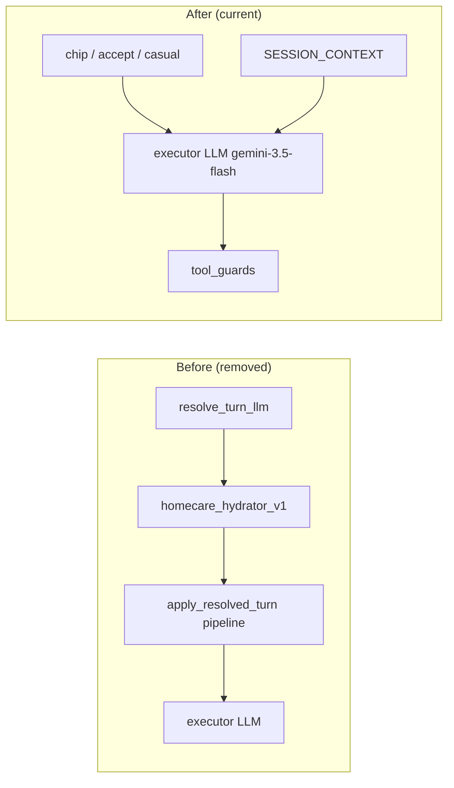

# Single-loop refactor — cleanup record

> **Branch:** `agents/single-loop-refactor` (June 2026)  
> **Status:** Code and documentation cleanup **complete**. Ship/validation (deploy, soak, PR, prod) remains.  
> **Live architecture:** [`property_agent/ARCHITECTURE.md`](../property_agent/ARCHITECTURE.md)  
> **Migration history (phases 0–5):** [`SINGLE_LOOP_REFACTOR_PLAN.md`](SINGLE_LOOP_REFACTOR_PLAN.md)  
> **Deploy runbook:** [`docs/deployment/runbooks/single-loop-cutover.md`](../../../docs/deployment/runbooks/single-loop-cutover.md)

This document records **everything removed, renamed, disabled, and re-documented** after the single-loop cutover. Use it for PR reviews, onboarding, and post-deploy audits.

---

## Summary

The homecare property agent moved from a **two-LLM routing stack** (resolve LLM → executor LLM → layered heuristics) to a **single-loop orchestrator**:

1. **Deterministic pre-routing** — chip taps, accept-offer, bare greetings/capabilities  
2. **One executor LLM** (`gemini-3.5-flash`) per substantive turn — flat tool registry  
3. **Tool-boundary guards** — ids, dedupe, idempotency, pending-offer, report mode (no arbitration)

Cleanup eliminated ~4,700 lines of routing authority split, legacy V2 naming, stale docs, and unused LLM calls. The resolve LLM path is **gone**; single-loop is **unconditional** (no feature flag).

**Zero-arbitration criterion met (post-Phase-5 cleanup):** The `should_block_checkpoint_pipeline_for_context_turn` context-only heuristic and `routing/query_mode/{heuristics,provider_context}.py` (~970 lines of regex + working-memory arbitration) have been removed. The executor prompt (`prompts.py`) is now the sole authority over whether to call `analyze_checkpoints` on a follow-up turn; `checkpoint/tool_guards.py` enforces only structural invariants (ids, dedupe, idempotency, report mode). This completes the plan's success criterion: *"A turn like 'Summarize the issues for the selected checkpoints' costs one LLM call… and zero heuristic arbitration."*

---

## Architecture before → after

| Before | After |
|--------|--------|
| Resolve LLM (`resolve_turn_llm`) + hydrator + `[RESOLVED_TURN]` inject | Slim `[SESSION_CONTEXT]` inject via `single_loop_routing.py` |
| Executor + resolve arbitration (`apply_resolved_turn`, thin invariants, …) | `ResolvedTurn` for guards only; chip/accept still use `resolve_turn.py` state apply |
| `HOMEAPP_EXECUTOR_ONLY_ROUTING` flag | Removed — single-loop always on |
| `orchestrator_v2_*` metrics / runbook naming | `single_loop_*`, `AGENT_*_METRICS`, `message_patch_metrics.py` |
| Rolling `conversation_summary` flash-lite after every long turn | **Disabled by default** (`HOMEAPP_CONVERSATION_SUMMARY=1` to opt in) |
| ADK compaction at 24k tokens | **130k** threshold, **32** event retention (~65% effective context) |



---

## Deleted code and artifacts

### Phase 5 — resolve stack (commit `799a57bc`, `13ef2aaf`)

| Removed | Notes |
|---------|--------|
| `property_agent/routing/resolve_turn_llm.py` | Separate routing LLM |
| `property_agent/routing/resolve_llm_schema.py` | Resolve output schema |
| `property_agent/routing/nlu_first_resolve.py` | NLU-first experiment |
| `property_agent/routing/homecare_resolve_hooks.py` | `ResolveTurnHooks` implementation |
| `property_agent/routing/turn_intent_llm.py` | Turn-intent micro-LLM |
| `property_agent/routing/apply_resolved_turn.py` | Standalone apply module (logic lives in `resolve_turn.py`) |
| `property_agent/context/homecare_hydrator_v1.py` | Retrieval-backed resolve hydration |
| `docs/ORCHESTRATOR_V2_PLAN.md` | Superseded planning doc |
| `evals/routing/baselines/2026-06-10.json` | Resolve-LLM routing baseline |
| `format_session_working_memory_block` + test | Not on live path after slim inject |
| `infer_query_mode`, `property_analysis_routing_blob` | Test-only / dead helpers |
| `executor_only_routing_enabled()` stub | Flag removed |
| Stale conftest fixture for `HOMEAPP_EXECUTOR_ONLY_ROUTING` | — |

### Post-Phase-5 scrub (`13ef2aaf`)

- Duplicate `branches_mentioned_in_query` removed from resolve stack  
- Working-memory inject removed from `format_resolved_turn_block` (chips/accept still inject `[RESOLVED_TURN]` where needed)  
- `ResolveTurnHooks` wiring deleted from property agent manifest  

### Zero-arbitration cleanup (heuristic layer removal)

| Removed | Notes |
|---------|--------|
| `property_agent/routing/query_mode/heuristics.py` | ~265-line regex + working-memory context-block layer |
| `property_agent/routing/query_mode/provider_context.py` | ~192-line provider-from-context matcher and answer formatter |
| `session_has_checkpoint_answer_context` | From `session_memory.py` — only consumer was the removed block guard |
| `should_answer_provider_from_context` short-circuit in `apply_resolved_turn_to_state` | Was pre-empting executor on provider follow-ups |
| `is_executor_conversational_turn` dead branches | `query_requests_checkpoint_inventory` + `session_has_checkpoint_answer_context` clauses unreachable under single-loop |
| `_CONTEXT_ONLY_BLOCKED_TOOLS` / `_CONTEXT_ONLY_FALLBACK` | Removed from `conversational_callbacks.py` with the block |

**Relocated (still live — legitimate tool-boundary logic):**
- `branches_mentioned_in_query`, `prior_analysis_branches_completed`, `query_requests_fresh_external_data`, `query_requests_entity_detail` → `routing/query_mode/branch_analysis.py` (consumed by `checkpoint/tool_guards.py` and `checkpoint/analysis/search_query.py`)
- `query_requests_checkpoint_inventory` → `checkpoint/retrieval/inventory_query.py` (consumed by `checkpoint/retrieval/agent.py` for `inventory_recent` retrieval mode)

---

## Renames (commit `ecd822ef`)

| Old | New |
|-----|-----|
| `routing/executor_only_routing.py` | `routing/single_loop_routing.py` |
| `prepare_executor_only_before_model` | `prepare_single_loop_before_model` |
| `EXECUTOR_ONLY_GEMINI_MODEL` | `SINGLE_LOOP_GEMINI_MODEL` |
| `resolve_source` / `routing_mode` value `executor_only` | `single_loop` (legacy `executor_only` still accepted in schema/guards) |
| `evals/routing/executor_only/` | `evals/routing/single_loop/` |
| `tests/test_executor_only_routing.py` | `tests/test_single_loop_routing.py` |
| `proxy/.../orchestrator_v2_metrics.py` | `proxy/.../message_patch_metrics.py` |
| `docs/.../orchestrator-v2-cutover.md` | `docs/.../single-loop-cutover.md` |
| Env `ORCHESTRATOR_V2_METRICS` | `AGENT_ROUTING_METRICS`, `AGENT_MESSAGE_METRICS` |

Log prefix: `orchestrator_v2_routing` → `orchestrator_routing`.

---

## Documentation and comment sync (commit `4eb02e67`, `843bdb61`)

Updated to single-loop terminology (no stale “resolve LLM”, “V2 message”, “no resolve LLM” wording):

| Area | Files (representative) |
|------|----------------------|
| Repo root | `CLAUDE.md` |
| Agent | `property_agent/ARCHITECTURE.md`, `README.md`, `evals/README.md`, `docs/MODEL_POLICY.md` |
| Framework | `gcp/agent_framework/README.md` (Homecare uses single-loop; generic resolve pipeline for other verticals) |
| Proxy | `message_content_persist.py`, `openapi.json`, `schemas/agent.py` |
| Clients | `apps/webapp`, `apps/mapp`, `apps/common` — chat/API comments |
| Deployment | `docs/deployment/runbooks/single-loop-cutover.md`, `gcp/docs/ARCHITECTURE.md`, product docs (`DOCS_CHAT_*`, `PROPERTY_REPORTS_PLAN`, …) |
| Skills | `.claude/skills/run-homecare-agent/SKILL.md` |

**Broken link fix (`843bdb61`):** `docs/deployment/README.md`, `OPERATIONS.md`, and `runbooks/README.md` now point at `single-loop-cutover.md` (not deleted `orchestrator-v2-cutover.md`).

---

## Features disabled or gated

### `conversation_summary` (commit `e0239ea2`)

- **Was:** After-agent flash-lite rolling summary on long chats (≥12 dialogue lines).  
- **Problem:** Write-only in single-loop — never injected into `[SESSION_CONTEXT]` or executor prompt; pure LLM cost.  
- **Now:** Off by default. Opt in with `HOMEAPP_CONVERSATION_SUMMARY=1`.  
- **Long sessions:** ADK event compaction is primary (see below).

### Deploy flags removed

- `HOMEAPP_EXECUTOR_ONLY_ROUTING` — no longer set in deploy or conftest  
- `RESOLVE_LLM_DISABLED`, `HOMEAPP_NLU_FIRST_RESOLVE` — removed from `.env.example`  

---

## Observability cleanup

| Change | Commit | Detail |
|--------|--------|--------|
| Routing metrics env | `ecd822ef` | `AGENT_ROUTING_METRICS` (default on); counters `orchestrator.routing.*` |
| Message patch metrics | `ecd822ef` | `AGENT_MESSAGE_METRICS`; module `message_patch_metrics.py` |
| Compaction INFO log | `843bdb61` | `adk_session_compaction applied` when new compaction events appear (`HomecareRunner.run_async` + `observability/session_compaction.py`) |
| Runbook metrics table | `843bdb61`, `0283dbc0` | Aligned with current metric names and 130k compaction threshold |

**GCP filter example:**

```
resource.type="aiplatform.googleapis.com/ReasoningEngine"
"adk_session_compaction applied"
```

---

## Session compaction defaults (commit `0283dbc0`)

Aligned with industry practice (~65% of *effective* context, not API max):

| Setting | Old | New | Override |
|---------|-----|-----|----------|
| `token_threshold` | 24,000 | **130,000** | `ADK_COMPACTION_TOKEN_THRESHOLD` |
| `event_retention_size` | 24 | **32** | `ADK_COMPACTION_EVENT_RETENTION_SIZE` |

Rationale: `gemini-3.5-flash` advertises ~1M context; quality degrades well below that. 130k ≈ 65% of ~200k effective executor window, leaving headroom for summarization and the next tool-heavy turn.

**Bug fix:** `g4_compaction_*` in `session_diet.py` now honor env overrides (previously always forced G4 defaults).

---

## Kept on purpose (not stale)

| Item | Why |
|------|-----|
| `routing/resolve_turn.py` | `ResolvedTurn` state apply, `[RESOLVED_TURN]` inject for chip/accept, `prepare_before_model_turn` entry |
| `executor_only` in schema/guards | Legacy session state compat |
| Weblog parsers / A/B baselines with `resolve_turn_llm` log lines | Historical log comparison (`summarize_weblog_ab.py`, `extract_weblog_cases.py`) |
| `pending_offer_extract.py` | Accept-offer fast-path (live) |
| `SINGLE_LOOP_REFACTOR_PLAN.md` | Phase-by-phase migration record |
| Gitignored `web-log*` | Local `adk web` captures for eval extraction |

---

## Eval and test artifacts

| Artifact | Location |
|----------|----------|
| Deterministic routing cases | `property_agent/evals/routing/single_loop/cases.yaml` (33 cases) |
| Routing baseline | `single_loop/baselines/2026-06-11.json` |
| Full-turn A/B report | `single_loop/baselines/weblog-ab-2026-06-11.json` |
| Weblog summarizer | `evals/routing/summarize_weblog_ab.py` (`make weblog-summarize`) |
| Unit tests | 476+ homecare tests; `test_single_loop_routing`, `test_session_compaction`, `test_no_legacy_checkpoint_imports`, … |

Run: `make routing-eval`, `make test`.

---

## Commit timeline (cleanup-focused)

| Commit | Summary |
|--------|---------|
| `799a57bc` | Phase 5: remove resolve LLM stack |
| `13ef2aaf` | Post-Phase-5 artifact deletion, ORCHESTRATOR_V2 plan doc removed |
| `ecd822ef` | Rename executor-only / V2 → single-loop |
| `4eb02e67` | Doc and comment sync across repo |
| `e0239ea2` | Disable `conversation_summary` by default |
| `843bdb61` | Fix runbook links; ADK compaction INFO logging |
| `0283dbc0` | Compaction defaults 130k / 32 |

Full branch includes phases 0–4 commits (`f4daa71a` … `22eb5afd`) before cleanup; see [`SINGLE_LOOP_REFACTOR_PLAN.md`](SINGLE_LOOP_REFACTOR_PLAN.md).

---

## Not done (ship path — not cleanup)

These are **operational**, not code cleanup:

- [ ] Deploy agent + proxy to staging (latest branch build)  
- [ ] Staging soak — runbook go/no-go in `single-loop-cutover.md`  
- [ ] Push branch, open PR, merge  
- [ ] Prod enable + one-sprint soak  
- [ ] `make conformance-record` — re-record multi-turn fixtures for single-loop transcripts  
- [ ] Optional: delete `conversation_summary.py` entirely if opt-in will never be used  
- [ ] Tool-description tweaks only if QA surfaces misroutes  

---

## Quick reference — current live path

```
Client → Proxy → Agent Engine
  → single_loop_routing.prepare_single_loop_before_model
      → chip / accept-offer / casual short-circuit OR
      → [SESSION_CONTEXT] + executor (gemini-3.5-flash)
  → flat tools: list_checkpoints, analyze_checkpoints, user_docs, report_retrieval
  → tool_guards (before_tool)
  → state_delta → proxy message_content_persist → Firestore
Post-turn: ADK compaction (if prompt ≥ threshold), pending_offer_extract
```

**Canonical doc:** [`property_agent/ARCHITECTURE.md`](../property_agent/ARCHITECTURE.md)
