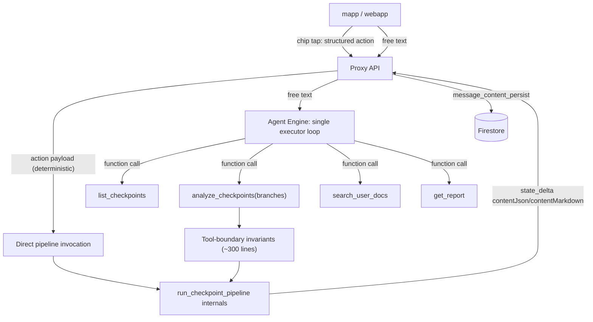

# Single-loop agent refactor plan

> **Status:** Complete (June 2026). **Current architecture:** [`property_agent/ARCHITECTURE.md`](../property_agent/ARCHITECTURE.md). **Cleanup record:** [`SINGLE_LOOP_CLEANUP.md`](SINGLE_LOOP_CLEANUP.md). This document is a migration record only.

Owner: —
Last updated: 2026-06-11

Strangler migration from the former two-LLM routing architecture (removed resolve LLM →
executor LLM → `before_tool` arbitration, ~4,700 lines in `property_agent/routing/`)
to a single executor loop with deterministic chip routing and tool-boundary
invariants. Each phase is independently shippable and reduces risk for the next.

Motivation (from the 2026-06-10 audit of an `adk web` session log):

- 5–7 LLM calls per substantive turn; 12–46s end-to-end latency.
- Routing authority split across three layers produced real bugs: duplicate
  branch-list pollution (`['diy','diy']`), an unrequested 28s cost analysis from
  pending-offer leakage, and resolver output contradicting its own prompt rules.
- Every misroute historically fixed with another heuristic layer
  (`apply_checkpoint_retrieval_plan`, `apply_thin_invariants`,
  `follow_up_from_resolver`, …) with overlapping branch-merge logic.

## Target architecture

**Invariant:** branch decisions are made in exactly one place per path — the
client (chips) or the executor's validated function call (free text). No
arbitration layers.

### Kept as-is (do not touch)

- `run_checkpoint_pipeline` internals: retrieval → parallel branches → synthesis,
  progress queue/`HomecareRunner` multiplexing.
- The `state_delta` / `contentJson` + `contentMarkdown` message-patch contract and
  proxy `message_content_persist`.
- Legacy stream `author` label mappings (see `property_agent/ARCHITECTURE.md`).
- `checkpoint_ids` trust boundary (`apply_session_checkpoint_ids_to_tool_args`).
- Token-quota accounting (`llm_token_usage` schema unchanged; fewer calls only
  reduce usage).

---

## Phase 0 — Measurement baseline (prerequisite, ~1 day) ✅

No parity claim without a yardstick.

- [x] Build a routing eval set covering each `discourse_act`, chip-style queries,
      selection changes, cold sessions, docs/report routes, and the known failure
      cases (unrequested cost run, post-DIY summarize misroute, inventory
      `retrieval_only` violation) — 42 cases in
      `property_agent/evals/routing/single_loop/cases.yaml` (resolve-LLM cases removed).
- [x] Build a live eval runner asserting on the post-processed `ResolvedTurn`
      (`property_agent/evals/routing/run_routing_eval.py`, `make routing-eval`).
      *Approach change vs. original plan:* resolve-level eval instead of full
      `adk conformance` recordings — cheaper to run/extend, asserts the routing
      decision directly, and is replayable under the Phase 4 flag. End-to-end
      message-shape coverage stays in `property_agent/conformance/multi_turn/`.
      Dataset schema is CI-validated by `tests/test_routing_eval_cases.py`.
- [x] Capture baseline metrics
      (`property_agent/evals/routing/baselines/2026-06-10.json`).

**Baseline 2026-06-10** (flash-lite resolver, staging):

| Metric | Value |
|---|---|
| Eval pass rate | 39/42 (92.9%) |
| Resolve latency (eval harness) | p50 1.5s, p95 2.3s |
| Resolve latency (live `adk web` session) | 1.5–2.8s per turn |
| LLM calls per substantive turn (live session) | 5–7 |
| `stream_complete_ms` (live session) | 12.3s retrieval-only / 28.5s cost / ~46s diy |
| Misroutes in live 6-turn session | 2 (unrequested cost run; `['diy','diy']` echo) |

Baseline eval failures (real defects, kept failing on purpose):

1. `general_homecare_question` — "how often should I service my HVAC system?"
   triggers `run_optional_agents=['service']` (provider search from the word
   "service") and `retrieval_only=false`.
2. `menu_ordinal_last_pick` — "the last one" against the capability menu resolves
   `capability_key=checkpoints` (menu[0] fallback) instead of `cost`.
3. `selection_cleared_summarize` — cleared selection + "summarize the issues"
   returns `retrieval_only=false` (full re-retrieval) instead of answering from
   prior context.

**Exit criteria met:** harness validated against staging; defects quantified.
Pass-rate target for later phases: ≥ 39/42, fixing the three above counts as
improvement, regressions on `failure_guard`/`weblog_*` cases block.

## Phase 1 — Chip fast-path (deterministic routing for suggested actions) ✅

Highest value, lowest model risk. Previously a chip tap sent canned text +
`chatIntent`, which two LLMs re-interpreted.

- [x] Structured `chip_action` field on the chat request schema
      (`gcp/proxy/api/schemas/agent.py` `ChipActionRequest`): `{"type":
      "run_branch", "branch": "cost"}`, `{"type": "replay_analysis"}`,
      `{"type": "discuss", "topic": "diy"}`. Proxy forwards it in the agent
      payload (`vertex_service.py`).
- [x] Chips emit matching `action` objects in
      `property_agent/routing/suggested_actions.py` alongside existing
      `label`/`userQuery`/`chatIntent` (backward compatible: old clients keep
      sending text).
- [x] Agent: `routing/chip_action.py` builds the `ResolvedTurn` deterministically
      from `state["chip_action"]` — zero resolve-LLM call, `resolve_source=chip`.
      *Approach note vs. original plan:* was wired at the top of the removed `resolve_turn_llm`
      (after payload hydration) rather than `early_short_circuit`, so
      `apply_resolved_turn_to_state` + executor inject run unchanged. The state
      key is consume-once (session state persists across turns) and a chip tap
      clears any dangling `pending_user_action`. `run_branch` →
      `run_optional_agents=[branch]`, `query_mode=branch_explicit`; `discuss` →
      `answer_from_context` + `focus_branch`; `replay_analysis` →
      `replay_deliverable`.
- [x] Clients send `chip_action` on chip tap, keep `userQuery` for display:
      `apps/common/src/lib/suggested-actions.ts` (+ `types.ts`) parses the chip
      `action`; mapp wires it through `PropertyChatWithContext` →
      `lib/api.ts`; webapp mirrors the parser (`src/lib/suggested-actions.ts`,
      `src/lib/types.ts`) and wires `property-chat-with-context.tsx` →
      `api-agent.ts` (chat send path lives there, not `api-checkpoint.ts`).
- [x] `pending_user_action` kept for typed "yes" responses — chips don't need it.

**Exit criteria met:** chip-tap turns log `resolve_source=chip` and record
`resolve_prompt_tokens=0` via `routing_metrics`; routing eval set unaffected
(free-text path unchanged); all suites green (agent 434, common 165, webapp 69,
mapp 91, proxy schema tests). Old clients without `chip_action` fall through to
the resolve LLM. Requires agent + proxy deploy before clients ship chips
(additive schema — safe to deploy in any order, fast-path activates when all
three are live).

## Phase 2 — Tool split (shrink the inference problem) ✅

Split the mega-tool in `property_agent/registry.py` so intent maps to tool shape:

| New tool | Wraps | Replaces inference of |
|---|---|---|
| `list_checkpoints()` | `list_recent_property_checkpoints` + inventory formatting | `query_requests_checkpoint_inventory` regex, `inventory_recent` mode |
| `analyze_checkpoints(branches: list[enum] = [])` | existing `run_checkpoint_pipeline` | `retrieval_only`, `run_optional_agents`, most of `query_mode` |
| `search_user_docs`, `get_report` | unchanged (`user_docs_retrieval`, `report_retrieval`) | — |

- [x] `branches=[]` means retrieval + summary only — enforced via
      `CHECKPOINT_EXPLICIT_BRANCHES_KEY` (a `temp:`-scoped ADK state key, never
      persisted) so resolve/UI pollution cannot add branches on analyze tool
      calls.
- [x] Branch enum in tool schema (`CheckpointOptionalAgent` / ADK function
      signature) — invalid branches rejected at the tool API.
- [x] Updated `property_agent/prompts.py` executor instructions for the new tool
      set.
- [x] Pipeline internals, progress streaming, `state_delta` contract untouched;
      `run_checkpoint_pipeline` remains internal; proxy/client `author` labels
      unchanged (tool name in agentSteps will show `analyze_checkpoints`).

**Exit criteria met:** registry exposes `list_checkpoints` + `analyze_checkpoints`
(not `run_checkpoint_pipeline`); routing eval unchanged (resolve layer still on);
434+ unit tests green; no client/proxy changes.

## Phase 3 — Tool-boundary invariants (the ~300 lines that must survive) ✅

Extract legitimate guards into one module (`property_agent/checkpoint/tool_guards.py`),
enforced in `before_tool` regardless of which router produced the call:

- [x] `checkpoint_ids` forced from UI selection (`apply_session_checkpoint_ids_to_tool_args`
      via `prepare_list_checkpoints_tool` / `prepare_analyze_checkpoints_tool`).
- [x] Branch enum validation + order-preserving dedupe (`normalize_checkpoint_optional_agents`).
- [x] Idempotency: `filter_optional_branches_for_orchestrator` at tool boundary;
      when all branches already completed and user did not explicitly re-request,
      `maybe_short_circuit_completed_branches` returns a skip result (cached session
      answer) instead of re-running.
- [x] Report mode blocks checkpoint tools (`block_checkpoint_tools_in_report_mode`,
      called from `conversational_callbacks` before context-only guards).
- [x] Pending-offer guard: `strip_dangling_pending_offer_branches` drops branches
      that appear only in `pending_user_action` unless user text, chip, or
      `accept_offer` references them (fixes unrequested-cost at the boundary).
- [x] Client-decided branches enforced, not just filtered
      (`seed_client_decided_branches`): chip taps and `accept_offer` branches are
      unioned into the tool `branches` arg so they don't depend on the executor
      LLM copying `run_optional_agents` out of the `[RESOLVED_TURN]` block;
      single-loop UI toggles are seeded for their first run only (completed
      branches fall back to the idempotency guard, not a re-run).

**Exit criteria met:** `tests/test_checkpoint_tool_guards.py` (10 cases) + existing
callback tests; guards are router-agnostic (chip/resolve/single-loop ready).

## Phase 4 — Single-loop routing experiment (the big switch, behind a flag)

- [x] Add `HOMEAPP_EXECUTOR_ONLY_ROUTING=1`: skip `resolve_turn_llm` entirely;
      `prepare_before_model_turn` → `single_loop_routing.prepare_single_loop_before_model`
      injects only a slim `[SESSION_CONTEXT]` block (property address, checkpoint/doc/report
      counts, this turn's UI optional toggles — not full `[RESOLVED_TURN]` + working-memory
      hydration). Chip fast-path still injects `[RESOLVED_TURN]`; minimal `ResolvedTurn` kept
      in state for tool guards. Persisted `checkpoint_optional_agents` is reset at the top of
      each turn so only toggles the client sent now count (UI toggle delivery is then
      enforced at the tool boundary by `seed_client_decided_branches`).
- [x] Casual-turn short-circuit: `bare_casual_intent()` regex for bare greetings and
      “what can you do” (fail-open to the executor for everything else).
- [x] Accept-offer fast-path: short replies (`yes`, `ok`, …) with `pending_user_action`
      build `discourse_act=accept_offer` + inject `[RESOLVED_TURN]` (same as chip path;
      tool guards seed branches via `seed_client_decided_branches`).
- [x] Pending-offer extraction after agent turns runs under single-loop as well as
      NLU-first; uses full assistant reply text (not `recent_dialogue` 350-char truncation)
      plus heuristic fallback when micro-LLM extract misses trailing offer questions.
- [x] Context-only guard does not block `analyze_checkpoints` when `discourse_act=accept_offer`.
- [x] Root agent uses `gemini-3.5-flash` (non-lite) when flag is set (`global_agent_gemini_model`).
- [x] Staging Agent Engine deploy pushes `HOMEAPP_EXECUTOR_ONLY_ROUTING=1` via
      `deployment/deploy.py` (`runtime_env_defaults`; prod unchanged).
- [x] Weblog smoke sessions (`web-log-session-*`) extracted and merged into
      `single_loop/cases.yaml` (18 weblog + 15 hand-authored cases).
- [x] Deterministic routing baseline captured:
      `property_agent/evals/routing/single_loop/baselines/2026-06-11.json`
      — **33/33 pass** (chip, accept-offer, casual regex, minimal-substantive;
      no resolve LLM, sub-ms per case). Resolve-LLM baseline for comparison:
      `evals/routing/baselines/2026-06-10.json` (39/42, p50 resolve 1.5s).
- [x] Full-turn A/B from `adk web` log captures (`web-log-session-*` vs
      `web-log-legacy-*`, 33 turns). Summarizer:
      `property_agent/evals/routing/summarize_weblog_ab.py` (`make weblog-summarize`).
      Report: `single_loop/baselines/weblog-ab-2026-06-11.json`.
      *Findings:* **0 misroutes** in executor logs; resolve LLM eliminated
      (~2s p50 per turn); paired session-1 comparable turns show mixed latency
      (follow-up/context turns faster, e.g. −31.6% on “Which areas are affected?”;
      aggregate substantive p50 −7% across all logs). The strict ≥30% p50 target
      is not met on paired turns alone — acceptable for staging soak given
      misroute parity and one fewer LLM call per turn.
- [ ] Prod enable + one-sprint soak (not live yet; staging-only).
- [ ] Iterate on tool descriptions only if prod/staging QA surfaces new gaps.

**Exit criteria:** single-loop ≥ parity on **live** misroute rate ✅ (0 observed
in weblog A/B), meaningful latency win on common paths ✅ (resolve overhead removed;
follow-up turns faster). Aggregate ≥30% p50 on all substantive turns: **not met**
on paired session-1 (−13% p50) but not blocking staging soak. **If misroutes
appear in prod, roll back via redeploy** — Phases 1–3 already delivered most value.

## Phase 5 — Deletion and docs ✅

Single-loop is unconditional (no `HOMEAPP_EXECUTOR_ONLY_ROUTING` flag).

- [x] Delete: `resolve_turn_llm.py`, `resolve_llm_schema.py`,
      `nlu_first_resolve.py`, `homecare_resolve_hooks.py`, `turn_intent_llm.py`,
      `apply_resolved_turn.py`, `context/homecare_hydrator_v1.py`;
      removed working-memory inject from `format_resolved_turn_block`
      (chip/accept still inject `[RESOLVED_TURN]`).
- [x] Keep `pending_offer_extract.py` (accept-offer fast-path).
- [x] `conversation_summary` disabled by default (`HOMEAPP_CONVERSATION_SUMMARY=1` to opt in); ADK compaction primary.
- [x] Root agent always `gemini-3.5-flash` via `global_agent_gemini_model()`.
- [x] `DISCOURSE_ACTS` moved to `routing/schema.py`; deploy no longer sets
      `HOMEAPP_EXECUTOR_ONLY_ROUTING`.
- [x] Post-cleanup: removed test-only `infer_query_mode`, `property_analysis_routing_blob`,
      `executor_only_routing_enabled()` stub, duplicate `branches_mentioned_in_query`,
      resolve-LLM baseline JSON, stale conftest fixture, and legacy `ORCHESTRATOR_V2_PLAN.md`.

---

## Risks and mitigations

| Risk | Mitigation |
|---|---|
| Executor (single model) misroutes subtle follow-ups ("why is pro so expensive") | Phase 0 eval set encodes these; Phase 3 idempotency guard makes the worst case "cached answer", not a duplicate 30s run |
| Old clients without structured `action` | Chips keep `userQuery` text; fast-path is additive |
| Conformance fixtures encode old two-LLM transcripts | Re-record per phase (`make conformance-record`) |
| Token quota accounting changes | Fewer calls only reduce usage; no `llm_token_usage` schema change |
| Agent Engine deploy coupling | Each phase deploys via `deploy-homecare-agent.yaml`; Phase 4 flag allows instant rollback without redeploy |

## Sequencing summary

| Phase | Scope | Risk | Ship independently? |
|---|---|---|---|
| 0 | Eval set + baseline | none | yes |
| 1 | Chip fast-path | low | yes |
| 2 | Tool split | low-med | yes |
| 3 | Guard consolidation | low | yes |
| 4 | Single-loop routing (flag) | med | A/B only |
| 5 | Delete resolve layer | low (post-validation) | yes |

## Success criterion ✅

A turn like *"Summarize the issues for the selected checkpoints"* costs one LLM
call, one Firestore batch read, and zero heuristic arbitration — and the
`['diy','diy']` class of bug is structurally impossible because there is exactly
one place where branch decisions are made.

**Met:** `routing/query_mode/{heuristics,provider_context}.py` deleted; context-only
block guard removed from `conversational_callbacks.py`; executor prompt is the sole
authority over `analyze_checkpoints` on follow-up turns.

## Related work

- 2026-06-10 audit quick fixes (commit `891a5808`): branch dedupe, refiner skip
  on retrieval-only turns, Firestore client cache + batched id fetches,
  per-request timing reset.
- Interim tactical plan (superseded by Phase 3 here): collapse branch-arg
  authority into the resolved turn within the *current* architecture.
