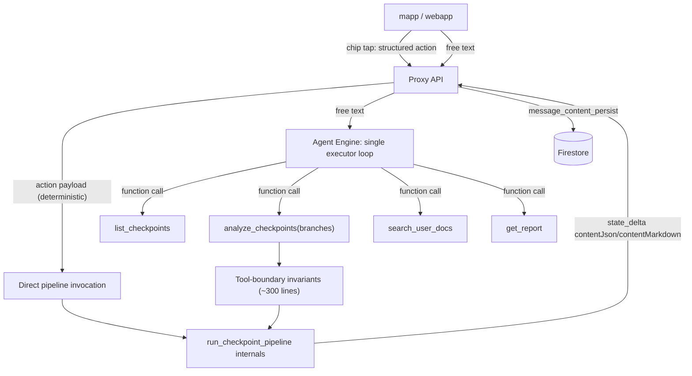

# Single-loop agent refactor plan (Orchestrator V3)

Status: **Phase 1 complete** — chip fast-path shipped end-to-end (agent + proxy + both clients) 2026-06-10.
Owner: —
Last updated: 2026-06-10

Strangler migration from the current two-LLM routing architecture (resolve LLM →
executor LLM → `before_tool` arbitration, ~4,700 lines in `property_agent/routing/`)
to a single executor loop with deterministic chip routing and tool-boundary
invariants. Each phase is independently shippable and reduces risk for the next.

Motivation (from the 2026-06-10 audit of an `adk web` session log):

- 5–7 LLM calls per substantive turn; 12–46s end-to-end latency.
- Routing authority split across three layers produced real bugs: duplicate
  branch-list pollution (`['diy','diy']`), an unrequested 28s cost analysis from
  pending-offer leakage, and resolver output contradicting its own prompt rules.
- Every misroute historically fixed with another heuristic layer
  (`apply_checkpoint_retrieval_plan`, `apply_thin_invariants`,
  `follow_up_from_resolver`, …) with overlapping branch-merge logic.

## Target architecture

**Invariant:** branch decisions are made in exactly one place per path — the
client (chips) or the executor's validated function call (free text). No
arbitration layers.

### Kept as-is (do not touch)

- `run_checkpoint_pipeline` internals: retrieval → parallel branches → synthesis,
  progress queue/`HomecareRunner` multiplexing.
- The `state_delta` / `contentJson` + `contentMarkdown` message-patch contract and
  proxy `message_content_persist`.
- Legacy stream `author` label mappings (see `property_agent/ARCHITECTURE.md`).
- `checkpoint_ids` trust boundary (`apply_session_checkpoint_ids_to_tool_args`).
- Token-quota accounting (`llm_token_usage` schema unchanged; fewer calls only
  reduce usage).

---

## Phase 0 — Measurement baseline (prerequisite, ~1 day) ✅

No parity claim without a yardstick.

- [x] Build a routing eval set covering each `discourse_act`, chip-style queries,
      selection changes, cold sessions, docs/report routes, and the known failure
      cases (unrequested cost run, post-DIY summarize misroute, inventory
      `retrieval_only` violation) — 42 cases in
      `property_agent/evals/routing/cases.yaml`.
- [x] Build a live eval runner asserting on the post-processed `ResolvedTurn`
      (`property_agent/evals/routing/run_routing_eval.py`, `make routing-eval`).
      *Approach change vs. original plan:* resolve-level eval instead of full
      `adk conformance` recordings — cheaper to run/extend, asserts the routing
      decision directly, and is replayable under the Phase 4 flag. End-to-end
      message-shape coverage stays in `property_agent/conformance/multi_turn/`.
      Dataset schema is CI-validated by `tests/test_routing_eval_cases.py`.
- [x] Capture baseline metrics
      (`property_agent/evals/routing/baselines/2026-06-10.json`).

**Baseline 2026-06-10** (flash-lite resolver, staging):

| Metric | Value |
|---|---|
| Eval pass rate | 39/42 (92.9%) |
| Resolve latency (eval harness) | p50 1.5s, p95 2.3s |
| Resolve latency (live `adk web` session) | 1.5–2.8s per turn |
| LLM calls per substantive turn (live session) | 5–7 |
| `stream_complete_ms` (live session) | 12.3s retrieval-only / 28.5s cost / ~46s diy |
| Misroutes in live 6-turn session | 2 (unrequested cost run; `['diy','diy']` echo) |

Baseline eval failures (real defects, kept failing on purpose):

1. `general_homecare_question` — "how often should I service my HVAC system?"
   triggers `run_optional_agents=['service']` (provider search from the word
   "service") and `retrieval_only=false`.
2. `menu_ordinal_last_pick` — "the last one" against the capability menu resolves
   `capability_key=checkpoints` (menu[0] fallback) instead of `cost`.
3. `selection_cleared_summarize` — cleared selection + "summarize the issues"
   returns `retrieval_only=false` (full re-retrieval) instead of answering from
   prior context.

**Exit criteria met:** harness validated against staging; defects quantified.
Pass-rate target for later phases: ≥ 39/42, fixing the three above counts as
improvement, regressions on `failure_guard`/`weblog_*` cases block.

## Phase 1 — Chip fast-path (deterministic routing for suggested actions) ✅

Highest value, lowest model risk. Previously a chip tap sent canned text +
`chatIntent`, which two LLMs re-interpreted.

- [x] Structured `chip_action` field on the chat request schema
      (`gcp/proxy/api/schemas/agent.py` `ChipActionRequest`): `{"type":
      "run_branch", "branch": "cost"}`, `{"type": "replay_report"}`,
      `{"type": "discuss", "topic": "diy"}`. Proxy forwards it in the agent
      payload (`vertex_service.py`).
- [x] Chips emit matching `action` objects in
      `property_agent/routing/suggested_actions.py` alongside existing
      `label`/`userQuery`/`chatIntent` (backward compatible: old clients keep
      sending text).
- [x] Agent: `routing/chip_action.py` builds the `ResolvedTurn` deterministically
      from `state["chip_action"]` — zero resolve-LLM call, `resolve_source=chip`.
      *Approach note vs. original plan:* wired at the top of `resolve_turn_llm`
      (after payload hydration) rather than `early_short_circuit`, so
      `apply_resolved_turn_to_state` + executor inject run unchanged. The state
      key is consume-once (session state persists across turns) and a chip tap
      clears any dangling `pending_user_action`. `run_branch` →
      `run_optional_agents=[branch]`, `query_mode=branch_explicit`; `discuss` →
      `answer_from_context` + `focus_branch`; `replay_report` →
      `replay_deliverable`.
- [x] Clients send `chip_action` on chip tap, keep `userQuery` for display:
      `apps/common/src/lib/suggested-actions.ts` (+ `types.ts`) parses the chip
      `action`; mapp wires it through `PropertyChatWithContext` →
      `lib/api.ts`; webapp mirrors the parser (`src/lib/suggested-actions.ts`,
      `src/lib/types.ts`) and wires `property-chat-with-context.tsx` →
      `api-agent.ts` (chat send path lives there, not `api-checkpoint.ts`).
- [x] `pending_user_action` kept for typed "yes" responses — chips don't need it.

**Exit criteria met:** chip-tap turns log `resolve_source=chip` and record
`resolve_prompt_tokens=0` via `routing_metrics`; routing eval set unaffected
(free-text path unchanged); all suites green (agent 434, common 165, webapp 69,
mapp 91, proxy schema tests). Old clients without `chip_action` fall through to
the resolve LLM. Requires agent + proxy deploy before clients ship chips
(additive schema — safe to deploy in any order, fast-path activates when all
three are live).

## Phase 2 — Tool split (shrink the inference problem)

Split the mega-tool in `property_agent/registry.py` so intent maps to tool shape:

| New tool | Wraps | Replaces inference of |
|---|---|---|
| `list_checkpoints()` | `list_recent_property_checkpoints` + inventory formatting | `query_requests_checkpoint_inventory` regex, `inventory_recent` mode |
| `analyze_checkpoints(branches: list[enum] = [])` | existing `run_checkpoint_pipeline` | `retrieval_only`, `run_optional_agents`, most of `query_mode` |
| `search_user_docs`, `get_report` | unchanged (`user_docs_retrieval`, `report_retrieval`) | — |

- [ ] `branches=[]` means retrieval + summary only (today's `retrieval_only=True`).
- [ ] Branch enum lives in the tool schema — invalid branches impossible at the
      API level.
- [ ] Update `property_agent/prompts.py` executor instructions for the new tool
      set (rules collapse into tool descriptions).
- [ ] Pipeline internals, progress streaming, `state_delta` contract untouched;
      proxy/client `author` label mappings stay valid.

**Exit criteria:** resolve layer still on (now picks among clearer tools); eval
set green; no client/proxy changes required.

## Phase 3 — Tool-boundary invariants (the ~300 lines that must survive)

Extract legitimate guards into one module (e.g.
`property_agent/checkpoint/tool_guards.py`), enforced in `before_tool` regardless
of which router produced the call:

- [ ] `checkpoint_ids` forced from UI selection (exists:
      `apply_session_checkpoint_ids_to_tool_args`).
- [ ] Branch enum validation + order-preserving dedupe (exists since the
      2026-06-10 fixes).
- [ ] Idempotency: branch completed this session + no explicit re-request + no
      fresh-external-data ask → return cached section instead of re-running (port
      `filter_optional_branches_for_orchestrator` semantics from
      `routing/apply_resolved_turn.py`).
- [ ] Report mode blocks checkpoint tools (exists in
      `routing/conversational_callbacks.py`).
- [ ] Pending-offer guard: branches appearing only in a dangling assistant offer
      do not run unless the user's text or chip references them (fixes the
      unrequested-cost bug at the boundary, not in the prompt).

**Exit criteria:** unit tests per guard; guards fire identically under both
routers (resolve-LLM path and Phase 4 executor-only path).

## Phase 4 — Executor-only routing experiment (the big switch, behind a flag)

- [ ] Add `HOMEAPP_EXECUTOR_ONLY_ROUTING=1`: skip `resolve_turn_llm` entirely;
      `prepare_before_model_turn` injects only a slim context block (property
      address, selected checkpoint count, doc/report ids — not the full
      `[RESOLVED_TURN]` machinery).
- [ ] Casual-turn short-circuit becomes a ~20-line regex for bare greetings
      (cheap, fail-open to the executor).
- [ ] Run the loop on flash (non-lite) for this experiment — Phases 1+2 removed
      most easy traffic; per-turn cost roughly neutral vs. two flash-lite calls.
- [ ] A/B on staging: replay the Phase 0 eval set plus live `adk web` QA under
      both flags. Compare misroute rate, latency, tokens.
- [ ] Iterate on tool descriptions (not heuristics) until parity or better.

**Exit criteria:** executor-only ≥ parity on misroute rate, ≥30% p50 latency
improvement on substantive turns. **If parity is not reachable, stop here** —
Phases 1–3 already delivered most of the value and the resolve layer stays.

## Phase 5 — Deletion and docs

After Phase 4 holds in production for a sprint:

- [ ] Delete: `resolve_turn_llm.py`, `resolve_llm_schema.py`,
      `nlu_first_resolve.py`, `apply_resolved_turn.py` post-processing,
      `pending_offer_extract.py`, `turn_intent_llm.py`, most of `query_mode/`,
      `conversational_intent.py` inference, `analysis_digest`/working-memory
      hydration (executor sees real history; ADK compaction handles long
      sessions). Expected: ~3,500–4,000 lines removed.
- [ ] Keep `conversation_summary` only if compaction proves insufficient in
      long-session QA.
- [ ] Update `property_agent/ARCHITECTURE.md`, `docs/ORCHESTRATOR_V2_PLAN.md`,
      proxy lifecycle-label docs; remove `RESOLVE_LLM_DISABLED` /
      `HOMEAPP_NLU_FIRST_RESOLVE` flags.
- [ ] Simplify `ResolvedTurn` to a thin record of what was decided (kept for
      logging/metrics), no longer a control structure.

---

## Risks and mitigations

| Risk | Mitigation |
|---|---|
| Executor (single model) misroutes subtle follow-ups ("why is pro so expensive") | Phase 0 eval set encodes these; Phase 3 idempotency guard makes the worst case "cached answer", not a duplicate 30s run |
| Old clients without structured `action` | Chips keep `userQuery` text; fast-path is additive |
| Conformance fixtures encode old two-LLM transcripts | Re-record per phase (`make conformance-record`) |
| Token quota accounting changes | Fewer calls only reduce usage; no `llm_token_usage` schema change |
| Agent Engine deploy coupling | Each phase deploys via `deploy-homecare-agent.yaml`; Phase 4 flag allows instant rollback without redeploy |

## Sequencing summary

| Phase | Scope | Risk | Ship independently? |
|---|---|---|---|
| 0 | Eval set + baseline | none | yes |
| 1 | Chip fast-path | low | yes |
| 2 | Tool split | low-med | yes |
| 3 | Guard consolidation | low | yes |
| 4 | Executor-only routing (flag) | med | A/B only |
| 5 | Delete resolve layer | low (post-validation) | yes |

## Success criterion

A turn like *"Summarize the issues for the selected checkpoints"* costs one LLM
call, one Firestore batch read, and zero heuristic arbitration — and the
`['diy','diy']` class of bug is structurally impossible because there is exactly
one place where branch decisions are made.

## Related work

- 2026-06-10 audit quick fixes (commit `891a5808`): branch dedupe, refiner skip
  on retrieval-only turns, Firestore client cache + batched id fetches,
  per-request timing reset.
- Interim tactical plan (superseded by Phase 3 here): collapse branch-arg
  authority into the resolved turn within the *current* architecture.
