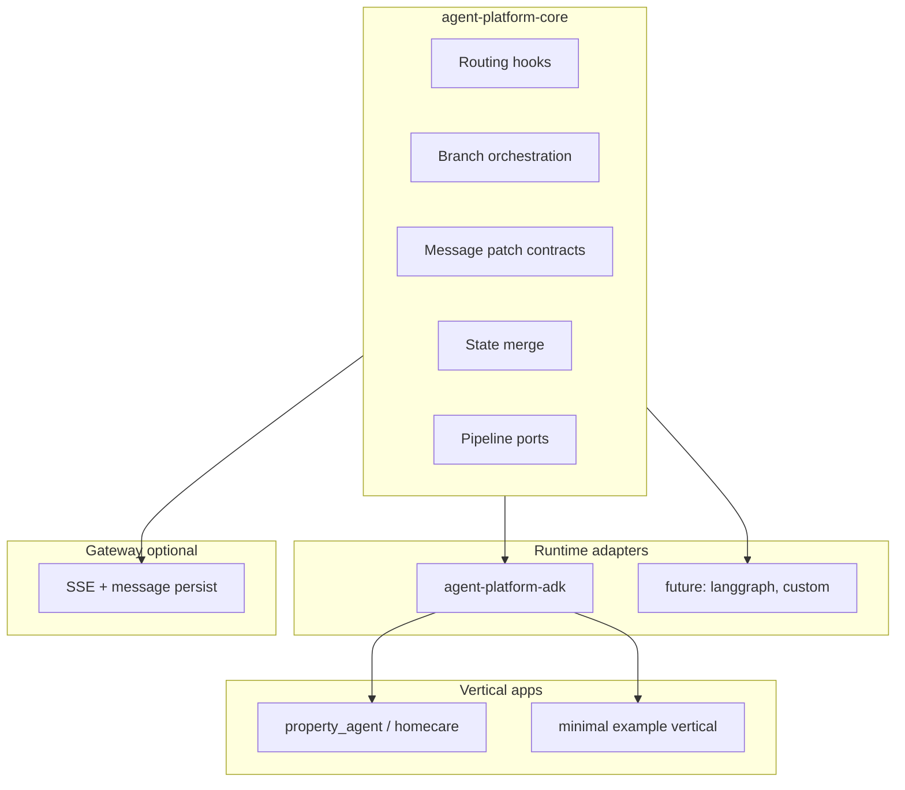

# RFC-001: Agent platform extraction (ADK-agnostic core)

**Status:** Draft  
**Authors:** HomeApp / AssetMem AI engineering  
**Created:** 2026-06-13  
**Branch:** `docs/agent-platform-extraction-plan`

---

## Summary

Extract and generalize `gcp/agent_framework` into a standalone open-source **agent control plane** that is **runtime-agnostic at the core**, with **Google ADK** shipped as the first production adapter. HomeApp (`property_agent`) remains a reference vertical deployed on Vertex Agent Engine via the ADK adapter.

This RFC defines goals, non-goals, package structure, phased execution, and API stability rules. Implementation details: [ports.md](./ports.md), [migration-matrix.md](./migration-matrix.md).

---

## Problem

HomeApp has production-proven patterns that are valuable beyond property care:

- Single-loop routing (deterministic pre-routing + one executor LLM)
- Composite pipelines with optional parallel branches and `depends_on` waves
- Structured UI output (`contentMarkdown` / `contentJson`) decoupled from stream prose
- Mid-tool progress streaming while blocking `FunctionTool` calls complete
- CI-safe deterministic routing eval (no live LLM)

Today these live in a monorepo split (`agent_framework` + `property_agent`), but several modules still import `google.adk` types. A public OSS project needs a clear **core vs adapter** boundary so adopters can use LangGraph, a custom loop, or ADK without forking domain logic.

---

## Goals

1. **Publish `agent-platform-core`** — no `google.adk` imports; stable contracts for routing hooks, orchestration, message patches, state merge.
2. **Publish `agent-platform-adk`** — ADK `Agent` builder, compaction, runner/progress multiplex, `AdkApp` helpers; depends on core + `google-adk`.
3. **Keep HomeApp deployable** at every phase — strangler migration, no big-bang.
4. **Ship one minimal example vertical** that exercises core + ADK adapter without homecare domain.
5. **Document wire formats** agents and gateways share (`MessagePatchInputV1`, revision semantics).

---

## Non-goals (v0.1)

| Out of scope | Rationale |
|--------------|-----------|
| Replacing ADK on Vertex Agent Engine for HomeApp prod | Deploy path stays `AdkApp`; core is portable, prod adapter is ADK |
| LangGraph / CrewAI / other adapters at launch | ADK adapter only; others are community or v0.2+ |
| Open-sourcing homecare domain (`property_agent` agents, checkpoint retrieval) | Reference vertical stays private or separate example repo |
| Full proxy / Firebase gateway OSS | Optional `agent-platform-gateway` later; contracts in core suffice for v0.1 |
| LLM-vendor neutrality in v0.1 | Gemini/`google-genai` in adapters; `ModelClient` port in core + `GeminiModelClient` in adk |

---

## Proposed package layout

### Phase A — monorepo restructure (before new GitHub repo)

```
gcp/
  agent_platform/
    core/              # agent-platform-core (evolved from agent_framework minus ADK)
    adk/               # agent-platform-adk
    gateway/           # optional: message persist helpers from proxy
```

`agent_framework/` becomes a thin re-export shim with `DeprecationWarning` until imports migrate.

### Phase B — published packages

| PyPI name | Contents |
|-----------|----------|
| `agent-platform-core` | Ports, routing, orchestration, contracts, execution, observability |
| `agent-platform-adk` | `build_root_agent`, compaction, progress runner, ADK type bridges |
| `agent-platform-gateway` | (optional) SSE persist, revision merge — extracted from proxy utils |

HomeApp:

- `property_agent` → `agent-platform-core` + `agent-platform-adk`
- `gcp/proxy/api` → `agent-platform-core` (contracts); gateway package when ready

---

## Architecture



**Boundary rules (hard):**

- `core` must not import `google.adk` or any vertical package.
- Adapters may import `core` + `google.adk`.
- Verticals may import `core` + adapters; never the reverse.

Extend `test_boundaries.py` → `test_core_does_not_import_adk.py` when `core/` exists.

---

## Phased execution

### Phase 0 — Planning (this branch)

- [x] RFC, ports spec, migration matrix
- [ ] Team review / sign-off on package names and license (Apache-2.0 recommended)

### Phase 1 — Ports in monorepo (weeks 2–3)

- Introduce `TurnContext`, `TurnOutcome`, `ToolCallContext` in core (see [ports.md](./ports.md))
- `run_resolve_before_model` returns `TurnOutcome | None`; ADK adapter maps to `LlmResponse`
- Vend/local `deep_merge_dicts` in `state_delta_merge.py`
- Generic event protocol for `memory/ingest.py`
- **Exit:** zero ADK imports under `core/`; `make test` green

### Phase 2 — Progress streaming (weeks 3–4)

- Core: `ProgressEvent`, queue registry contract
- ADK adapter: move `progress_stream` multiplex + `HomecareRunner` wiring
- **Exit:** documented queue contract; unit tests without Vertex

### Phase 3 — Pipeline skeleton + example (weeks 4–6)

- Core: `CompositePipeline` ports (retrieve → branches → assemble → synthesize)
- `property_agent.checkpoint.pipeline` implements ports
- `examples/minimal-vertical/` — 1 composite tool, 2 optional branches, message patches
- **Exit:** example runs via `adk web` or local runner

### Phase 4 — Gateway (optional, weeks 6–7)

- [x] Extract `message_content_persist` / `message_patch_state` to `packages/gateway`
- [x] Proxy imports `agent_platform.gateway`; stage `agent_platform` for Cloud Run deploy
- [x] Retire `stage-agent-framework-contracts.sh` (delegates to `stage-agent-platform-for-proxy.sh`)
- **Exit:** proxy tests pass with gateway package

### Phase 5 — Publish OSS (week 8+)

- Public GitHub repo (or monorepo `packages/` publish)
- PyPI release `0.1.0`
- HomeApp pins PyPI instead of path dependency
- Migration guide + blog post

---

## HomeApp migration strategy

**Strangler pattern:**

1. New `agent_platform/core` grows beside `agent_framework`
2. `agent_framework` re-exports from new paths
3. Update `property_agent` imports file-by-file
4. Remove shim when grep shows zero `from agent_framework` (or keep alias one release)

**CI gates (every PR):**

```bash
cd gcp/agent_platform/core && uv run pytest tests/ -v
cd gcp/agents/homecare && make test
uv run python -m property_agent.evals.routing.run_routing_eval  # no LLM
```

Staging smoke: `adk web` + one Agent Engine deploy to non-prod.

---

## API stability (pre-1.0)

| Stable in 0.1 | Explicitly unstable in 0.x |
|---------------|----------------------------|
| `MessagePatchInputV1` / `contentSchemaVersion: 2` wire keys | `TurnContext` field set |
| `merge_state_delta` list/dict semantics | Pipeline hook signatures |
| `BranchToolSpec` + `build_execution_plan` wave ordering | Progress event JSON schema |
| `STATE_DELTA_MESSAGE_PATCH_KEYS` | Gateway persist API |

Breaking wire format → **major** version. HomeApp clients depend on `contentJson` shape.

---

## Risks and mitigations

| Risk | Mitigation |
|------|------------|
| Over-abstraction | Cap v0.1 at five ports; defer second runtime |
| ADK API churn | Pin `google-adk` in adapter package only |
| Stalled migration | Monorepo path dep until 0.1; single CI |
| OSS without adopters | Minimal example + “ADK callback migration” guide |
| Vertex coupling | Document: prod HomeApp = ADK adapter; core runs anywhere |

---

## Success criteria (v0.1)

- [ ] `pip install agent-platform-core` — no ADK transitive dependency
- [ ] `pip install agent-platform-adk` — HomeApp `make test` passes when wired
- [ ] Boundary tests: core ⊄ ADK, core ⊄ property_agent
- [ ] Minimal example vertical documented and runnable
- [ ] README explains ports vs adapters in &lt; 10 minutes read time

---

## Open questions

1. **Repo home:** new GitHub org vs `HomeApp/gcp/agent_platform` until 0.1?
2. **Package naming:** `agent-platform-*` vs `assetmem-agent-*` (brand)?
3. **Example vertical:** support-ticket vs doc-QA vs trimmed checkpoint clone?
4. **License:** Apache-2.0 (matches ADK file headers) — confirm with legal?

---

## References

- [`gcp/agent_framework/README.md`](../../agent_framework/README.md) — intended future standalone repo note
- [`property_agent/ARCHITECTURE.md`](../../agents/homecare/property_agent/ARCHITECTURE.md) — single-loop routing, progress queue
- [`gcp/proxy/api/README.md`](../../proxy/api/README.md) — V2 message persistence
